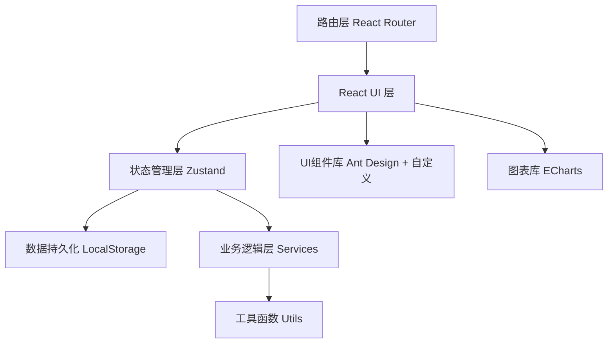
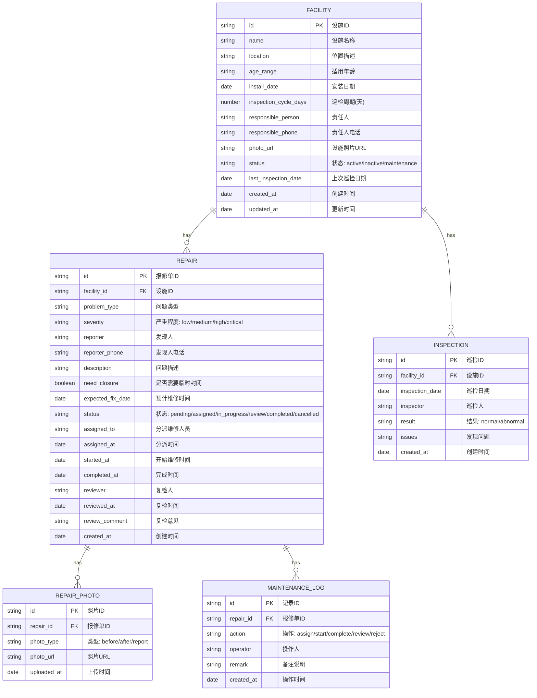

## 1. 架构设计
纯前端单页应用，使用LocalStorage持久化数据，无需后端服务。



## 2. 技术说明
- **前端框架**：React@18 + TypeScript
- **构建工具**：Vite@5
- **路由**：React Router DOM@6
- **状态管理**：Zustand（轻量，支持persist持久化）
- **UI组件库**：Ant Design@5（定制主题色）
- **样式方案**：Tailwind CSS@3
- **图表库**：ECharts@5 + echarts-for-react
- **图标**：@ant-design/icons + Font Awesome
- **日期处理**：dayjs
- **数据持久化**：LocalStorage（Zustand persist中间件）
- **初始化方式**：npm create vite@latest playground -- --template react-ts

## 3. 路由定义
| 路由 | 页面组件 | 用途 |
|-------|---------|-------|
| /dashboard | Dashboard | 仪表盘首页：数据概览、待处理、巡检计划 |
| /facilities | FacilityList | 设施档案列表 |
| /facilities/new | FacilityForm | 新增设施档案 |
| /facilities/:id | FacilityDetail | 设施详情（含历史记录） |
| /facilities/:id/edit | FacilityForm | 编辑设施档案 |
| /repairs | RepairList | 报修单列表 |
| /repairs/new | RepairForm | 新增报修单 |
| /repairs/:id | RepairDetail | 报修单详情（状态流转、维修记录） |
| /statistics | Statistics | 统计分析仪表盘 |
| * | NotFound | 404页面 |

## 4. 数据模型

### 4.1 ER图



### 4.2 数据常量定义

```typescript
// 设施状态
type FacilityStatus = 'active' | 'inactive' | 'maintenance';

// 严重程度
type Severity = 'low' | 'medium' | 'high' | 'critical';

// 报修状态
type RepairStatus = 'pending' | 'assigned' | 'in_progress' | 'review' | 'completed' | 'cancelled';

// 问题类型枚举
const PROBLEM_TYPES = [
  '结构松动', '链条异响', '表面破损', '焊接开裂',
  '塑料老化', '螺丝脱落', '油漆剥落', '安全垫破损',
  '电气故障', '其他'
];

// 严重程度映射（含自动停用判断）
const SEVERITY_CONFIG = {
  low: { label: '轻微', color: '#2A9D8F', autoDisable: false },
  medium: { label: '一般', color: '#FFB703', autoDisable: false },
  high: { label: '严重', color: '#FF6B35', autoDisable: true },
  critical: { label: '高危', color: '#E63946', autoDisable: true }
};

// 报修状态配置
const REPAIR_STATUS_CONFIG = {
  pending: { label: '待分派', color: '#868E96', step: 1 },
  assigned: { label: '已分派', color: '#219EBC', step: 2 },
  in_progress: { label: '维修中', color: '#FF6B35', step: 3 },
  review: { label: '待复检', color: '#FFB703', step: 4 },
  completed: { label: '已完成', color: '#2A9D8F', step: 5 },
  cancelled: { label: '已取消', color: '#ADB5BD', step: 0 }
};
```

## 5. 目录结构

```
src/
├── assets/              # 静态资源（图片、图标）
├── components/          # 通用组件
│   ├── Layout/          # 布局组件（侧边栏、顶栏）
│   ├── StatusTag/       # 状态标签组件
│   ├── SeverityTag/     # 严重程度标签
│   ├── PhotoUpload/     # 照片上传组件
│   ├── PhotoCompare/    # 维修前后对比组件
│   ├── EmptyState/      # 空状态组件
│   └── StatCard/        # 统计卡片组件
├── pages/               # 页面组件
│   ├── Dashboard/       # 仪表盘
│   ├── Facility/        # 设施管理（列表、详情、表单）
│   ├── Repair/          # 报修管理（列表、详情、表单）
│   ├── Statistics/      # 统计分析
│   └── NotFound.tsx
├── store/               # Zustand状态管理
│   ├── facilityStore.ts
│   ├── repairStore.ts
│   └── inspectionStore.ts
├── types/               # TypeScript类型定义
│   ├── facility.ts
│   ├── repair.ts
│   └── inspection.ts
├── utils/               # 工具函数
│   ├── date.ts          # 日期处理
│   ├── storage.ts       # 本地存储
│   └── statistics.ts    # 统计计算
├── data/                # Mock初始数据
│   └── mockData.ts
├── router/              # 路由配置
│   └── index.tsx
├── App.tsx
├── main.tsx
└── index.css
```

## 6. 核心业务逻辑说明

### 6.1 高风险自动停用
- 报修单创建时，若 `severity ∈ ['high', 'critical']`，自动触发：
  1. 将关联设施 `status` 更新为 `'inactive'`
  2. 在维修日志中记录自动停用操作
  3. 系统通知（Toast提示）显示"设施已自动标记为停用"

### 6.2 下次巡检日期计算
```typescript
function getNextInspectionDate(facility: Facility): Date {
  const baseDate = facility.last_inspection_date || facility.install_date;
  return addDays(baseDate, facility.inspection_cycle_days);
}
```

### 6.3 平均维修时长计算
```typescript
// 仅统计已完成的报修单（completed_at - created_at）
function getAverageRepairDuration(repairs: Repair[]): number {
  const completed = repairs.filter(r => r.status === 'completed' && r.completed_at);
  if (completed.length === 0) return 0;
  const totalHours = completed.reduce((sum, r) => {
    return sum + diffHours(r.completed_at!, r.created_at);
  }, 0);
  return Math.round(totalHours / completed.length);
}
```

### 6.4 重复故障设施判定
- 统计每个设施关联的报修单数量（不含已取消）
- `count >= 2` 判定为重复故障设施
- 按故障次数降序排列
