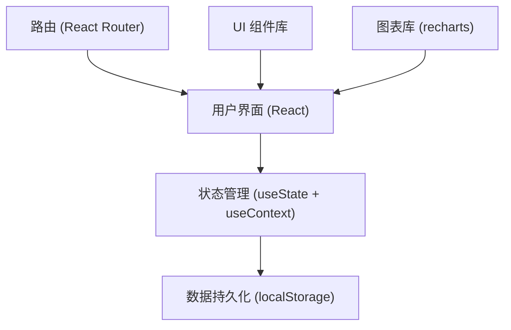
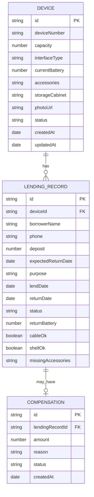

## 1. 架构设计



## 2. 技术描述

- **前端框架**：React@18 + TypeScript
- **构建工具**：Vite@5
- **样式方案**：TailwindCSS@3
- **路由管理**：React Router@6
- **图表组件**：Recharts@2
- **图标库**：Lucide React
- **数据存储**：浏览器 localStorage（无需后端）
- **初始化方式**：npm create vite@latest

## 3. 路由定义

| 路由路径 | 页面名称 | 说明 |
|----------|----------|------|
| /dashboard | 数据看板 | 首页，展示统计数据和图表 |
| /devices | 设备档案 | 设备列表管理 |
| /devices/new | 新增设备 | 创建设备档案 |
| /devices/:id/edit | 编辑设备 | 修改设备信息 |
| /lending | 借出管理 | 借出登记和记录 |
| /return | 归还管理 | 归还检查和赔付 |
| /compensation | 赔付记录 | 赔付记录查询和管理 |

## 4. 数据模型

### 4.1 ER 图



### 4.2 类型定义

```typescript
// 设备状态
type DeviceStatus = 'available' | 'lent' | 'maintenance' | 'low_battery';

// 借出记录状态
type LendingStatus = 'active' | 'returned' | 'overdue';

// 赔付状态
type CompensationStatus = 'pending' | 'paid' | 'waived';

interface Device {
  id: string;
  deviceNumber: string;
  capacity: number;
  interfaceType: string;
  currentBattery: number;
  accessories: string[];
  storageCabinet: string;
  photoUrl: string;
  status: DeviceStatus;
  createdAt: string;
  updatedAt: string;
}

interface LendingRecord {
  id: string;
  deviceId: string;
  borrowerName: string;
  phone: string;
  deposit: number;
  expectedReturnDate: string;
  purpose: string;
  lendDate: string;
  returnDate?: string;
  status: LendingStatus;
  returnBattery?: number;
  cableOk?: boolean;
  shellOk?: boolean;
  missingAccessories?: string[];
}

interface Compensation {
  id: string;
  lendingRecordId: string;
  amount: number;
  reason: string;
  status: CompensationStatus;
  createdAt: string;
}
```

## 5. 目录结构

```
src/
├── components/          # 通用组件
│   ├── Layout.tsx       # 布局组件（侧边栏+内容区）
│   ├── Sidebar.tsx      # 侧边导航
│   ├── StatusBadge.tsx  # 状态标签
│   ├── DataCard.tsx     # 统计卡片
│   └── Modal.tsx        # 模态框
├── pages/               # 页面组件
│   ├── Dashboard.tsx    # 数据看板
│   ├── DeviceList.tsx   # 设备列表
│   ├── DeviceForm.tsx   # 设备表单
│   ├── Lending.tsx      # 借出管理
│   ├── Return.tsx       # 归还管理
│   └── Compensation.tsx # 赔付记录
├── context/             # 状态管理
│   └── AppContext.tsx   # 全局状态
├── utils/               # 工具函数
│   ├── storage.ts       # localStorage 操作
│   ├── mock.ts          # 模拟数据
│   └── helpers.ts       # 通用工具
├── types/               # 类型定义
│   └── index.ts
├── App.tsx
├── main.tsx
└── index.css
```

## 6. 核心功能实现说明

### 6.1 本地存储封装
- 使用 localStorage 存储设备、借出记录、赔付记录
- 封装统一的 CRUD 操作函数
- 应用启动时从 localStorage 加载数据，无数据时初始化模拟数据

### 6.2 归还检查逻辑
- 归还时逐项检查：电量、线材、外壳、配件
- 缺失配件自动匹配预设赔付金额
- 确认归还后自动生成赔付记录
- 更新设备状态和当前电量

### 6.3 统计看板逻辑
- 可借数量：设备状态为 available 的数量
- 超时未还：借出记录状态为 active 且 expectedReturnDate < 今天
- 低电量待充：设备状态为 available 且 currentBattery < 20%
- 本周租借次数：lendDate 在本周范围内的记录数

### 6.4 赔付标准（预设）
- 缺失充电线：20 元
- 缺失充电头：30 元
- 外壳破损：50 元
- 电量低于借出时 50%：10 元（可选）
