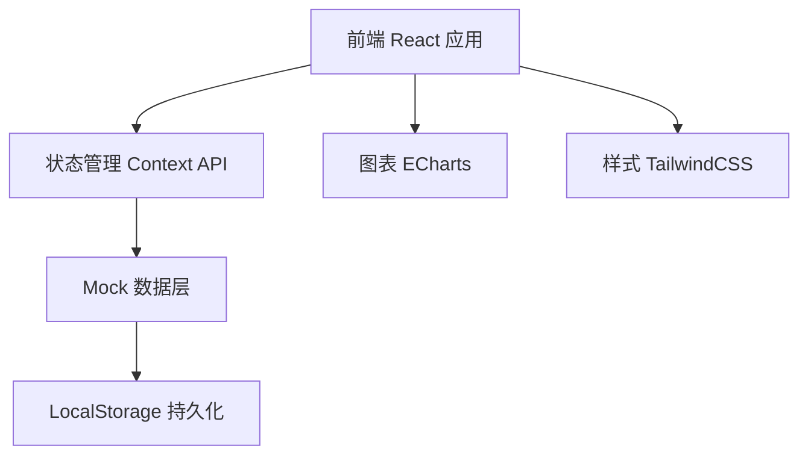
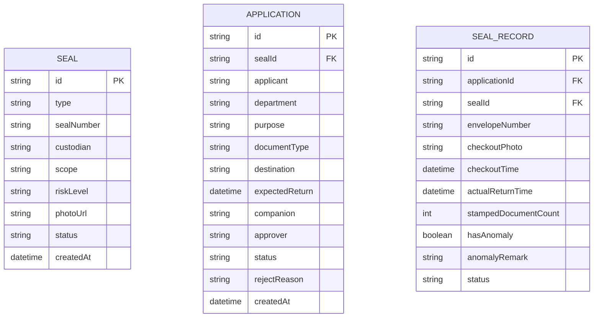

## 1. 架构设计



## 2. 技术描述
- **前端**: React@18 + TypeScript + Vite
- **样式**: TailwindCSS@3
- **图表**: ECharts@5
- **图标**: Lucide React
- **状态管理**: React Context API + useReducer
- **数据持久化**: LocalStorage（前端模拟）
- **路由**: React Router DOM@6

## 3. 路由定义
| 路由 | 用途 |
|------|------|
| /dashboard | 数据看板 |
| /seals | 印章档案列表 |
| /seals/new | 新增印章 |
| /seals/:id | 印章详情 |
| /applications | 外带申请列表 |
| /applications/new | 发起外带申请 |
| /applications/:id | 申请详情/审批 |
| /checkout/:applicationId | 外带登记拍照确认 |
| /return/:recordId | 归还登记 |

## 4. 数据模型

### 4.1 数据模型定义



### 4.2 核心数据类型定义

```typescript
type SealStatus = 'available' | 'in_use' | 'maintenance';
type RiskLevel = 'low' | 'medium' | 'high';
type ApplicationStatus = 'pending' | 'approved' | 'rejected' | 'checked_out' | 'returned' | 'overdue';

interface Seal {
  id: string;
  type: string;
  sealNumber: string;
  custodian: string;
  scope: string;
  riskLevel: RiskLevel;
  photoUrl: string;
  status: SealStatus;
  createdAt: string;
}

interface Application {
  id: string;
  sealId: string;
  applicant: string;
  department: string;
  purpose: string;
  documentType: string;
  destination: string;
  expectedReturn: string;
  companion: string;
  approver: string;
  status: ApplicationStatus;
  rejectReason?: string;
  createdAt: string;
}

interface SealRecord {
  id: string;
  applicationId: string;
  sealId: string;
  envelopeNumber: string;
  checkoutPhoto: string;
  checkoutTime: string;
  actualReturnTime?: string;
  stampedDocumentCount?: number;
  hasAnomaly?: boolean;
  anomalyRemark?: string;
  status: 'checked_out' | 'returned' | 'overdue';
}
```

## 5. 项目目录结构

```
src/
├── components/          # 通用组件
│   ├── Layout/         # 布局组件
│   ├── Card/           # 卡片组件
│   ├── Modal/          # 弹窗组件
│   ├── StatusBadge/    # 状态徽章
│   └── Chart/          # 图表组件
├── pages/              # 页面
│   ├── Dashboard/      # 数据看板
│   ├── Seals/          # 印章档案
│   ├── Applications/   # 外带申请
│   ├── Checkout/       # 外带登记
│   └── Return/         # 归还登记
├── context/            # 状态管理
│   ├── SealContext.tsx
│   ├── ApplicationContext.tsx
│   └── RecordContext.tsx
├── types/              # 类型定义
│   └── index.ts
├── data/               # Mock数据
│   └── mockData.ts
├── utils/              # 工具函数
│   └── helpers.ts
├── App.tsx
├── main.tsx
└── index.css
```
