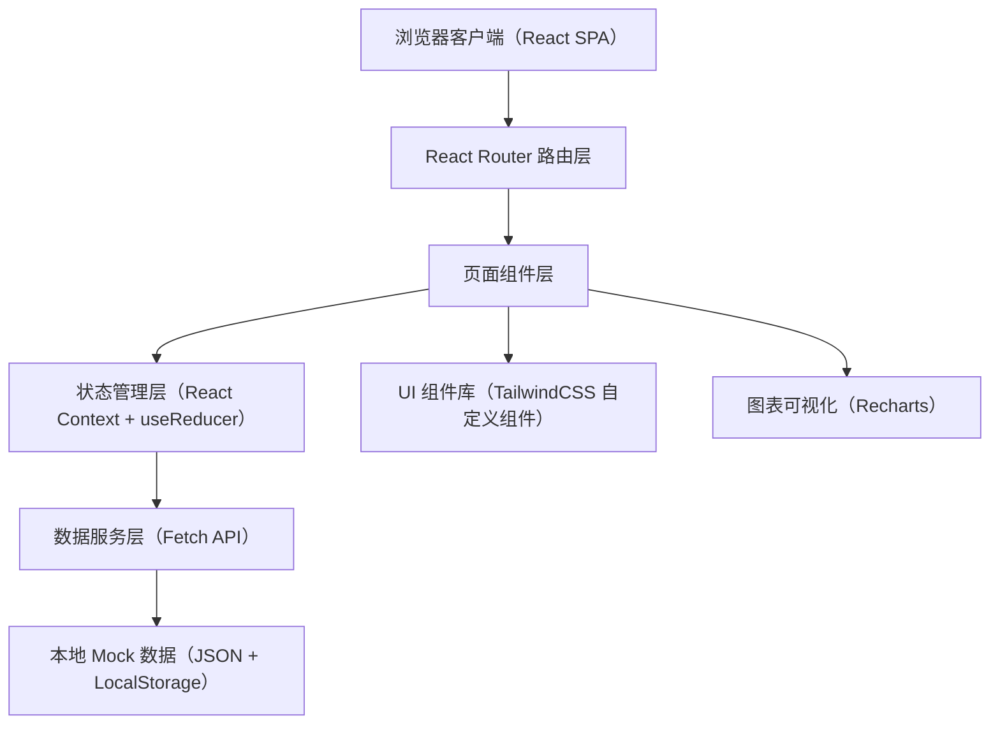
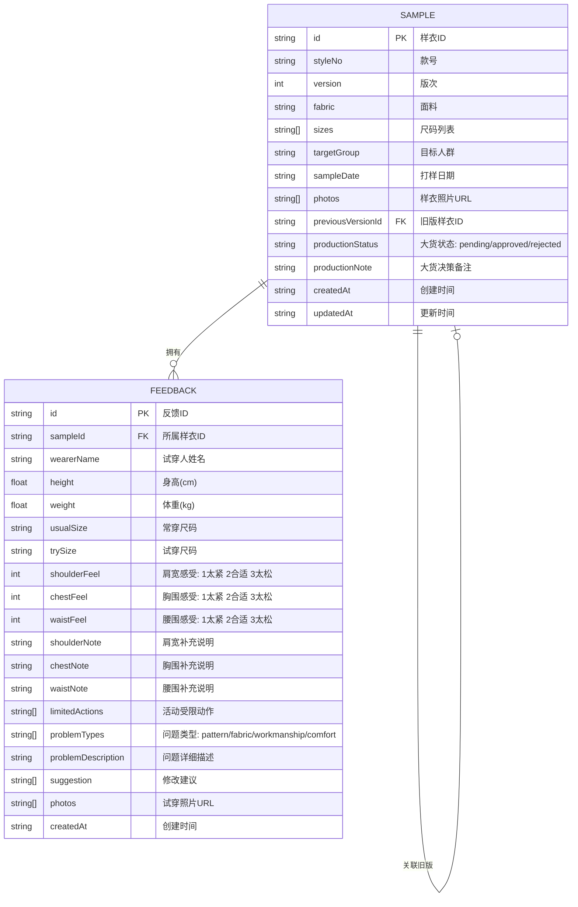

## 1. 架构设计



## 2. 技术说明

- **前端框架**：React@18 + TypeScript
- **构建工具**：Vite@5
- **样式方案**：TailwindCSS@3 + 自定义 CSS 变量主题
- **路由管理**：React Router@6
- **状态管理**：React Context + useReducer（轻量场景，无需 Redux）
- **数据持久化**：LocalStorage 模拟后端存储，初始 Mock 数据
- **图表库**：Recharts@2（饼图、柱状图、热力图）
- **图标库**：Lucide React（线性简约图标）
- **后端**：无后端，前端纯 Mock 数据 + LocalStorage 持久化

## 3. 路由定义

| 路由路径 | 页面名称 | 说明 |
|----------|----------|------|
| / | 样衣档案列表页 | 首页，展示所有样衣卡片及筛选功能 |
| /sample/:id | 样衣档案详情页 | 展示单个样衣的完整信息、反馈和统计 |
| /sample/new | 新建样衣页 | 创建新的样衣档案 |
| /sample/:id/edit | 编辑样衣页 | 修改已有样衣档案信息 |
| /sample/:id/feedback/new | 试穿反馈录入页 | 为指定样衣录入试穿反馈 |
| /dashboard | 数据统计看板 | 全局统计分析、问题汇总、大货决策 |

## 4. 数据模型

### 4.1 实体关系图



### 4.2 TypeScript 类型定义

```typescript
export type ProductionStatus = 'pending' | 'approved' | 'rejected';
export type FeelLevel = 1 | 2 | 3;
export type ProblemType = 'pattern' | 'fabric' | 'workmanship' | 'comfort';
export type SizeCode = 'XS' | 'S' | 'M' | 'L' | 'XL' | 'XXL';

export interface Sample {
  id: string;
  styleNo: string;
  version: number;
  fabric: string;
  sizes: SizeCode[];
  targetGroup: string;
  sampleDate: string;
  photos: string[];
  previousVersionId?: string;
  productionStatus: ProductionStatus;
  productionNote?: string;
  createdAt: string;
  updatedAt: string;
}

export interface Feedback {
  id: string;
  sampleId: string;
  wearerName: string;
  height: number;
  weight: number;
  usualSize: SizeCode;
  trySize: SizeCode;
  shoulderFeel: FeelLevel;
  chestFeel: FeelLevel;
  waistFeel: FeelLevel;
  shoulderNote?: string;
  chestNote?: string;
  waistNote?: string;
  limitedActions: string[];
  problemTypes: ProblemType[];
  problemDescription?: string;
  suggestions: string[];
  photos: string[];
  createdAt: string;
}
```

## 5. 目录结构

```
src/
├── assets/               # 静态资源：字体、图标、占位图
├── components/           # 可复用 UI 组件
│   ├── layout/          # 布局组件：Header、Sidebar、Container
│   ├── sample/          # 样衣相关：SampleCard、SampleForm、VersionTimeline
│   ├── feedback/        # 反馈相关：FeedbackCard、FeedbackForm、FeelSlider
│   ├── stats/           # 统计相关：HeatmapChart、ProblemPie、SuggestionWall
│   └── common/          # 通用组件：Button、Input、Tag、Modal、PhotoUploader
├── context/              # React Context：SampleContext、FeedbackContext
├── data/                 # Mock 数据
│   ├── samples.ts       # 样衣模拟数据
│   └── feedbacks.ts     # 反馈模拟数据
├── hooks/                # 自定义 Hooks：useLocalStorage、useSamples、useFeedbacks
├── pages/                # 页面组件
│   ├── SampleList.tsx
│   ├── SampleDetail.tsx
│   ├── SampleForm.tsx
│   ├── FeedbackForm.tsx
│   └── Dashboard.tsx
├── router/               # 路由配置
│   └── index.tsx
├── types/                # TypeScript 类型定义
│   └── index.ts
├── utils/                # 工具函数
│   ├── storage.ts       # LocalStorage 封装
│   ├── statistics.ts    # 统计计算函数
│   └── format.ts        # 格式化工具
├── App.tsx
├── main.tsx
└── index.css            # TailwindCSS 入口 + 自定义主题变量
```

## 6. 核心数据服务与工具函数

### 6.1 本地存储封装（storage.ts）
- `getSamples(): Sample[]` — 读取所有样衣
- `saveSamples(samples: Sample[]): void` — 保存样衣列表
- `getFeedbacks(): Feedback[]` — 读取所有反馈
- `saveFeedbacks(feedbacks: Feedback[]): void` — 保存反馈列表

### 6.2 统计计算函数（statistics.ts）
- `getProblemCountBySize(sampleId: string): Record<SizeCode, number>` — 按尺码统计问题数
- `getProblemTypeDistribution(sampleId?: string): Record<ProblemType, number>` — 问题类型分布
- `getHeatmapData(sampleId?: string): (SizeCode | ProblemType | number)[][]` — 热力图矩阵数据
- `aggregateSuggestions(sampleId?: string): { text: string; count: number }[]` — 修改建议聚合
- `getSizeFeelStats(sampleId: string, size: SizeCode)` — 指定尺码的部位感受统计
- `getProductionReadiness(sampleId: string): { ready: boolean; score: number; issues: string[] }` — 大货就绪评估

### 6.3 Mock 数据规范
- 预置不少于 5 个样衣档案，涵盖不同款号、版次、尺码范围
- 每个样衣预置 3-8 条试穿反馈，覆盖多个尺码和问题类型
- 样衣照片与试穿照片使用统一占位图服务，带有款号/尺码水印
- 至少包含一组存在旧版关联的样衣，用于版本对比展示
