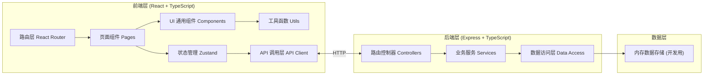
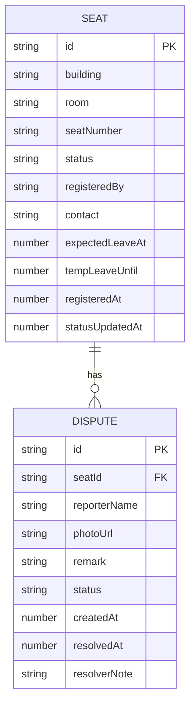

## 1. 架构设计



## 2. 技术描述

- 前端：React@18 + TypeScript + Vite + TailwindCSS@3 + Zustand + React Router DOM + Recharts + Lucide React
- 初始化工具：vite-init
- 后端：Express@4 + TypeScript
- 数据库：内存数据存储（Mock数据，便于演示），生产可替换为 SQLite/PostgreSQL

## 3. 路由定义

| 路由 | 页面 | 用途 |
|-------|------|------|
| / | 首页座位板 | 展示座位状态分组、筛选搜索 |
| /register | 座位登记 | 登记新座位使用信息 |
| /seat/:id | 座位详情 | 查看座位详情、反馈占座 |
| /admin | 管理员面板 | 处理争议、恢复座位 |
| /admin/login | 管理员登录 | 管理员身份验证 |
| /stats | 统计分析 | 自习室紧张度、占座时段、恢复统计 |

## 4. API 定义

```typescript
// 座位状态枚举
enum SeatStatus {
  EMPTY = 'empty',           // 空座
  IN_USE = 'in_use',        // 使用中
  TEMP_LEAVE = 'temp_leave', // 短暂离开
  SUSPECTED = 'suspected'   // 疑似占座
}

// 座位数据模型
interface Seat {
  id: string;
  building: string;        // 教学楼
  room: string;            // 房间号
  seatNumber: string;       // 座位号
  status: SeatStatus;
  registeredBy?: string;       // 登记人昵称
  contact?: string;         // 联系方式
  expectedLeaveAt?: number;  // 预计离开时间戳
  tempLeaveUntil?: number;    // 短暂离座到期时间
  registeredAt?: number;       // 登记时间
  statusUpdatedAt: number;      // 状态更新时间
}

// 争议反馈
interface Dispute {
  id: string;
  seatId: string;
  reporterName: string;
  photoUrl?: string;
  remark?: string;
  createdAt: number;
  status: 'pending' | 'resolved' | 'rejected';
  resolvedAt?: number;
  resolverNote?: string;
}

// 统计数据
interface StatsData {
  totalSeats: number;
  seatsByBuilding: Record<string, { total: number; inUse: number; suspected: number }>;
  suspectedByHour: number[];   // 24小时数组
  recoveredByDay: { date: string; count: number }[];
  totalRecovered: number;
}

// API Endpoints
GET    /api/seats?building=&room=       获取座位列表
POST   /api/seats                          登记座位
PATCH  /api/seats/:id                      更新座位状态
DELETE /api/seats/:id                      取消登记/恢复空座
GET    /api/disputes                      获取争议列表
POST   /api/disputes                      提交争议反馈
PATCH  /api/disputes/:id/resolve            处理争议(恢复/驳回)
GET    /api/stats                          获取统计数据
POST   /api/admin/login                  管理员登录
```

## 5. 数据模型



## 6. 项目目录结构

```
trae0601-3/
├── src/                          # 前端源码
│   ├── components/              # 通用组件
│   │   ├── SeatCard.tsx        # 座位卡片
│   │   ├── StatusBadge.tsx       # 状态徽章
│   │   ├── FilterBar.tsx         # 筛选栏
│   │   ├── StatsCard.tsx          # 统计卡片
│   │   └── Modal.tsx            # 弹窗组件
│   ├── pages/                     # 页面
│   │   ├── Home.tsx             # 首页座位板
│   │   ├── RegisterSeat.tsx      # 座位登记
│   │   ├── SeatDetail.tsx        # 座位详情
│   │   ├── AdminLogin.tsx         # 管理员登录
│   │   ├── AdminPanel.tsx         # 管理员面板
│   │   └── Statistics.tsx        # 统计分析
│   ├── store/                     # 状态管理
│   │   └── useStore.ts          # Zustand Store
│   ├── api/                       # API调用
│   │   └── client.ts            # API Client
│   ├── types/                     # 类型定义
│   │   └── index.ts
│   ├── utils/                     # 工具函数
│   │   └── time.ts
│   ├── App.tsx
│   ├── main.tsx
│   └── index.css
├── api/                           # 后端源码
│   ├── index.ts                   # Express 入口
│   ├── routes/
│   │   ├── seats.ts
│   │   ├── disputes.ts
│   │   ├── stats.ts
│   │   └── admin.ts
│   ├── services/
│   │   ├── seatService.ts
│   │   ├── disputeService.ts
│   │   └── statsService.ts
│   ├── data/
│   │   └── store.ts              # 内存数据
│   └── types/
│       └── index.ts
├── shared/                        # 共享类型
│   └── types.ts
├── vite.config.ts
├── tailwind.config.js
├── tsconfig.json
└── package.json
```
