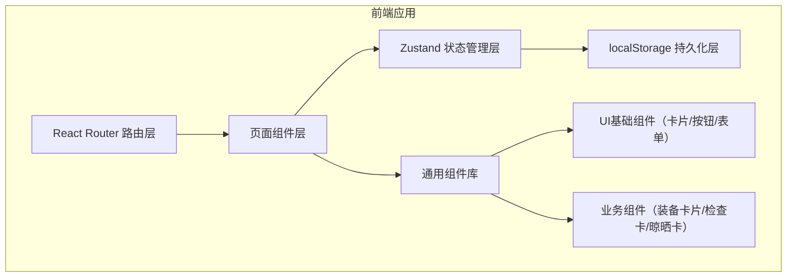
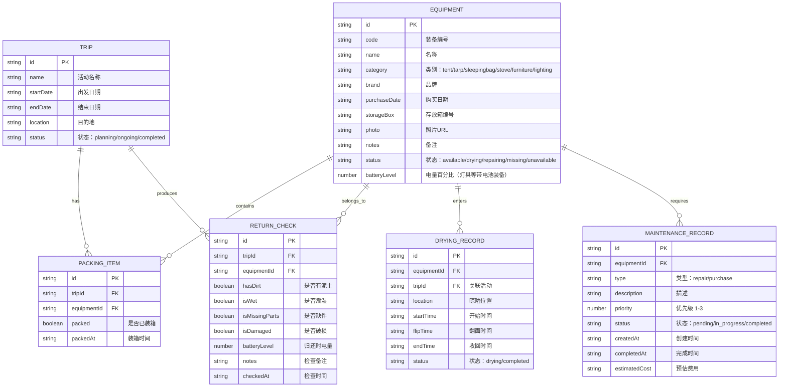

## 1. 架构设计

纯前端单页应用，数据使用 localStorage 持久化存储，无需后端服务。



## 2. 技术说明
- **前端框架**：React@18 + TypeScript@5
- **构建工具**：Vite@5
- **样式方案**：TailwindCSS@3
- **状态管理**：Zustand@4
- **路由**：React Router DOM@6
- **图标库**：Lucide React
- **数据存储**：localStorage（封装工具类，支持初始化mock数据）
- **项目初始化模板**：react-ts

## 3. 路由定义
| 路由 | 页面 | 用途 |
|------|------|------|
| / | Dashboard 首页 | 四大状态看板 + 快速操作 + 最近活动 |
| /equipment | EquipmentList 装备档案 | 装备列表、分类筛选、增删改查 |
| /equipment/new | EquipmentForm 新增装备 | 新增装备表单 |
| /equipment/:id/edit | EquipmentForm 编辑装备 | 编辑装备表单 |
| /trips | TripList 露营活动 | 活动列表、创建新活动 |
| /trips/:id/pack | PackingList 装箱清单 | 某活动的装箱确认流程 |
| /trips/:id/check | ReturnCheck 归还检查 | 某活动的归营逐件检查 |
| /drying | DryingQueue 晾晒管理 | 晾晒队列、翻面收回操作 |
| /maintenance | Maintenance 维修补购 | 维修进度、补购清单 |

## 4. 数据模型

### 6.1 数据模型定义



### 6.2 装备类别定义
```typescript
const CATEGORIES = [
  { id: 'tent', name: '帐篷', emoji: '⛺', icon: 'tent' },
  { id: 'tarp', name: '天幕', emoji: '🏕️', icon: 'umbrella' },
  { id: 'sleepingbag', name: '睡袋', emoji: '🛌', icon: 'bed-double' },
  { id: 'stove', name: '炉具', emoji: '🔥', icon: 'flame' },
  { id: 'furniture', name: '桌椅', emoji: '🪑', icon: 'armchair' },
  { id: 'lighting', name: '灯具', emoji: '💡', icon: 'lightbulb' },
]
```

### 6.3 初始 Mock 数据
- 6大类各2-3件装备，共15件示例装备
- 2次示例露营活动（1次已完成、1次计划中）
- 3条晾晒记录（2条进行中、1条已完成）
- 2条维修记录、1条补购记录
