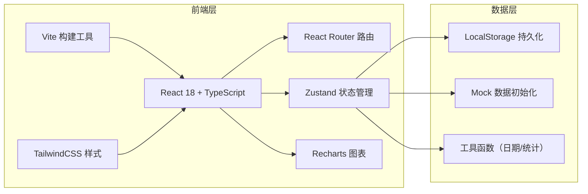
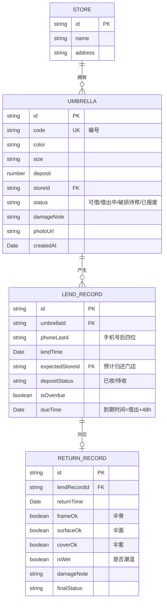

## 1. 架构设计



## 2. 技术描述

- **前端框架**：React 18 + TypeScript
- **构建工具**：Vite 5.x
- **样式方案**：TailwindCSS 3.x + CSS 变量主题
- **路由管理**：React Router DOM 6.x
- **状态管理**：Zustand 4.x（含 persist 中间件持久化到 LocalStorage）
- **图标库**：Lucide React
- **图表库**：Recharts 2.x
- **数据库**：无需后端，使用 LocalStorage + 内存 Mock 数据
- **初始化工具**：vite-init，选择 react-ts 模板

## 3. 路由定义

| 路由路径 | 页面组件 | 功能说明 |
|----------|----------|----------|
| `/` | Dashboard | 仪表盘：数据概览 + 快捷操作 |
| `/umbrellas` | UmbrellaList | 雨伞档案列表 |
| `/umbrellas/new` | UmbrellaForm | 新增雨伞档案 |
| `/umbrellas/:id` | UmbrellaDetail | 雨伞详情（抽屉式） |
| `/umbrellas/:id/edit` | UmbrellaForm | 编辑雨伞档案 |
| `/lend` | LendPage | 雨伞借出操作 |
| `/return` | ReturnPage | 雨伞归还操作 |
| `/overdue` | OverdueList | 逾期提醒清单 |
| `/statistics` | Statistics | 统计分析面板 |

## 4. 数据模型

### 4.1 ER 图



### 4.2 类型定义（TypeScript）

```typescript
// 门店
interface Store {
  id: string;
  name: string;
  address: string;
}

// 雨伞状态枚举
type UmbrellaStatus = 'available' | 'lent' | 'damaged' | 'scrapped';

// 雨伞档案
interface Umbrella {
  id: string;
  code: string;
  color: string;
  size: 'small' | 'medium' | 'large';
  deposit: number;
  storeId: string;
  status: UmbrellaStatus;
  damageNote: string;
  photoUrl: string;
  createdAt: string;
}

// 押金状态
type DepositStatus = 'paid' | 'unpaid';

// 借出记录
interface LendRecord {
  id: string;
  umbrellaId: string;
  phoneLast4: string;
  lendTime: string;
  expectedStoreId: string;
  depositStatus: DepositStatus;
  dueTime: string;
}

// 归还记录
interface ReturnRecord {
  id: string;
  lendRecordId: string;
  returnTime: string;
  frameOk: boolean;
  surfaceOk: boolean;
  coverOk: boolean;
  isWet: boolean;
  damageNote: string;
  finalStatus: UmbrellaStatus;
}

// 借伞历史（用于详情页时间线）
interface LendHistoryItem {
  id: string;
  umbrellaId: string;
  phoneLast4: string;
  lendTime: string;
  returnTime?: string;
  storeName: string;
  status: 'lending' | 'returned' | 'overdue';
}

// 统计数据类型
interface StoreStats {
  storeId: string;
  storeName: string;
  available: number;
  lent: number;
  damaged: number;
  total: number;
}

interface DailyPeakItem {
  hour: string;
  count: number;
  isRainyDay: boolean;
}

interface DamageRateItem {
  month: string;
  rate: number;
}

interface OverdueItem {
  lendRecordId: string;
  umbrellaCode: string;
  umbrellaPhoto: string;
  phoneLast4: string;
  lendTime: string;
  dueTime: string;
  overdueDays: number;
  lentStoreName: string;
  expectedStoreName: string;
  reminded: boolean;
}
```

## 5. 状态管理设计

### 5.1 Zustand Store 划分

```typescript
// useUmbrellaStore - 雨伞档案
interface UmbrellaStore {
  umbrellas: Umbrella[];
  stores: Store[];
  addUmbrella: (data: Omit<Umbrella, 'id' | 'createdAt'>) => void;
  updateUmbrella: (id: string, data: Partial<Umbrella>) => void;
  getUmbrellaByCode: (code: string) => Umbrella | undefined;
  getAvailableByStore: (storeId?: string) => Umbrella[];
}

// useLendStore - 借还记录
interface LendStore {
  lendRecords: LendRecord[];
  returnRecords: ReturnRecord[];
  lendUmbrella: (data: Omit<LendRecord, 'id' | 'dueTime'>) => void;
  returnUmbrella: (lendRecordId: string, data: Omit<ReturnRecord, 'id' | 'lendRecordId'>) => void;
  getActiveLendByUmbrella: (umbrellaId: string) => LendRecord | undefined;
}

// useStatsStore - 统计计算（派生数据）
interface StatsStore {
  getDashboardStats: () => { available: number; lent: number; overdue: number; damaged: number };
  getStoreStats: () => StoreStats[];
  getOverdueList: () => OverdueItem[];
  getDamageRate: () => DamageRateItem[];
  getRainyDayPeak: () => DailyPeakItem[];
}
```

## 6. 目录结构

```
src/
├── main.tsx                 # 入口文件
├── App.tsx                  # 路由配置
├── index.css                # 全局样式 + Tailwind + 字体
├── types/
│   └── index.ts             # 所有类型定义
├── store/
│   ├── umbrellaStore.ts     # 雨伞 & 门店状态
│   ├── lendStore.ts         # 借还记录状态
│   └── mockData.ts          # Mock 初始化数据
├── utils/
│   ├── dateUtils.ts         # 日期格式化、逾期计算
│   └── statsUtils.ts        # 统计计算函数
├── components/
│   ├── Layout/
│   │   ├── MainLayout.tsx   # 主布局（侧边栏+内容区）
│   │   └── Sidebar.tsx      # 侧边导航
│   ├── common/
│   │   ├── StatCard.tsx     # 统计数据卡片
│   │   ├── StatusBadge.tsx  # 状态标签
│   │   ├── UmbrellaCard.tsx # 雨伞缩略卡片
│   │   └── Modal.tsx        # 通用抽屉/弹窗
│   └── charts/
│       ├── StoreBarChart.tsx
│       ├── DamageLineChart.tsx
│       └── PeakBarChart.tsx
└── pages/
    ├── Dashboard.tsx
    ├── umbrellas/
    │   ├── UmbrellaList.tsx
    │   ├── UmbrellaForm.tsx
    │   └── UmbrellaDetail.tsx
    ├── LendPage.tsx
    ├── ReturnPage.tsx
    ├── OverdueList.tsx
    └── Statistics.tsx
```
