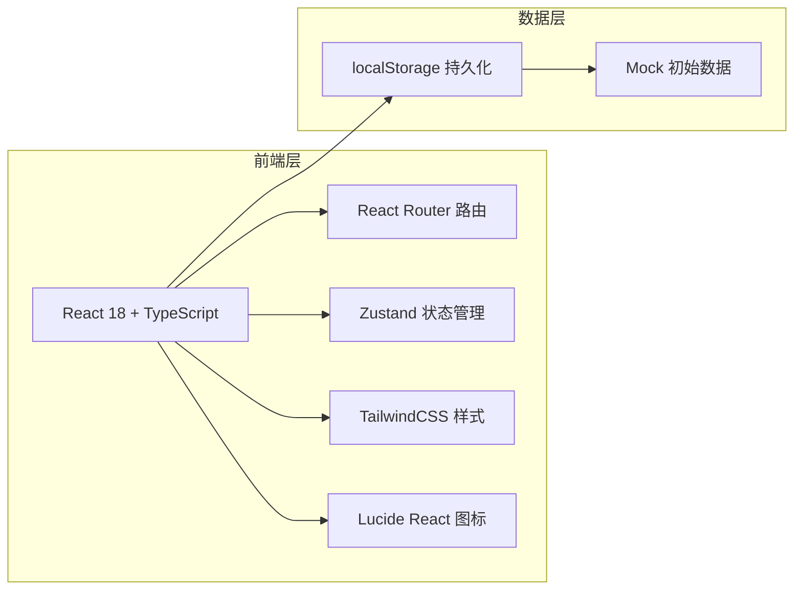
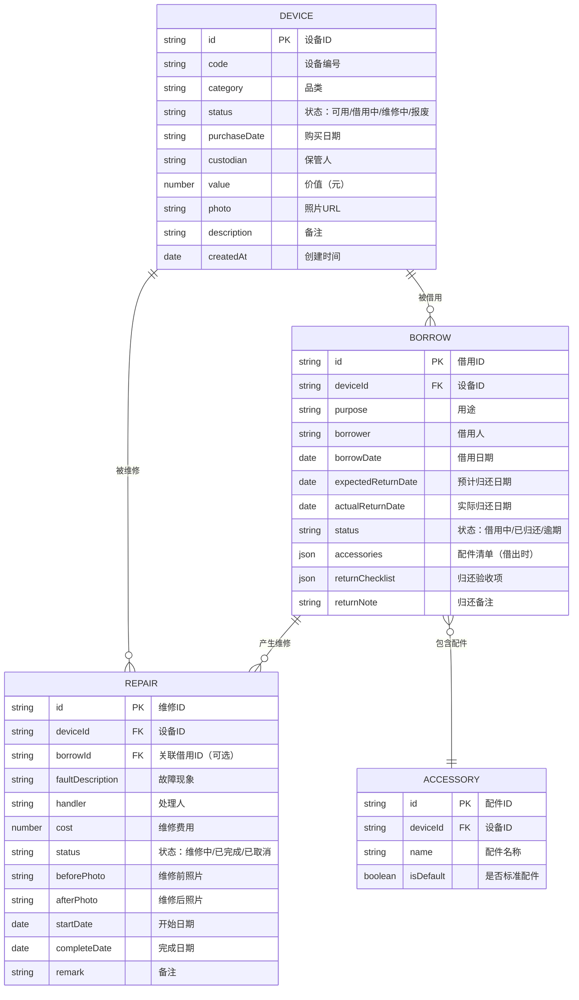

## 1. 架构设计



## 2. 技术说明

- **前端框架**：React@18 + TypeScript + Vite
- **初始化工具**：vite-init (react-ts 模板)
- **后端**：无后端，前端纯 Mock 数据 + localStorage 持久化
- **状态管理**：Zustand
- **路由**：react-router-dom
- **样式**：TailwindCSS@3
- **图标**：lucide-react

## 3. 路由定义

| 路由 | 用途 |
|-------|---------|
| /dashboard | 统计看板首页 |
| /devices | 设备档案列表 |
| /devices/new | 新增设备 |
| /devices/:id | 设备详情 |
| /borrows | 借用记录列表 |
| /borrows/new | 发起借用申请 |
| /returns/:borrowId | 归还验收 |
| /repairs | 维修单列表 |
| /repairs/new | 新建维修单 |
| /repairs/:id | 维修单详情 |

## 4. 数据模型

### 4.1 数据模型 ER 图



### 4.2 类型定义（TypeScript）

```typescript
type DeviceStatus = 'available' | 'borrowed' | 'repairing' | 'scrapped';
type BorrowStatus = 'borrowing' | 'returned' | 'overdue';
type RepairStatus = 'repairing' | 'completed' | 'cancelled';

interface Device {
  id: string;
  code: string;
  category: string;
  status: DeviceStatus;
  purchaseDate: string;
  custodian: string;
  value: number;
  photo: string;
  description?: string;
  createdAt: string;
}

interface AccessoryItem {
  id: string;
  name: string;
  checked: boolean;
}

interface Borrow {
  id: string;
  deviceId: string;
  purpose: string;
  borrower: string;
  borrowDate: string;
  expectedReturnDate: string;
  actualReturnDate?: string;
  status: BorrowStatus;
  accessories: AccessoryItem[];
  returnChecklist?: {
    accessories: AccessoryItem[];
    appearance: 'good' | 'minor_damage' | 'damaged';
    note?: string;
  };
}

interface Repair {
  id: string;
  deviceId: string;
  borrowId?: string;
  faultDescription: string;
  handler: string;
  cost: number;
  status: RepairStatus;
  beforePhoto?: string;
  afterPhoto?: string;
  startDate: string;
  completeDate?: string;
  remark?: string;
}
```
