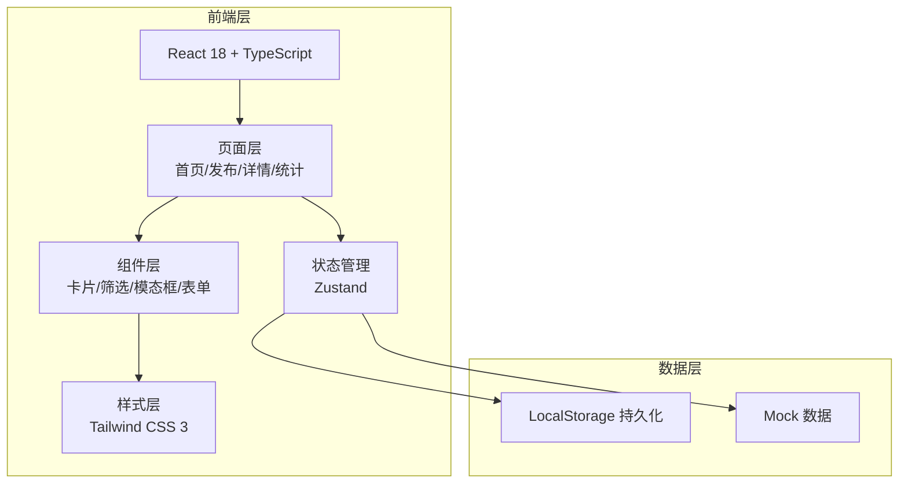
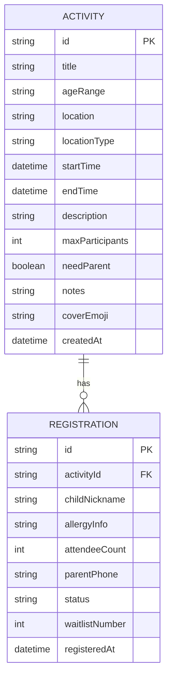

## 1. 架构设计



## 2. 技术描述

- **前端框架**：React@18 + TypeScript
- **构建工具**：Vite 5
- **样式方案**：Tailwind CSS 3
- **路由**：react-router-dom 6
- **状态管理**：Zustand 4
- **图标库**：lucide-react
- **数据持久化**：LocalStorage
- **数据来源**：内置 Mock 数据，无后端

## 3. 路由定义

| 路由路径 | 页面用途 |
|-----------|---------|
| / | 首页 - 活动广场，展示活动列表和筛选 |
| /publish | 发布活动页 - 填写并发布新活动 |
| /activity/:id | 活动详情页 - 查看详情、报名、候补 |
| /stats | 管理统计页 - 数据统计和我的活动 |

## 4. 数据模型

### 4.1 数据模型定义



### 4.2 TypeScript 类型定义

```typescript
// 活动地点类型
type LocationType = 'indoor' | 'outdoor';

// 报名状态
type RegistrationStatus = 'confirmed' | 'waitlist' | 'cancelled';

// 活动
interface Activity {
  id: string;
  title: string;
  ageRange: string; // e.g. "3-5岁"
  location: string;
  locationType: LocationType;
  startTime: string; // ISO datetime
  endTime: string;
  description: string;
  maxParticipants: number;
  needParent: boolean;
  notes: string;
  coverEmoji: string;
  createdAt: string;
}

// 报名记录
interface Registration {
  id: string;
  activityId: string;
  childNickname: string;
  allergyInfo: string;
  attendeeCount: number;
  parentPhone: string; // 仅存储，列表不展示
  status: RegistrationStatus;
  waitlistNumber: number | null;
  registeredAt: string;
}

// 筛选条件
type FilterType = 'all' | 'today' | 'weekend' | 'indoor' | 'outdoor';
```

## 5. 项目目录结构

```
src/
├── components/         # 通用组件
│   ├── ActivityCard.tsx      # 活动卡片
│   ├── FilterTabs.tsx      # 筛选标签
│   ├── Modal.tsx          # 模态框
│   ├── Badge.tsx          # 标签徽章
│   ├── Empty.tsx          # 空状态
│   └── Layout.tsx         # 布局组件
├── pages/            # 页面
│   ├── Home.tsx           # 首页-活动广场
│   ├── Publish.tsx        # 发布活动
│   ├── ActivityDetail.tsx # 活动详情
│   └── Statistics.tsx     # 管理统计
├── store/            # Zustand 状态管理
│   └── index.ts
├── types/            # 类型定义
│   └── index.ts
├── utils/            # 工具函数
│   └── helpers.ts
├── App.tsx
├── main.tsx
└── index.css
```
