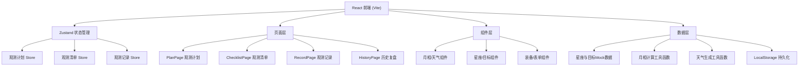
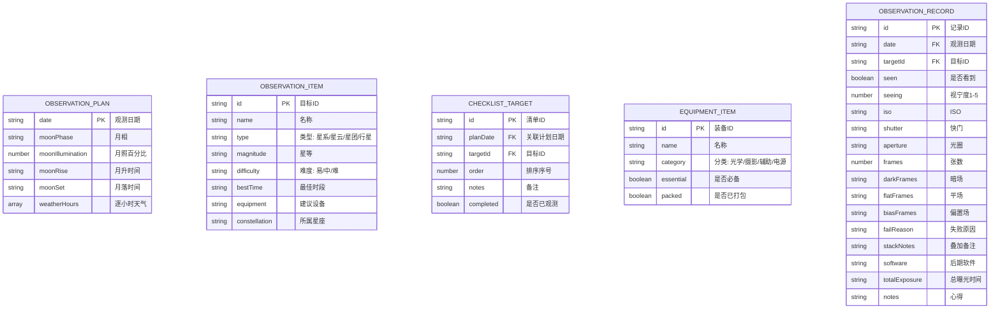

## 1. 架构设计

## 2. 技术说明
- **前端**：React@18 + TypeScript + tailwindcss@3 + Vite
- **初始化工具**：vite-init
- **后端**：无后端，纯前端应用，数据持久化使用 LocalStorage
- **路由**：react-router-dom 管理 4 个主页面
- **状态管理**：zustand 管理观测计划、清单、记录状态
- **图表**：recharts 绘制天气云量折线图
- **图标**：lucide-react
- **拖拽排序**：@dnd-kit/core + @dnd-kit/sortable

## 3. 路由定义
| 路由 | 用途 |
|------|------|
| / | 观测计划页（首页），日期选择+月相+天气+星座+深空目标 |
| /checklist | 观测清单页，已选目标+装备清单+打包确认 |
| /record/:date | 观测记录页，目标记录卡+曝光参数+失败原因+叠加备注 |
| /history | 历史复盘页，时间线记录列表+统计面板 |

## 4. 数据模型

### 4.1 数据模型定义

### 4.2 数据存储说明
- 所有数据存储在 LocalStorage 中，Key 前缀：`astro-plan-*`
- `astro-plan-config`：用户偏好设置
- `astro-plan-checklist-:date`：某日观测清单
- `astro-plan-equipment`：装备清单模板
- `astro-plan-records`：所有历史观测记录数组
- 月相和天气数据：使用工具函数根据日期实时计算/生成，不持久化
