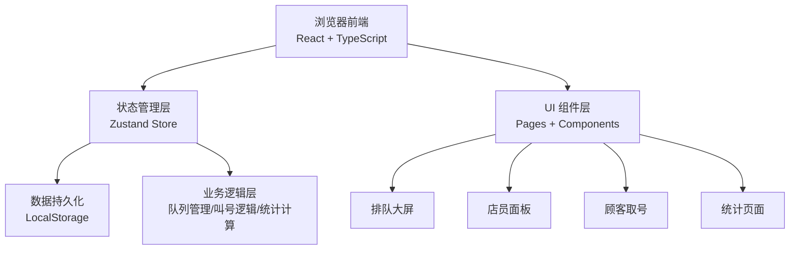
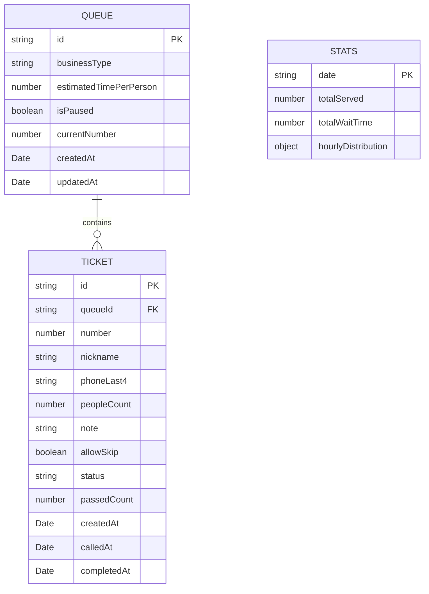

## 1. 架构设计



## 2. 技术描述

- **前端框架**：React@18 + TypeScript
- **构建工具**：Vite@5
- **样式方案**：TailwindCSS@3 + CSS 变量
- **状态管理**：Zustand@4
- **路由管理**：React Router DOM@6
- **图标库**：Lucide React
- **数据持久化**：LocalStorage（无需后端）
- **初始化工具**：vite-init

## 3. 路由定义

| 路由 | 页面 | 用途 |
|-------|------|------|
| / | 排队大屏 | 首页，显示当前叫号、等待列表、过号列表 |
| /staff | 店员面板 | 队列设置、叫号、过号、暂停接单 |
| /ticket | 顾客取号 | 填写信息取号 |
| /ticket/:id | 取号详情 | 显示个人排队状态和预计等待时间 |
| /stats | 统计页面 | 今日数据、平均等待、时段分布 |

## 4. 数据模型

### 4.1 数据模型定义



### 4.2 TypeScript 类型定义

```typescript
// 排队状态
type TicketStatus = 'waiting' | 'calling' | 'served' | 'passed';

// 业务类型
type BusinessType = 'haircut' | 'milktea' | 'repair' | 'other';

// 排队队列
interface Queue {
  id: string;
  businessType: BusinessType;
  businessName: string;
  estimatedTimePerPerson: number; // 分钟
  isPaused: boolean;
  currentNumber: number;
  createdAt: string;
  updatedAt: string;
}

// 取号单
interface Ticket {
  id: string;
  queueId: string;
  number: number;
  nickname: string;
  phoneLast4: string;
  peopleCount: number;
  note: string;
  allowSkip: boolean;
  status: TicketStatus;
  passedCount: number; // 过号次数
  createdAt: string;
  calledAt?: string;
  completedAt?: string;
}

// 统计数据
interface DailyStats {
  date: string; // YYYY-MM-DD
  totalServed: number;
  totalWaitTime: number; // 总等待时间（分钟）
  hourlyDistribution: Record<number, number>; // 每小时取号数
}
```

## 5. 核心业务逻辑

### 5.1 取号逻辑
- 号码自增，从 A001 开始
- 自动计算前方等待人数
- 根据预计单人耗时预估等待时间

### 5.2 叫号逻辑
- 叫号时标记状态为 calling
- 完成服务后标记为 served，更新统计
- 过号后 passedCount +1，状态改为 passed，排到队尾
- 连续叫号：完成后自动叫下一位等待中的顾客

### 5.3 排队排序
- 正常按取号顺序排列
- 过号的顾客排在队尾，但优先级低于新取号顾客
- 愿意过号的顾客在过号时自动后移

### 5.4 等待时间计算
- 预计等待时间 = 前方人数 × 预计单人耗时
- 快轮到判断：前方人数 ≤ 2 时显示"快轮到你了"

### 5.5 统计计算
- 今日接待人数：status = 'served' 的数量
- 平均等待时间：总等待时间 / 已服务人数
- 时段分布：按小时统计取号数量，找出最挤时段
