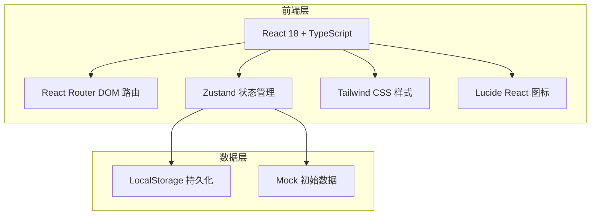
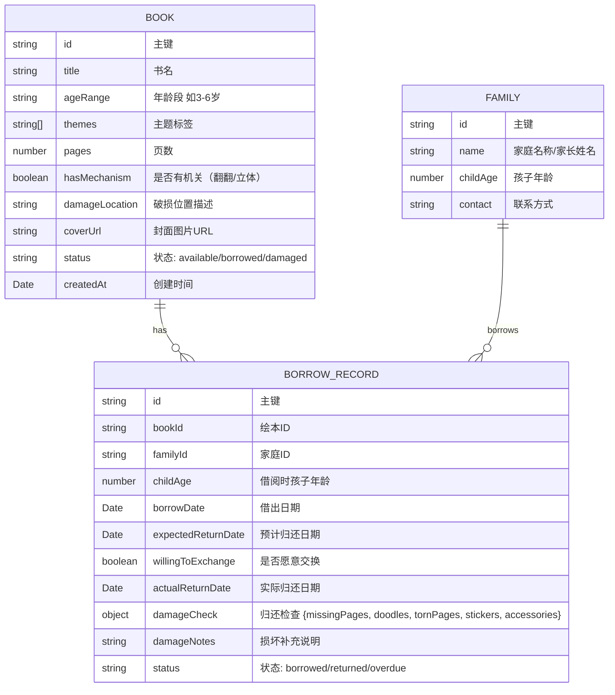

## 1. 架构设计



## 2. 技术描述
- **前端**：React@18 + TypeScript + Vite
- **初始化工具**：vite-init
- **后端**：无（纯前端单页应用，数据存储在 LocalStorage）
- **数据存储**：LocalStorage + JSON 序列化
- **状态管理**：Zustand
- **路由**：React Router DOM
- **样式**：Tailwind CSS 3
- **图标**：Lucide React

## 3. 路由定义
| 路由 | 用途 |
|------|------|
| / | 看板首页，展示逾期、热门、破损、家庭概览 |
| /books | 绘本档案列表 |
| /books/new | 新增绘本 |
| /books/:id | 绘本详情与编辑 |
| /borrow | 借阅管理（借出登记 + 归还检查） |
| /borrow/new | 新建借出记录 |
| /borrow/return/:id | 归还检查登记 |
| /recommend | 智能推荐 |

## 4. 数据模型

### 4.1 数据模型定义



### 4.2 TypeScript 类型定义

```typescript
interface Book {
  id: string;
  title: string;
  ageRange: string;
  themes: string[];
  pages: number;
  hasMechanism: boolean;
  damageLocation: string;
  coverUrl: string;
  status: 'available' | 'borrowed' | 'damaged';
  createdAt: string;
}

interface Family {
  id: string;
  name: string;
  childAge: number;
  contact: string;
}

interface DamageCheck {
  missingPages: boolean;
  doodles: boolean;
  tornPages: boolean;
  stickers: boolean;
  accessories: boolean;
}

interface BorrowRecord {
  id: string;
  bookId: string;
  familyId: string;
  childAge: number;
  borrowDate: string;
  expectedReturnDate: string;
  willingToExchange: boolean;
  actualReturnDate?: string;
  damageCheck?: DamageCheck;
  damageNotes?: string;
  status: 'borrowed' | 'returned' | 'overdue';
}
```

## 5. 项目目录结构

```
src/
├── components/        # 可复用组件
│   ├── BookCard.tsx       # 绘本卡片
│   ├── StatCard.tsx       # 统计卡片
│   ├── DamageForm.tsx     # 损坏检查表
│   └── TagInput.tsx       # 标签输入
├── pages/             # 页面组件
│   ├── Dashboard.tsx      # 看板首页
│   ├── BookList.tsx       # 绘本列表
│   ├── BookForm.tsx       # 绘本表单
│   ├── BorrowList.tsx     # 借阅管理
│   ├── BorrowForm.tsx     # 借出登记
│   ├── ReturnForm.tsx     # 归还检查
│   └── Recommend.tsx      # 智能推荐
├── store/             # Zustand 状态
│   └── index.ts           # 全局 store
├── types/             # 类型定义
│   └── index.ts
├── utils/             # 工具函数
│   ├── storage.ts         # LocalStorage 封装
│   ├── recommend.ts       # 推荐算法
│   └── mock.ts            # Mock 数据
├── App.tsx
├── main.tsx
└── index.css
```
