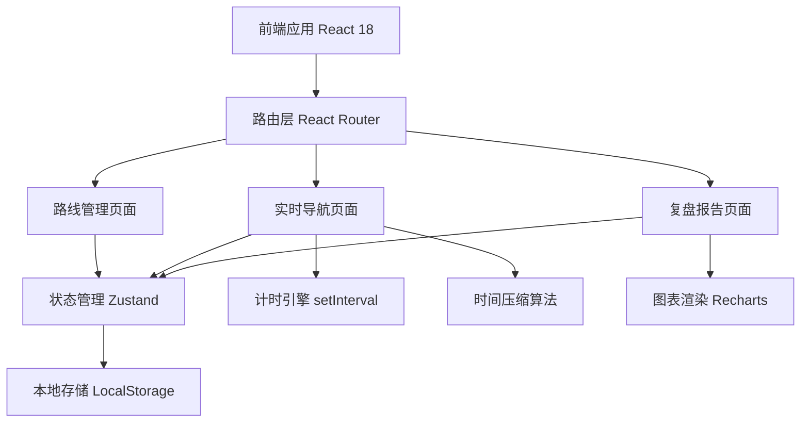

## 1. 架构设计



## 2. 技术描述

- **前端框架**: React@18 + TypeScript
- **构建工具**: Vite@5
- **样式方案**: TailwindCSS@3
- **状态管理**: Zustand（轻量级，适合本地应用）
- **路由**: React Router DOM@6
- **图表库**: Recharts（React友好，轻量级）
- **图标**: Lucide React（线性图标，美观现代）
- **拖拽排序**: @dnd-kit/core + @dnd-kit/sortable
- **数据持久化**: LocalStorage（无需后端，本地保存路线和历史记录）
- **后端**: 无（纯前端应用，数据全部本地存储）
- **数据库**: 无（使用LocalStorage模拟）

## 3. 路由定义

| 路由 | 目的 |
|-------|---------|
| / | 首页，展示路线列表，快速开始讲解 |
| /routes | 路线管理，查看所有路线 |
| /routes/new | 新建路线 |
| /routes/:id/edit | 编辑已有路线 |
| /guide/:id | 实时导航讲解模式 |
| /report/:sessionId | 讲解复盘报告页 |

## 4. API 定义

本应用为纯前端应用，无后端API。所有数据操作通过LocalStorage进行：

```typescript
// 数据存储键名
const STORAGE_KEYS = {
  ROUTES: 'museum_guide_routes',
  SESSIONS: 'museum_guide_sessions',
} as const;

// 路线数据模型
interface RoutePoint {
  id: string;
  name: string;
  description?: string;
  plannedDuration: number; // 秒
  isKeyPoint: boolean;     // 是否重点展柜
  order: number;
}

interface TourRoute {
  id: string;
  name: string;
  description?: string;
  points: RoutePoint[];
  createdAt: number;
  updatedAt: number;
}

// 讲解会话数据模型
interface PointSession {
  pointId: string;
  plannedDuration: number;      // 计划时长
  adjustedDuration: number;     // 调整后时长（压缩后）
  actualDuration: number;       // 实际用时
  startedAt: number | null;
  endedAt: number | null;
  timeAdded: number;            // 延长的总时间
  isCompleted: boolean;
}

interface GuideSession {
  id: string;
  routeId: string;
  routeName: string;
  pointSessions: PointSession[];
  currentPointIndex: number;
  status: 'idle' | 'running' | 'paused' | 'completed';
  startedAt: number | null;
  endedAt: number | null;
  totalPlannedDuration: number;
  totalActualDuration: number;
}
```

## 5. 状态管理

```typescript
// Zustand Store 设计
interface GuideStore {
  // 路线数据
  routes: TourRoute[];
  currentRoute: TourRoute | null;
  
  // 讲解会话
  activeSession: GuideSession | null;
  pastSessions: GuideSession[];
  
  // 路线CRUD
  createRoute: (data: Omit<TourRoute, 'id' | 'createdAt' | 'updatedAt'>) => void;
  updateRoute: (id: string, data: Partial<TourRoute>) => void;
  deleteRoute: (id: string) => void;
  duplicateRoute: (id: string) => void;
  
  // 讲解控制
  startSession: (routeId: string) => void;
  pauseSession: () => void;
  resumeSession: () => void;
  addTimeToCurrent: (seconds: number) => void;
  nextPoint: () => void;
  prevPoint: () => void;
  endSession: () => void;
  
  // 时间压缩算法
  recalculateDurations: () => void;
}
```

## 6. 核心算法

### 6.1 时间压缩算法

当某点位超时或用户延长时间时，需要从后续非重点点位按比例压缩时间：

```
输入：总超时时间 overtime，后续点位列表 remainingPoints
处理逻辑：
1. 筛选出非重点点位 nonKeyPoints = remainingPoints.filter(p => !p.isKeyPoint)
2. 计算非重点点位总可用时长 totalAvailable = sum(nonKeyPoints.adjustedDuration - 最低保障时长)
3. 如果 overtime <= totalAvailable：
   - 按各点位剩余可用时长比例压缩
   - 每个点位压缩量 = (该点可用时长 / 总可用时长) * overtime
4. 如果 overtime > totalAvailable：
   - 先压缩所有非重点点位到最低保障
   - 剩余超时量再从重点点位按比例压缩（最低保留50%）
5. 更新各点位 adjustedDuration
```

### 6.2 节奏评分算法

```
评分维度（满分100）：
- 时间准确度（40分）：实际总时长 vs 计划总时长的偏差率
- 重点覆盖率（30分）：重点点位的实际时长是否达到计划的80%
- 均匀度（30分）：各点位时间偏差的标准差，越低越稳定
```

## 7. 项目目录结构

```
src/
├── components/           # 公共组件
│   ├── ui/              # 基础UI组件（Button, Card, Input等）
│   ├── layout/          # 布局组件
│   ├── route/           # 路线相关组件
│   ├── guide/           # 导航相关组件
│   └── report/          # 报告相关组件
├── pages/               # 页面组件
│   ├── Home.tsx
│   ├── RouteList.tsx
│   ├── RouteEditor.tsx
│   ├── GuideMode.tsx
│   └── Report.tsx
├── store/               # Zustand状态管理
│   └── useGuideStore.ts
├── types/               # TypeScript类型定义
│   └── index.ts
├── utils/               # 工具函数
│   ├── time.ts          # 时间格式化
│   ├── compression.ts   # 时间压缩算法
│   ├── scoring.ts       # 评分算法
│   └── storage.ts       # LocalStorage封装
├── data/                # Mock数据
│   └── sampleRoutes.ts
├── hooks/               # 自定义Hooks
│   ├── useTimer.ts      # 计时器Hook
│   └── useLocalStorage.ts
├── styles/              # 全局样式
│   └── globals.css
├── App.tsx
├── main.tsx
└── Router.tsx
```
