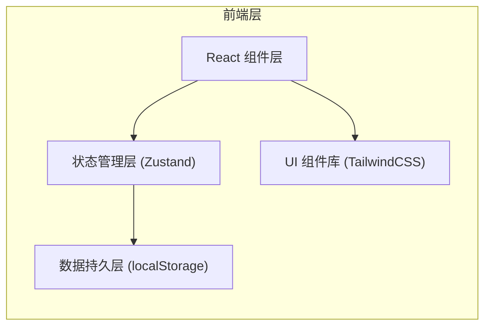
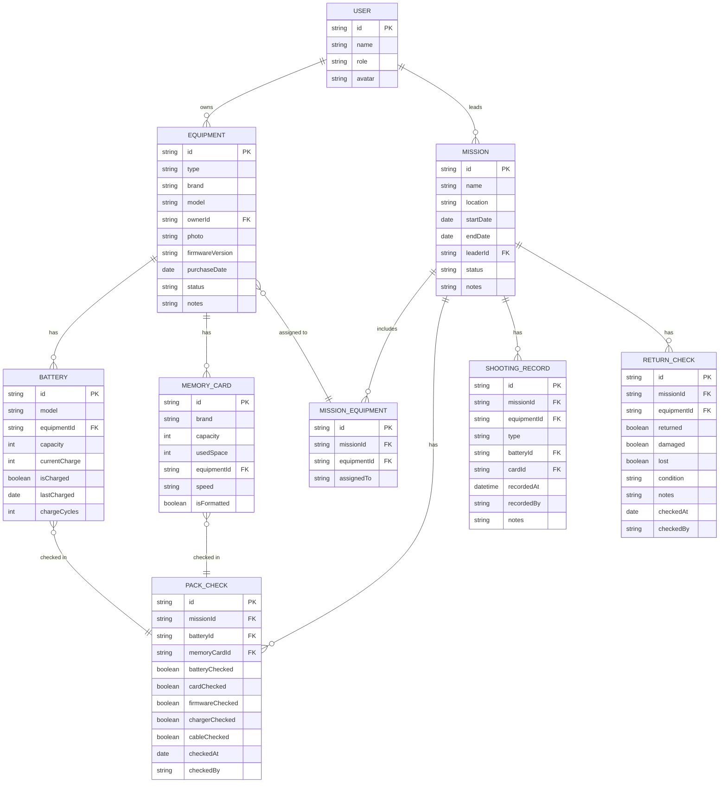

## 1. 架构设计

本项目为纯前端单页应用，数据存储于浏览器 localStorage，无需后端服务。采用组件化架构，状态集中管理。



## 2. 技术描述

- **前端框架**：React@18 + TypeScript
- **构建工具**：Vite@5
- **样式方案**：TailwindCSS@3
- **状态管理**：Zustand（轻量级状态管理）
- **路由管理**：React Router DOM@6
- **图标库**：Lucide React
- **数据持久化**：localStorage + 自定义封装
- **表单处理**：React Hook Form
- **开发语言**：TypeScript

**项目初始化命令**：
```bash
npm create vite@latest . -- --template react-ts
npm install
npm install -D tailwindcss postcss autoprefixer
npx tailwindcss init -p
npm install zustand react-router-dom lucide-react react-hook-form
```

## 3. 目录结构

```
src/
├── components/          # 通用组件
│   ├── layout/         # 布局组件（侧边栏、导航栏）
│   ├── ui/             # 基础UI组件（按钮、卡片、表单）
│   └── features/       # 业务组件
├── pages/              # 页面组件
│   ├── Dashboard/      # 看板首页
│   ├── Equipment/      # 器材档案
│   ├── Missions/       # 出行任务
│   ├── PackCheck/      # 打包确认
│   ├── Shooting/       # 拍摄记录
│   └── ReturnCheck/    # 归还检查
├── store/              # Zustand 状态管理
│   ├── equipmentStore.ts
│   ├── missionStore.ts
│   └── recordStore.ts
├── types/              # TypeScript 类型定义
│   └── index.ts
├── data/               # Mock 数据
│   └── mockData.ts
├── utils/              # 工具函数
│   ├── storage.ts
│   └── helpers.ts
├── App.tsx
├── main.tsx
└── index.css
```

## 4. 路由定义

| 路由 | 页面 | 说明 |
|------|------|------|
| `/` | 看板首页 | 状态总览、快捷操作 |
| `/equipment` | 器材档案列表 | 所有器材列表展示 |
| `/equipment/new` | 新增器材 | 添加新器材 |
| `/equipment/:id` | 器材详情 | 查看器材详细信息 |
| `/equipment/:id/edit` | 编辑器材 | 修改器材信息 |
| `/missions` | 任务列表 | 所有出行任务 |
| `/missions/new` | 新建任务 | 创建新的拍摄任务 |
| `/missions/:id` | 任务详情 | 任务信息和器材清单 |
| `/missions/:id/pack` | 打包确认 | 打包前检查清单 |
| `/missions/:id/shooting` | 拍摄记录 | 记录电池更换和卡满 |
| `/missions/:id/return` | 归还检查 | 归还时设备检查 |

## 5. 数据模型

### 5.1 ER 图



### 5.2 类型定义

```typescript
// 用户
interface User {
  id: string;
  name: string;
  role: 'admin' | 'member';
  avatar?: string;
}

// 器材类型
type EquipmentType = 'camera' | 'lens' | 'flash' | 'stabilizer' | 'memory_card' | 'battery' | 'charger' | 'cable';

// 器材
interface Equipment {
  id: string;
  type: EquipmentType;
  brand: string;
  model: string;
  ownerId: string;
  photo?: string;
  firmwareVersion?: string;
  purchaseDate?: string;
  status: 'available' | 'in_use' | 'maintenance' | 'damaged' | 'lost';
  notes?: string;
  batteries: Battery[];
  memoryCards: MemoryCard[];
}

// 电池
interface Battery {
  id: string;
  model: string;
  equipmentId?: string;
  capacity: number; // mAh
  currentCharge: number; // 0-100
  isCharged: boolean;
  lastCharged?: string;
  chargeCycles: number;
}

// 存储卡
interface MemoryCard {
  id: string;
  brand: string;
  capacity: number; // GB
  usedSpace: number; // GB
  equipmentId?: string;
  speed: string;
  isFormatted: boolean;
}

// 任务
interface Mission {
  id: string;
  name: string;
  location: string;
  startDate: string;
  endDate: string;
  leaderId: string;
  status: 'draft' | 'packing' | 'shooting' | 'returning' | 'completed';
  notes?: string;
  equipmentList: MissionEquipment[];
}

// 任务器材关联
interface MissionEquipment {
  id: string;
  equipmentId: string;
  assignedTo?: string;
}

// 打包检查
interface PackCheck {
  id: string;
  missionId: string;
  equipmentId: string;
  batteryChecked: boolean;
  cardChecked: boolean;
  firmwareChecked: boolean;
  chargerChecked: boolean;
  cableChecked: boolean;
  checkedAt?: string;
  checkedBy?: string;
}

// 拍摄记录
interface ShootingRecord {
  id: string;
  missionId: string;
  equipmentId: string;
  type: 'battery_change' | 'card_full' | 'other';
  batteryId?: string;
  cardId?: string;
  recordedAt: string;
  recordedBy: string;
  notes?: string;
}

// 归还检查
interface ReturnCheck {
  id: string;
  missionId: string;
  equipmentId: string;
  returned: boolean;
  damaged: boolean;
  lost: boolean;
  condition: 'excellent' | 'good' | 'fair' | 'poor';
  notes?: string;
  checkedAt?: string;
  checkedBy?: string;
}
```

## 6. 状态管理设计

### Store 划分

1. **equipmentStore** - 器材管理
   - 器材 CRUD
   - 电池管理
   - 存储卡管理
   - 器材状态更新

2. **missionStore** - 任务管理
   - 任务 CRUD
   - 任务器材分配
   - 任务状态流转

3. **recordStore** - 记录管理
   - 打包检查记录
   - 拍摄记录
   - 归还检查记录

### 数据持久化策略

- 所有状态变更自动同步到 localStorage
- 应用启动时从 localStorage 加载数据
- 使用时间戳保证数据新鲜度
- 提供数据导出/导入功能（JSON 格式）

## 7. 核心组件设计

### 通用组件
- `Sidebar` - 侧边导航栏
- `StatusCard` - 状态统计卡片
- `EquipmentCard` - 器材展示卡片
- `Modal` - 通用弹窗
- `FormField` - 表单字段
- `Timeline` - 时间线组件

### 业务组件
- `BatteryStatus` - 电池电量显示
- `CardCapacity` - 存储卡容量显示
- `ChecklistItem` - 检查清单项
- `EquipmentSelector` - 器材选择器
- `EquipmentTypeIcon` - 器材类型图标
