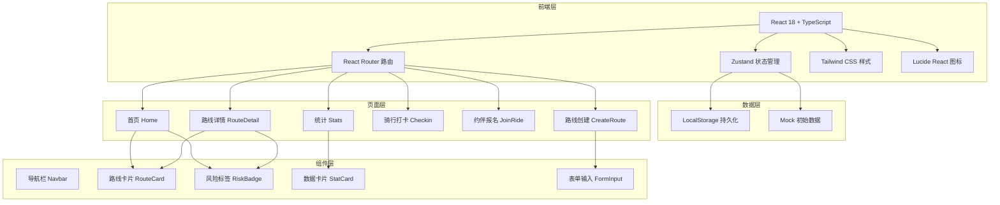
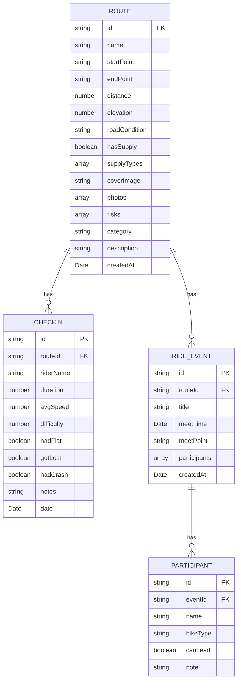

# 城市骑行路线打卡应用 - 技术架构文档

## 1. 架构设计



## 2. 技术描述

- **前端框架**：React 18 + TypeScript
- **构建工具**：Vite 5
- **路由**：react-router-dom 6
- **状态管理**：zustand 4
- **样式方案**：tailwindcss 3
- **图标库**：lucide-react
- **后端**：无（纯前端，LocalStorage 模拟）
- **数据库**：LocalStorage + Mock 数据

## 3. 路由定义

| 路由 | 页面 | 用途 |
|------|------|------|
| `/` | Home | 首页，路线分组展示 |
| `/create` | CreateRoute | 创建新路线 |
| `/route/:id` | RouteDetail | 路线详情页 |
| `/route/:id/checkin` | Checkin | 骑行打卡记录 |
| `/route/:id/join` | JoinRide | 约伴报名 |
| `/stats` | Stats | 数据统计页 |

## 4. 数据模型

### 4.1 实体关系图



### 4.2 类型定义

```typescript
// 路线分类
type RouteCategory = 'easy' | 'climbing' | 'night' | 'construction';

// 风险类型
type RiskType = 'tunnel_no_light' | 'heavy_traffic' | 'no_parking' | 'slippery_when_rain';

// 补给类型
type SupplyType = 'convenience_store' | 'water' | 'restroom' | 'bike_shop';

// 路况类型
type RoadCondition = 'asphalt' | 'concrete' | 'gravel' | 'mixed';

// 车型
type BikeType = 'road' | 'mountain' | 'hybrid' | 'folding' | 'city' | 'other';

interface Route {
  id: string;
  name: string;
  startPoint: string;
  endPoint: string;
  distance: number; // km
  elevation: number; // m
  roadCondition: RoadCondition;
  hasSupply: boolean;
  supplyTypes: SupplyType[];
  coverImage: string;
  photos: string[];
  risks: RiskType[];
  category: RouteCategory;
  description: string;
  createdAt: string;
}

interface Checkin {
  id: string;
  routeId: string;
  riderName: string;
  duration: number; // minutes
  avgSpeed: number; // km/h
  difficulty: 1 | 2 | 3 | 4 | 5;
  hadFlat: boolean;
  gotLost: boolean;
  hadCrash: boolean;
  notes: string;
  date: string;
}

interface Participant {
  id: string;
  eventId: string;
  name: string;
  bikeType: BikeType;
  canLead: boolean;
  note: string;
}

interface RideEvent {
  id: string;
  routeId: string;
  title: string;
  meetTime: string;
  meetPoint: string;
  participants: Participant[];
  createdAt: string;
}
```

## 5. 目录结构

```
src/
├── components/          # 可复用组件
│   ├── Navbar.tsx
│   ├── RouteCard.tsx
│   ├── RiskBadge.tsx
│   ├── StatCard.tsx
│   ├── CategoryTabs.tsx
│   └── FormField.tsx
├── pages/              # 页面组件
│   ├── Home.tsx
│   ├── CreateRoute.tsx
│   ├── RouteDetail.tsx
│   ├── Checkin.tsx
│   ├── JoinRide.tsx
│   └── Stats.tsx
├── store/              # Zustand store
│   └── useStore.ts
├── types/              # TypeScript 类型
│   └── index.ts
├── utils/              # 工具函数
│   ├── mockData.ts
│   ├── formatters.ts
│   └── constants.ts
├── App.tsx
├── main.tsx
└── index.css
```
