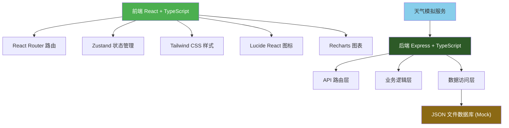
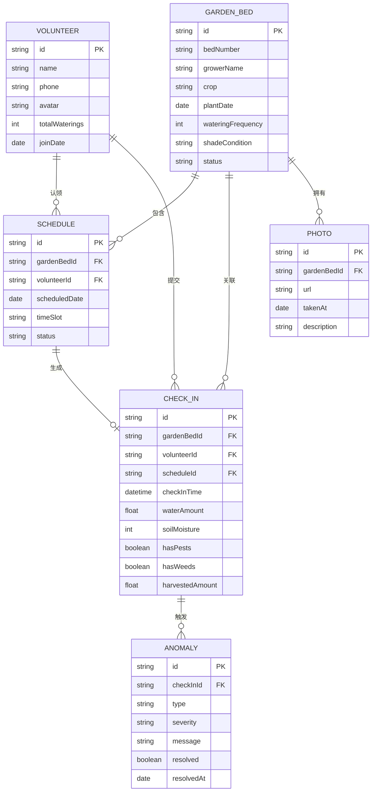

## 1. 架构设计



## 2. 技术描述

### 2.1 技术栈选型

- **前端**：React@18 + TypeScript + Vite
  - 状态管理：Zustand（轻量、简洁、TypeScript友好）
  - 路由：React Router DOM@6
  - 样式：Tailwind CSS@3
  - 图表：Recharts
  - 图标：Lucide React
  - 日期处理：date-fns

- **后端**：Express@4 + TypeScript
  - 使用 ESM 模块格式
  - 中间件：cors、express.json

- **数据存储**：JSON 文件数据库（模拟持久化）
  - 包含种子数据，开箱即用
  - 自动读写，无需额外数据库配置

- **初始化工具**：vite-init（react-express-ts 模板）

## 3. 目录结构

```
trae0601-1/
├── src/                          # 前端代码
│   ├── components/               # 通用组件
│   │   ├── Layout.tsx           # 布局组件
│   │   ├── GardenBedCard.tsx    # 菜畦卡片
│   │   ├── ScheduleCard.tsx     # 排班卡片
│   │   ├── StatCard.tsx         # 统计卡片
│   │   └── WeatherBanner.tsx    # 天气提示横幅
│   ├── pages/                    # 页面组件
│   │   ├── Dashboard.tsx        # 看板首页
│   │   ├── GardenBeds.tsx       # 菜畦档案
│   │   ├── Schedule.tsx         # 排班管理
│   │   ├── CheckIn.tsx          # 打卡记录
│   │   ├── Anomalies.tsx        # 异常中心
│   │   └── Profile.tsx          # 个人中心
│   ├── store/                    # 状态管理
│   │   └── useStore.ts          # Zustand store
│   ├── utils/                    # 工具函数
│   │   ├── dateUtils.ts         # 日期工具
│   │   ├── anomalyDetector.ts   # 异常检测
│   │   └── weatherService.ts    # 天气服务
│   ├── types/                    # 类型定义
│   │   └── index.ts             # 共享类型
│   ├── App.tsx                  # 根组件
│   ├── main.tsx                 # 入口文件
│   └── index.css                # 全局样式
├── api/                          # 后端代码
│   ├── routes/                   # API 路由
│   │   ├── gardenBeds.ts        # 菜畦相关接口
│   │   ├── schedules.ts         # 排班相关接口
│   │   ├── checkIns.ts          # 打卡相关接口
│   │   ├── anomalies.ts         # 异常相关接口
│   │   ├── volunteers.ts        # 志愿者相关接口
│   │   └── stats.ts             # 统计相关接口
│   ├── data/                     # 数据层
│   │   ├── db.json              # JSON 数据库
│   │   └── seedData.ts          # 种子数据
│   ├── services/                 # 业务逻辑
│   │   ├── anomalyService.ts    # 异常检测服务
│   │   └── weatherService.ts    # 天气服务
│   └── index.ts                 # 后端入口
├── shared/                       # 前后端共享
│   └── types.ts                 # 共享类型定义
├── vite.config.ts
├── tailwind.config.js
├── tsconfig.json
└── package.json
```

## 4. 路由定义

### 4.1 前端路由

| 路由路径 | 页面名称 | 说明 |
|---------|---------|------|
| / | 看板首页 | 默认路由，展示今日概览和统计 |
| /garden-beds | 菜畦档案 | 菜畦列表、新增、编辑、详情 |
| /schedule | 排班管理 | 排班日历、时段认领 |
| /check-in | 打卡记录 | 浇水打卡、数据录入 |
| /anomalies | 异常中心 | 异常列表、处理操作 |
| /profile | 个人中心 | 个人信息、贡献统计 |

### 4.2 API 路由

| 方法 | 路径 | 说明 |
|-----|------|------|
| GET | /api/garden-beds | 获取所有菜畦列表 |
| GET | /api/garden-beds/:id | 获取单个菜畦详情 |
| POST | /api/garden-beds | 新增菜畦 |
| PUT | /api/garden-beds/:id | 更新菜畦信息 |
| DELETE | /api/garden-beds/:id | 删除菜畦 |
| GET | /api/schedules | 获取排班列表（支持按日期筛选） |
| POST | /api/schedules/:id/claim | 志愿者认领时段 |
| GET | /api/check-ins | 获取打卡记录 |
| POST | /api/check-ins | 提交打卡记录（触发异常检测） |
| GET | /api/anomalies | 获取异常列表 |
| PUT | /api/anomalies/:id/resolve | 标记异常已处理 |
| GET | /api/volunteers | 获取志愿者列表 |
| GET | /api/stats/dashboard | 获取看板统计数据 |
| GET | /api/stats/water-usage | 获取用水统计数据 |
| GET | /api/weather | 获取当前天气状况 |

## 5. API 请求/响应示例

### 5.1 打卡提交

**请求**:
```typescript
POST /api/check-ins
{
  "gardenBedId": "gb-001",
  "volunteerId": "vol-001",
  "scheduleId": "sch-001",
  "waterAmount": 15,
  "soilMoisture": 72,
  "hasPests": false,
  "pestDetails": "",
  "hasWeeds": true,
  "weedLevel": "mild",
  "harvestedAmount": 0,
  "notes": "生长良好",
  "photoUrl": ""
}
```

**响应**:
```typescript
{
  "success": true,
  "data": {
    "id": "chk-123",
    "createdAt": "2026-06-19T10:30:00Z",
    "anomalies": [
      {
        "id": "anm-001",
        "type": "duplicate_watering",
        "severity": "warning",
        "message": "该菜畦4小时前已被浇水"
      }
    ]
  }
}
```

### 5.2 看板统计

**响应**:
```typescript
{
  "todaySchedules": {
    "total": 8,
    "completed": 3,
    "inProgress": 2,
    "unclaimed": 3
  },
  "anomaliesCount": 2,
  "waterUsageThisWeek": [
    { "date": "2026-06-13", "amount": 45 },
    { "date": "2026-06-14", "amount": 52 },
    { "date": "2026-06-15", "amount": 38 },
    { "date": "2026-06-16", "amount": 60 },
    { "date": "2026-06-17", "amount": 48 },
    { "date": "2026-06-18", "amount": 55 },
    { "date": "2026-06-19", "amount": 30 }
  ],
  "readyToHarvest": [
    { "id": "gb-003", "crop": "番茄", "expectedYield": 5, "plantDate": "2026-04-15" }
  ]
}
```

## 6. 数据模型

### 6.1 ER 图



### 6.2 TypeScript 类型定义

```typescript
// 菜畦
interface GardenBed {
  id: string;
  bedNumber: string;
  growerName: string;
  crop: string;
  plantDate: string;
  wateringFrequency: number;
  shadeCondition: 'full_sun' | 'partial_shade' | 'full_shade';
  status: 'seedling' | 'growing' | 'mature' | 'harvesting';
  photoUrl?: string;
  photos?: Photo[];
}

// 志愿者
interface Volunteer {
  id: string;
  name: string;
  phone: string;
  avatar?: string;
  totalWaterings: number;
  joinDate: string;
}

// 排班
interface Schedule {
  id: string;
  gardenBedId: string;
  volunteerId?: string;
  scheduledDate: string;
  timeSlot: 'morning' | 'afternoon' | 'evening';
  status: 'unclaimed' | 'claimed' | 'completed' | 'skipped';
}

// 打卡记录
interface CheckIn {
  id: string;
  gardenBedId: string;
  volunteerId: string;
  scheduleId?: string;
  checkInTime: string;
  waterAmount: number;
  soilMoisture: number;
  hasPests: boolean;
  pestDetails?: string;
  hasWeeds: boolean;
  weedLevel?: 'none' | 'mild' | 'moderate' | 'severe';
  harvestedAmount: number;
  notes?: string;
  photoUrl?: string;
}

// 异常记录
interface Anomaly {
  id: string;
  checkInId?: string;
  gardenBedId?: string;
  type: 'duplicate_watering' | 'missed_watering' | 'pest_infestation' | 'excessive_weeds';
  severity: 'info' | 'warning' | 'critical';
  message: string;
  resolved: boolean;
  resolvedAt?: string;
  resolvedBy?: string;
  createdAt: string;
}

// 天气
interface Weather {
  condition: 'sunny' | 'cloudy' | 'rainy' | 'hot';
  temperature: number;
  consecutiveHotDays: number;
  humidity: number;
}

// 统计数据
interface DashboardStats {
  todaySchedules: {
    total: number;
    completed: number;
    inProgress: number;
    unclaimed: number;
  };
  anomaliesCount: number;
  waterUsageThisWeek: { date: string; amount: number }[];
  readyToHarvest: GardenBed[];
  cropGrowthStatus: { gardenBed: GardenBed; growthProgress: number }[];
}
```

## 7. 核心业务逻辑

### 7.1 异常检测规则

1. **重复浇水检测**：
   - 检查当前菜畦在过去4小时内是否已有打卡记录
   - 若有，则生成 `duplicate_watering` 异常，级别为 `warning`

2. **漏浇检测**：
   - 每日凌晨扫描所有菜畦
   - 检查自上次浇水后是否已超过 `wateringFrequency * 24` 小时
   - 若是，则生成 `missed_watering` 异常，级别为 `warning`
   - 超过2倍频率未浇水，级别升级为 `critical`

3. **病虫害检测**：
   - 打卡时 `hasPests = true` 且 `pestDetails` 包含特定关键词
   - 或连续2次打卡都报告有虫害
   - 生成 `pest_infestation` 异常，级别为 `warning` 或 `critical`

4. **杂草过多检测**：
   - 打卡时 `weedLevel = severe`
   - 或连续2次打卡 `weedLevel = moderate`
   - 生成 `excessive_weeds` 异常，级别为 `info` 或 `warning`

### 7.2 智能提醒规则

1. **下雨天跳过提醒**：
   - 当天气 `condition = rainy`
   - 今日排班自动标记为可跳过
   - 显示蓝色提示横幅："今日有雨，可跳过浇水 💧"

2. **高温加密提醒**：
   - 当 `temperature >= 35°C` 且 `consecutiveHotDays >= 2`
   - 浇水频率自动临时加倍
   - 显示橙色提示横幅："连续高温，建议增加浇水频率 ☀️"
   - 排班表自动增加额外时段

3. **生长进度计算**：
   - 根据作物类型和播种日期计算生长天数
   - 进度 = (当前日期 - 播种日期) / 作物生长周期 * 100%
   - 常见作物生长周期：番茄60天、黄瓜45天、生菜30天、辣椒70天
