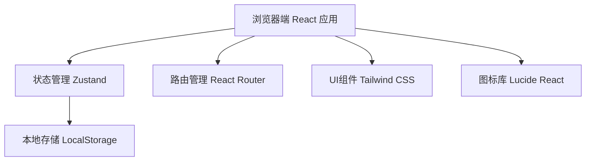
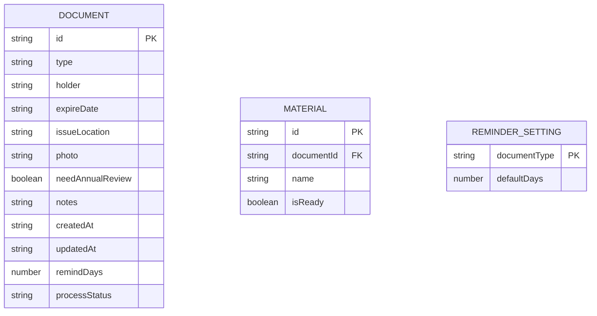

## 1. 架构设计



## 2. 技术描述
- **前端框架**: React@18 + TypeScript
- **构建工具**: Vite@5
- **样式方案**: TailwindCSS@3
- **状态管理**: Zustand
- **路由管理**: React Router DOM@6
- **图标库**: Lucide React
- **数据持久化**: LocalStorage
- **无后端**: 纯前端应用，数据本地存储

## 3. 路由定义
| 路由 | 页面 | 用途 |
|------|------|------|
| `/` | 首页 | 证件分组展示、快速添加 |
| `/document/:id` | 证件详情 | 查看证件详情、设置提醒、追踪进度、管理材料 |
| `/add` | 添加证件 | 添加新证件表单 |
| `/edit/:id` | 编辑证件 | 编辑已有证件信息 |
| `/statistics` | 统计页 | 证件统计、风险分析 |
| `/settings` | 设置页 | 全局提醒设置 |

## 4. 数据模型

### 4.1 数据模型定义



### 4.2 TypeScript 类型定义

```typescript
type DocumentType = 'id_card' | 'passport' | 'driver_license' | 'hk_macau_permit' | 'bank_card' | 'other';

type ProcessStatus = 'not_started' | 'appointment' | 'submitted' | 'waiting' | 'completed';

interface Document {
  id: string;
  type: DocumentType;
  holder: string;
  expireDate: string;
  issueLocation: string;
  photo: string;
  needAnnualReview: boolean;
  notes: string;
  createdAt: string;
  updatedAt: string;
  remindDays: number;
  processStatus: ProcessStatus;
}

interface Material {
  id: string;
  documentId: string;
  name: string;
  isReady: boolean;
}

interface ReminderSetting {
  documentType: DocumentType;
  defaultDays: number;
}

type DocumentStatus = 'expired' | 'expiring_soon' | 'valid' | 'long_term';
```

### 4.3 证件类型默认提醒天数
| 证件类型 | 类型值 | 默认提醒天数 |
|---------|--------|-------------|
| 身份证 | id_card | 90 |
| 护照 | passport | 180 |
| 驾照 | driver_license | 30 |
| 港澳通行证 | hk_macau_permit | 60 |
| 银行卡 | bank_card | 30 |
| 其他 | other | 30 |

### 4.4 办理进度状态
| 状态值 | 显示名称 | 说明 |
|--------|----------|------|
| not_started | 未开始 | 未开始办理 |
| appointment | 已预约 | 已预约办理 |
| submitted | 已提交材料 | 已提交申请材料 |
| waiting | 等待领取 | 审核通过，等待领取 |
| completed | 已拿到 | 已领取新证件 |
