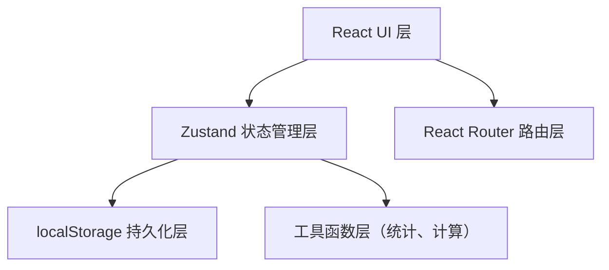
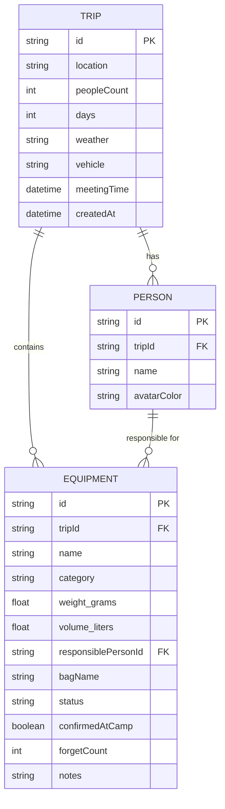

## 1. 架构设计

纯前端单页应用，使用 localStorage 进行本地持久化存储，无需后端服务。



## 2. 技术描述
- **前端框架**：React@18 + TypeScript
- **构建工具**：Vite
- **路由**：react-router-dom@6
- **状态管理**：zustand
- **样式方案**：TailwindCSS@3
- **图标库**：lucide-react
- **数据持久化**：localStorage（zustand persist 中间件）
- **图表**：纯 CSS 实现（避免额外依赖）

## 3. 路由定义
| 路由 | 用途 |
|------|------|
| `/` | 首页 - 装备状态看板 |
| `/plan` | 露营计划创建/编辑 |
| `/equipment` | 装备管理（分类展示与增删改） |
| `/checklist` | 分包清单 - 出发前打包/营地归位勾选 |
| `/statistics` | 统计页面 |

## 4. 数据模型

### 4.1 数据模型定义



### 4.2 TypeScript 类型定义

```typescript
// 装备分类
type EquipmentCategory = 'tent' | 'sleep' | 'cooking' | 'lighting' | 'firstaid' | 'entertainment';

// 装备状态
type EquipmentStatus = 'unassigned' | 'packed' | 'in_car' | 'at_risk';

interface Trip {
  id: string;
  location: string;
  peopleCount: number;
  days: number;
  weather: string;
  vehicle: string;
  meetingTime: string; // ISO datetime
  createdAt: string;
}

interface Person {
  id: string;
  tripId: string;
  name: string;
  avatarColor: string;
}

interface Equipment {
  id: string;
  tripId: string;
  name: string;
  category: EquipmentCategory;
  weightGrams: number;
  volumeLiters: number;
  responsiblePersonId: string | null;
  bagName: string | null;
  status: EquipmentStatus;
  confirmedAtCamp: boolean;
  forgetCount: number;
  notes: string;
}

interface AppState {
  currentTripId: string | null;
  trips: Trip[];
  people: Person[];
  equipment: Equipment[];
}
```

## 5. 文件结构

```
src/
├── components/          # 可复用组件
│   ├── layout/         # 布局组件（导航、页头等）
│   ├── equipment/      # 装备相关组件
│   ├── plan/           # 计划相关组件
│   └── stats/          # 统计相关组件
├── hooks/              # 自定义 hooks
├── pages/              # 页面组件
│   ├── Dashboard.tsx
│   ├── Plan.tsx
│   ├── Equipment.tsx
│   ├── Checklist.tsx
│   └── Statistics.tsx
├── store/              # zustand store
│   └── useStore.ts
├── types/              # TypeScript 类型定义
│   └── index.ts
├── utils/              # 工具函数
│   ├── statistics.ts
│   └── formatters.ts
├── App.tsx
├── main.tsx
└── index.css
```

## 6. Zustand Store 设计

```typescript
// store/useStore.ts
interface StoreState {
  // 数据
  currentTripId: string | null;
  trips: Trip[];
  people: Person[];
  equipment: Equipment[];
  
  // Trip actions
  createTrip: (data: Omit<Trip, 'id' | 'createdAt'>) => void;
  updateTrip: (id: string, data: Partial<Trip>) => void;
  setCurrentTrip: (id: string) => void;
  
  // Person actions
  addPerson: (name: string) => void;
  removePerson: (id: string) => void;
  updatePerson: (id: string, data: Partial<Person>) => void;
  
  // Equipment actions
  addEquipment: (data: Omit<Equipment, 'id' | 'tripId' | 'forgetCount' | 'status' | 'confirmedAtCamp'>) => void;
  updateEquipment: (id: string, data: Partial<Equipment>) => void;
  removeEquipment: (id: string) => void;
  setEquipmentStatus: (id: string, status: EquipmentStatus) => void;
  toggleConfirmedAtCamp: (id: string) => void;
  
  // Derived selectors
  getEquipmentByStatus: (status: EquipmentStatus) => Equipment[];
  getEquipmentByPerson: (personId: string) => Equipment[];
  getEquipmentByBag: () => Record<string, Equipment[]>;
}
```
