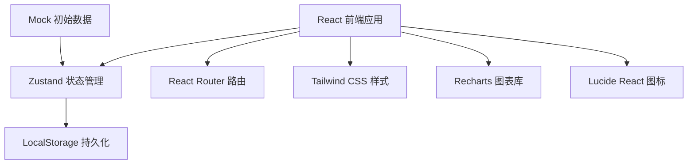
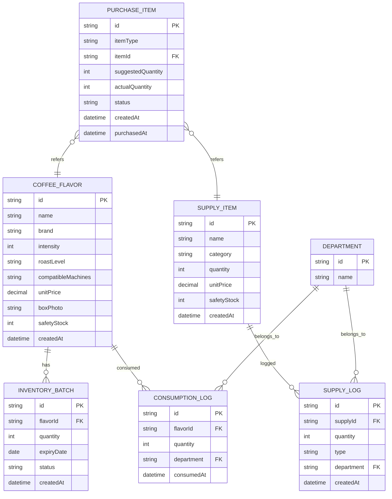

## 1. 架构设计



本项目为纯前端单页应用，无需后端服务。数据通过 localStorage 持久化存储，状态管理使用 Zustand，图表展示使用 Recharts。

## 2. 技术描述

- **前端**：React@18 + TypeScript@5 + Vite@5
- **状态管理**：Zustand@4
- **路由**：React Router DOM@6
- **样式**：Tailwind CSS@3
- **图表**：Recharts@2
- **图标**：Lucide React@0.344
- **数据持久化**：LocalStorage
- **初始化工具**：vite-init
- **后端**：无（纯前端应用）
- **数据库**：LocalStorage（内置 Mock 数据）

## 3. 路由定义

| 路由 | 页面 | 用途 |
|------|------|------|
| / | Dashboard | 库存总览，快速取用入口，低库存预警 |
| /flavors | FlavorProfile | 咖啡口味档案管理 |
| /consume | ConsumeRegister | 取用登记页面 |
| /supplies | SuppliesManage | 配套物品（清洁片、除垢剂、纸杯）管理 |
| /statistics | Statistics | 统计分析页面 |
| /purchase | PurchaseList | 采购清单页面 |

## 4. 数据模型

### 4.1 ER 图



### 4.2 TypeScript 类型定义

```typescript
// 咖啡口味
interface CoffeeFlavor {
  id: string;
  name: string;
  brand: string;
  intensity: number; // 1-12
  roastLevel: 'light' | 'medium' | 'dark';
  compatibleMachines: string[];
  unitPrice: number;
  boxPhoto: string;
  safetyStock: number;
  createdAt: string;
}

// 库存批次（支持多批次管理保质期）
interface InventoryBatch {
  id: string;
  flavorId: string;
  quantity: number;
  expiryDate: string; // YYYY-MM-DD
  status: 'normal' | 'expired' | 'damp';
  createdAt: string;
}

// 取用记录
interface ConsumptionLog {
  id: string;
  flavorId: string;
  quantity: number;
  department: string;
  consumedAt: string;
}

// 配套物品
interface SupplyItem {
  id: string;
  name: string;
  category: 'cleaning' | 'descaler' | 'cups' | 'other';
  quantity: number;
  unitPrice: number;
  safetyStock: number;
  expiryDate?: string;
  createdAt: string;
}

// 配套物品记录
interface SupplyLog {
  id: string;
  supplyId: string;
  quantity: number;
  type: 'consume' | 'restock';
  department?: string;
  createdAt: string;
}

// 部门
interface Department {
  id: string;
  name: string;
}

// 采购清单项
interface PurchaseItem {
  id: string;
  itemType: 'coffee' | 'supply';
  itemId: string;
  suggestedQuantity: number;
  actualQuantity: number;
  status: 'pending' | 'ordered' | 'received';
  createdAt: string;
  purchasedAt?: string;
  receivedAt?: string;
}

// 统计数据
interface StatisticsData {
  popularFlavors: { flavorId: string; name: string; total: number }[];
  departmentConsumption: { department: string; total: number; cost: number }[];
  weeklyCost: { week: string; cost: number }[];
  expiringItems: { id: string; name: string; daysLeft: number; quantity: number }[];
  purchaseSuggestions: { id: string; name: string; currentStock: number; avgWeeklyConsumption: number; suggestedOrder: number }[];
}
```

## 5. 项目结构

```
src/
├── components/          # 可复用组件
│   ├── layout/         # 布局组件（导航、侧边栏）
│   ├── ui/             # 基础 UI 组件（按钮、卡片、表单）
│   └── charts/         # 图表组件
├── pages/              # 页面组件
│   ├── Dashboard.tsx
│   ├── FlavorProfile.tsx
│   ├── ConsumeRegister.tsx
│   ├── SuppliesManage.tsx
│   ├── Statistics.tsx
│   └── PurchaseList.tsx
├── store/              # Zustand 状态管理
│   ├── useCoffeeStore.ts
│   ├── useSupplyStore.ts
│   └── usePurchaseStore.ts
├── types/              # TypeScript 类型定义
│   └── index.ts
├── utils/              # 工具函数
│   ├── storage.ts      # localStorage 封装
│   ├── date.ts         # 日期处理
│   └── statistics.ts   # 统计计算
├── data/               # Mock 初始数据
│   └── mockData.ts
├── App.tsx
├── main.tsx
└── index.css
```

## 6. 核心业务逻辑

### 6.1 库存扣减逻辑
1. 按批次先进先出（FIFO）扣减库存
2. 优先扣减即将过期的批次
3. 扣减后检查是否低于安全库存，是则自动加入采购清单

### 6.2 采购建议算法
```
建议下单量 = MAX(安全库存 * 2 - 当前库存, 每周平均消耗量 * 2)
```
- 安全库存 * 2：保证两周用量
- 每周平均消耗 * 2：基于历史数据预测两周需求
- 取两者较大值作为建议下单量

### 6.3 保质期预警
- 过期：expiryDate < today
- 即将过期：0 < (expiryDate - today) <= 30 天
- 受潮：手动标记状态

### 6.4 数据持久化
- 状态变化时自动同步到 localStorage
- 应用启动时从 localStorage 恢复数据
- 首次使用时加载 Mock 数据初始化
