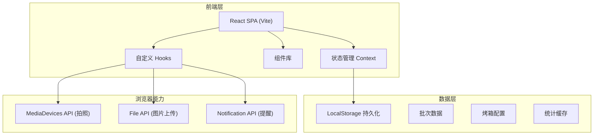
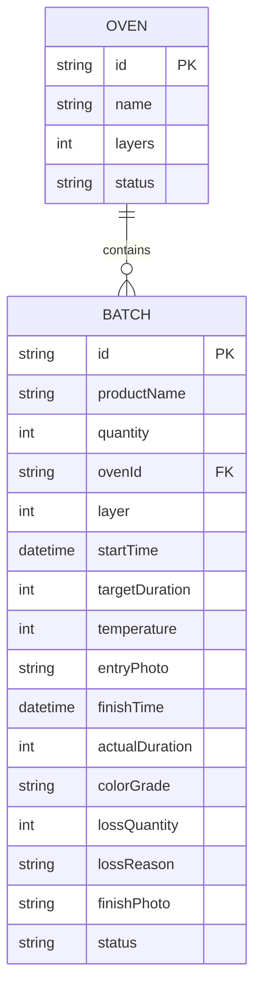

## 1. 架构设计



## 2. 技术描述

- **前端框架**: React@18 + TypeScript
- **构建工具**: Vite@5
- **样式方案**: TailwindCSS@3 + CSS Variables
- **状态管理**: React Context + useReducer
- **图表库**: Recharts
- **图标**: React Icons (LineAwesome)
- **数据持久化**: LocalStorage + 自定义 Hook
- **后端**: 无（纯前端单机应用）
- **数据库**: 无（LocalStorage 存储）

## 3. 目录结构

```
src/
├── components/
│   ├── OvenStatus/          # 烤箱状态可视化
│   ├── BatchCard/           # 批次倒计时卡片
│   ├── BatchForm/           # 新建批次表单
│   ├── FinishForm/          # 出炉记录表单
│   ├── StatsPanel/          # 统计报表
│   ├── StatsOverview/       # 统计概览卡片
│   ├── CameraCapture/       # 拍照/上传组件
│   ├── StarRating/          # 星级评分
│   └── Header/              # 顶部导航
├── context/
│   └── BatchContext.tsx     # 全局状态管理
├── hooks/
│   ├── useCountdown.ts      # 倒计时 Hook
│   ├── useLocalStorage.ts   # LocalStorage Hook
│   └── useCamera.ts         # 摄像头 Hook
├── types/
│   └── index.ts             # TypeScript 类型定义
├── utils/
│   ├── time.ts              # 时间工具
│   └── stats.ts             # 统计计算
├── data/
│   └── mockData.ts          # 初始 mock 数据
├── App.tsx
├── main.tsx
└── index.css
```

## 4. 数据模型

### 4.1 ER 图



### 4.2 类型定义

```typescript
interface Oven {
  id: string;
  name: string;
  layers: number;
  status: 'active' | 'inactive';
}

interface Batch {
  id: string;
  productName: string;
  quantity: number;
  ovenId: string;
  layer: number;
  startTime: string;
  targetDuration: number;
  temperature: number;
  entryPhoto?: string;
  finishTime?: string;
  actualDuration?: number;
  colorGrade?: 'light' | 'good' | 'dark' | 'burnt';
  lossQuantity?: number;
  lossReason?: string;
  finishPhoto?: string;
  status: 'baking' | 'finished';
}

type ColorGrade = 'light' | 'good' | 'dark' | 'burnt';
```

## 5. 核心状态管理

使用 React Context + useReducer 管理全局状态：

- `ovens`: 烤箱列表
- `batches`: 所有批次
- `activeBatches`: 进行中批次（派生）
- `finishedBatches`: 已完成批次（派生）

## 6. 关键逻辑说明

### 6.1 烤箱层位占用校验
- 新建批次时，过滤掉 `ovenId + layer` 已被 `status: 'baking'` 批次占用的选项
- 确保同一层同一时间只显示一个批次

### 6.2 倒计时变色规则
- 剩余 > 20%: 绿色边框/背景 (`#43A047`)
- 剩余 10%-20%: 橙色边框/背景 + 轻微闪烁 (`#FF8C42`)
- 剩余 < 10% 或已超时: 红色边框/背景 + 强烈闪烁 (`#E53935`)

### 6.3 统计计算
- 报损排行: 按 `productName` 聚合 `lossQuantity`，降序排列
- 平均超时: `(actualDuration - targetDuration)` 平均值
- 烤箱利用率: 每台烤箱当日 `actualDuration` 总和 / (工作时长假设 12h)
