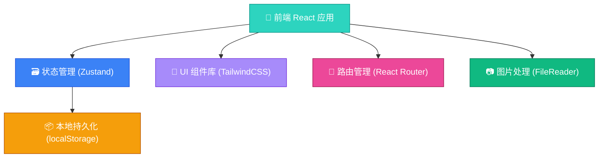
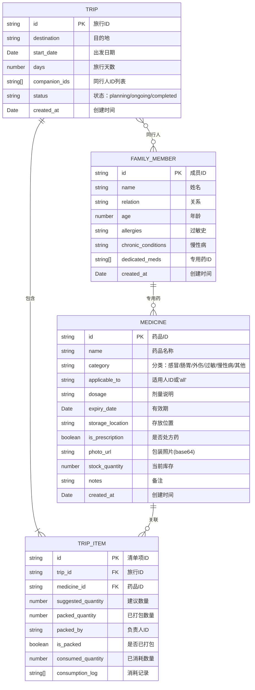

## 1. 架构设计



---

## 2. 技术选型说明

| 层级 | 技术 | 版本 | 选择理由 |
|------|------|------|----------|
| 前端框架 | React | ^18.2 | 组件化开发，生态成熟，适合复杂交互 |
| 构建工具 | Vite | ^5.0 | 开发启动快，HMR 体验优秀 |
| 语言 | TypeScript | ^5.3 | 类型安全，降低运行时 Bug |
| 样式 | TailwindCSS | ^3.4 | 原子化CSS，设计系统一致性好 |
| 路由 | react-router-dom | ^6.21 | 声明式路由，支持嵌套路由 |
| 状态管理 | zustand | ^4.4 | 轻量、简单、无需 Provider，支持持久化中间件 |
| 图标 | lucide-react | ^0.294 | 现代线性图标，风格统一 |

---

## 3. 路由定义

| 路由路径 | 页面名称 | 主要功能 |
|----------|----------|----------|
| `/` | 仪表盘首页 | 快速入口、即将出发的旅行、库存预警 |
| `/medicines` | 药品档案列表 | 药品CRUD、筛选、有效期预警 |
| `/medicines/new` | 新建药品 | 填写药品信息表单 |
| `/medicines/:id/edit` | 编辑药品 | 修改已有药品信息 |
| `/family` | 家庭成员管理 | 成员CRUD、健康信息录入 |
| `/trips` | 旅行列表 | 查看所有旅行、创建新旅行入口 |
| `/trips/new` | 新建旅行向导 | 分步骤填写、生成建议清单 |
| `/trips/:id` | 旅行详情（打包） | 清单勾选、数量/负责人、消耗登记 |
| `/trips/:id/summary` | 旅行汇总统计 | 缺药/专用药/补货清单 |

---

## 4. 数据模型

### 4.1 ER 图



### 4.2 TypeScript 类型定义

```typescript
// 家庭成员
interface FamilyMember {
  id: string;
  name: string;
  relation: string;
  age: number;
  allergies: string;
  chronicConditions: string;
  dedicatedMedicineIds: string[];
  createdAt: string;
}

// 药品分类
type MedicineCategory = 
  | 'cold'        // 感冒退烧
  | 'gastro'      // 肠胃
  | 'trauma'      // 外伤
  | 'allergy'     // 过敏
  | 'chronic'     // 慢性病
  | 'motion'      // 晕车晕船
  | 'other';      // 其他

// 药品档案
interface Medicine {
  id: string;
  name: string;
  category: MedicineCategory;
  applicableTo: string; // 'all' 或 FamilyMember.id
  dosage: string;
  expiryDate: string; // ISO date string
  storageLocation: string;
  isPrescription: boolean;
  photoUrl: string; // base64 or empty
  stockQuantity: number;
  notes: string;
  createdAt: string;
}

// 旅行状态
type TripStatus = 'planning' | 'ongoing' | 'completed';

// 旅行
interface Trip {
  id: string;
  destination: string;
  startDate: string;
  days: number;
  companionIds: string[];
  status: TripStatus;
  createdAt: string;
}

// 消耗记录
interface ConsumptionLog {
  id: string;
  type: 'used' | 'lost';
  quantity: number;
  note: string;
  timestamp: string;
}

// 旅行清单项
interface TripItem {
  id: string;
  tripId: string;
  medicineId: string;
  suggestedQuantity: number;
  packedQuantity: number;
  packedBy: string; // FamilyMember.id
  isPacked: boolean;
  consumedQuantity: number;
  consumptionLog: ConsumptionLog[];
}

// App 全局状态
interface AppState {
  familyMembers: FamilyMember[];
  medicines: Medicine[];
  trips: Trip[];
  tripItems: TripItem[];
}
```

---

## 5. 核心工具函数

### 5.1 建议清单生成算法

```typescript
function generateSuggestedTripItems(
  trip: Trip,
  companions: FamilyMember[],
  allMedicines: Medicine[]
): { medicineId: string; suggestedQuantity: number }[] {
  const suggestions: { medicineId: string; suggestedQuantity: number }[] = [];
  
  // 1. 基础常备药（按天数计算）
  const basicCategories: MedicineCategory[] = ['cold', 'gastro', 'trauma', 'allergy'];
  const perDayMultiplier = Math.ceil(trip.days / 3);
  
  basicCategories.forEach(cat => {
    const meds = allMedicines.filter(
      m => m.category === cat && m.applicableTo === 'all' && !isExpired(m)
    );
    if (meds.length > 0) {
      // 取该分类库存最多的一个
      const selected = meds.reduce((a, b) => 
        a.stockQuantity > b.stockQuantity ? a : b
      );
      suggestions.push({
        medicineId: selected.id,
        suggestedQuantity: Math.max(1, perDayMultiplier)
      });
    }
  });
  
  // 2. 晕车药（如果旅行天数>1 或目的地含"飞机"/"车程"关键词）
  const motionMeds = allMedicines.filter(
    m => m.category === 'motion' && !isExpired(m)
  );
  if (trip.days > 1 && motionMeds.length > 0) {
    const selected = motionMeds[0];
    suggestions.push({
      medicineId: selected.id,
      suggestedQuantity: Math.max(2, companions.length)
    });
  }
  
  // 3. 每位同行人的专用药 + 慢性病药
  companions.forEach(member => {
    // 专用药
    member.dedicatedMedicineIds.forEach(medId => {
      const med = allMedicines.find(m => m.id === medId);
      if (med && !isExpired(med)) {
        suggestions.push({
          medicineId: medId,
          suggestedQuantity: trip.days // 每天一份
        });
      }
    });
    
    // 慢性病药
    const chronicMeds = allMedicines.filter(
      m => m.category === 'chronic' && 
           (m.applicableTo === member.id || m.applicableTo === 'all') &&
           !isExpired(m)
    );
    chronicMeds.forEach(med => {
      const existing = suggestions.find(s => s.medicineId === med.id);
      if (!existing) {
        suggestions.push({
          medicineId: med.id,
          suggestedQuantity: trip.days + 2 // 多带2天备用
        });
      }
    });
    
    // 过敏史 → 过敏药加倍
    if (member.allergies.trim()) {
      const allergyMeds = suggestions.filter(s => {
        const med = allMedicines.find(m => m.id === s.medicineId);
        return med?.category === 'allergy';
      });
      allergyMeds.forEach(m => {
        m.suggestedQuantity = Math.ceil(m.suggestedQuantity * 1.5);
      });
    }
  });
  
  return suggestions;
}
```

### 5.2 状态检查工具函数

```typescript
// 检查是否过期
function isExpired(medicine: Medicine): boolean {
  return new Date(medicine.expiryDate) < new Date();
}

// 检查是否临期（30天内）
function isExpiringSoon(medicine: Medicine, days = 30): boolean {
  const threshold = new Date();
  threshold.setDate(threshold.getDate() + days);
  const expiry = new Date(medicine.expiryDate);
  return expiry >= new Date() && expiry <= threshold;
}

// 获取药品状态
function getMedicineStatus(medicine: Medicine): 'normal' | 'expiring' | 'expired' {
  if (isExpired(medicine)) return 'expired';
  if (isExpiringSoon(medicine)) return 'expiring';
  return 'normal';
}

// 计算补货数量
function calculateRestock(medicine: Medicine, tripItems: TripItem[]): number {
  const totalConsumed = tripItems
    .filter(ti => ti.medicineId === medicine.id)
    .reduce((sum, ti) => sum + ti.consumedQuantity, 0);
  const minStock = 5; // 最低库存阈值
  const currentAfter = medicine.stockQuantity;
  if (currentAfter < minStock) {
    return minStock - currentAfter + totalConsumed;
  }
  return totalConsumed;
}
```

---

## 6. 项目目录结构

```
src/
├── main.tsx                 # 应用入口
├── App.tsx                  # 根组件 + 路由
├── index.css                # 全局样式 + Tailwind
├── store/
│   └── useAppStore.ts       # Zustand 全局状态
├── types/
│   └── index.ts             # TypeScript 类型定义
├── utils/
│   ├── date.ts              # 日期处理
│   ├── medicine.ts          # 药品状态/建议算法
│   └── id.ts                # ID 生成器
├── data/
│   └── mockData.ts          # 初始演示数据
├── components/
│   ├── layout/
│   │   ├── Layout.tsx       # 主布局（侧边栏/内容区）
│   │   └── NavLink.tsx
│   ├── medicines/
│   │   ├── MedicineCard.tsx
│   │   ├── MedicineForm.tsx
│   │   └── MedicineFilter.tsx
│   ├── family/
│   │   ├── MemberCard.tsx
│   │   └── MemberForm.tsx
│   ├── trips/
│   │   ├── TripCard.tsx
│   │   ├── TripWizard.tsx
│   │   ├── PackingList.tsx
│   │   ├── PackingItem.tsx
│   │   └── SummaryPanel.tsx
│   └── common/
│       ├── Button.tsx
│       ├── Modal.tsx
│       ├── Badge.tsx
│       ├── StatusTag.tsx
│       └── EmptyState.tsx
└── pages/
    ├── Dashboard.tsx
    ├── Medicines.tsx
    ├── MedicineEdit.tsx
    ├── Family.tsx
    ├── Trips.tsx
    ├── TripNew.tsx
    ├── TripDetail.tsx
    └── TripSummary.tsx
```

---
