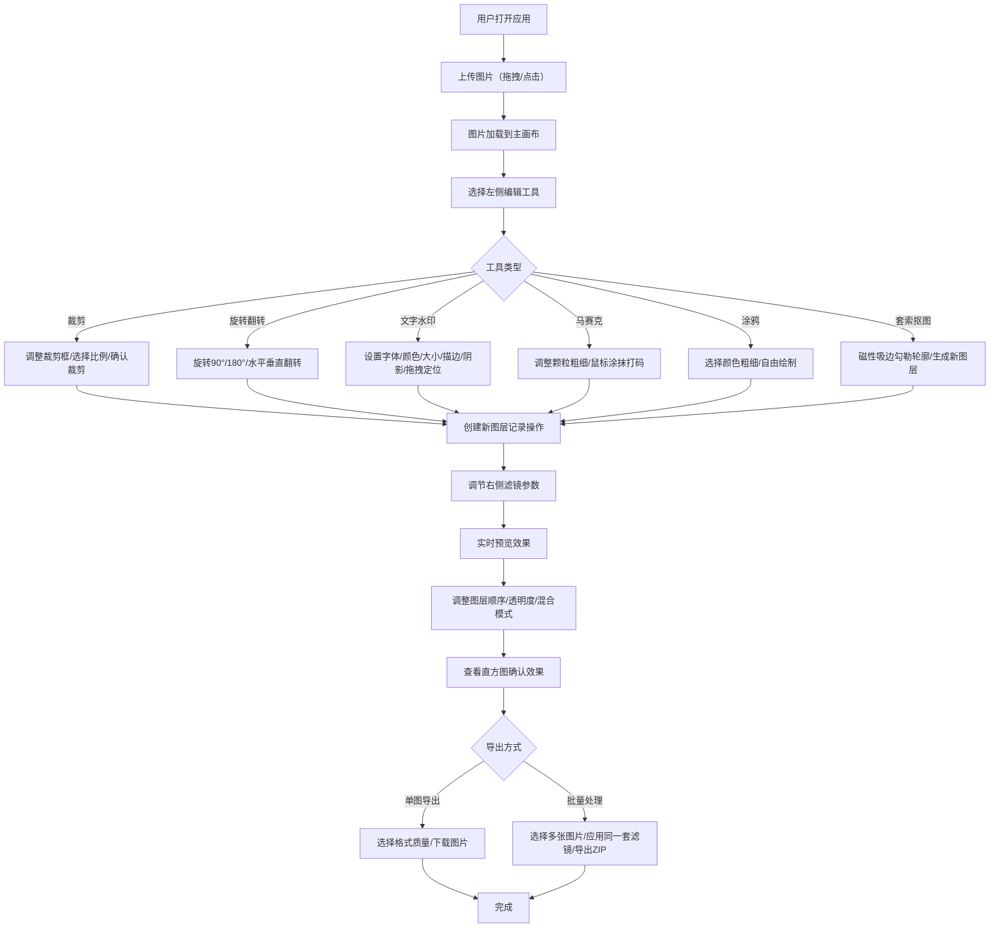

## 1. 产品概述

网页版简化版Photoshop，基于Canvas API和ImageData实现的专业图片处理工具。核心价值在于提供无需安装、轻量高效的在线图片编辑体验，满足日常图片处理需求。

- 主要用途：图片裁剪、调色、加水印、涂鸦、抠图等基础到进阶的图片处理
- 目标用户：需要快速处理图片的设计师、运营人员、普通用户
- 核心优势：纯前端实现，无需上传服务器，保护隐私；支持批量处理；图层化编辑

## 2. 核心功能

### 2.1 用户角色

| 角色 | 注册方式 | 核心权限 |
|------|----------|----------|
| 普通用户 | 无需注册 | 使用所有编辑功能，导出处理后的图片 |

### 2.2 功能模块

1. **主画布区**：图片显示、拖拽上传、实时预览
2. **左侧工具栏**：裁剪、旋转、翻转、文字水印、马赛克、涂鸦、套索抠图
3. **右侧滤镜面板**：亮度、对比度、饱和度、色调、模糊、锐化、灰度、反色、怀旧、Lomo
4. **顶部图层管理**：图层列表、顺序调整、透明度、混合模式、锁定、删除
5. **直方图面板**：RGB三通道分布可视化
6. **导出模块**：单图导出、批量处理、ZIP下载

### 2.3 页面详情

| 页面名称 | 模块名称 | 功能描述 |
|----------|----------|----------|
| 编辑器主页 | 上传模块 | 支持拖拽上传、点击选择，支持JPG/PNG/WebP格式 |
| 编辑器主页 | 主画布 | 显示当前图片，支持缩放平移，实时渲染所有图层效果 |
| 编辑器主页 | 左侧工具栏 | 7种编辑工具，每种工具配有参数调节面板 |
| 编辑器主页 | 右侧滤镜面板 | 10种滤镜滑块调节，实时预览，支持多滤镜叠加 |
| 编辑器主页 | 顶部图层列表 | 显示所有图层，支持拖拽排序、透明度调节、混合模式切换、锁定、删除 |
| 编辑器主页 | 直方图面板 | 实时显示RGB三通道像素分布 |
| 编辑器主页 | 导出面板 | 选择导出格式（JPG/PNG/WebP）、质量，批量处理多张图片导出ZIP |
| 编辑器主页 | 撤销重做 | 按图层独立维护历史记录，支持Ctrl+Z/Ctrl+Y快捷键 |

## 3. 核心流程

## 4. 用户界面设计

### 4.1 设计风格

**专业深色主题**，类似专业图像处理软件的视觉风格：
- 主色调：深灰 `#1a1a1a` 作为背景，中灰 `#2d2d2d` 作为面板背景
- 强调色：科技蓝 `#3b82f6` 用于选中状态和操作按钮
- 文字色：浅灰 `#e5e5e5` 主文字，`#a3a3a3` 辅助文字
- 按钮风格：扁平化圆角按钮，4px圆角，悬停时微提亮
- 字体：系统等宽字体 + 无衬线字体组合，代码感和专业感
- 布局风格：三栏布局，左工具-中画布-右滤镜，顶部图层条
- 图标风格：线性简约图标，来自lucide-react

### 4.2 页面设计概述

| 页面名称 | 模块名称 | UI元素 |
|----------|----------|----------|
| 编辑器主页 | 主画布区 | 居中画布，棋盘格透明背景，可拖拽虚线边框上传提示 |
| 编辑器主页 | 左侧工具栏 | 64px宽垂直工具条，图标+文字tooltip，选中项高亮蓝边 |
| 编辑器主页 | 工具参数面板 | 工具条右侧弹出面板，滑块、色板、输入框 |
| 编辑器主页 | 右侧滤镜面板 | 280px宽面板，每个滤镜配滑块和数值显示 |
| 编辑器主页 | 顶部图层条 | 水平图层缩略图列表，拖拽排序，右键菜单 |
| 编辑器主页 | 直方图面板 | 可折叠面板，三通道彩色波形图 |
| 编辑器主页 | 导出区域 | 右上角导出按钮，点击弹出导出选项 |

### 4.3 响应式

- 桌面端优先设计，最小支持1280px宽度
- 三栏固定宽度布局，中间画布区自适应
- 移动端简化为单栏布局，工具和滤镜改为底部/顶部可滑动面板

### 4.4 交互细节

- 画布支持滚轮缩放、空格拖拽平移
- 所有滑块调节实时预览
- 文字水印支持直接在画布上拖拽定位
- 裁剪框支持8个方向拖拽调整
- 图层支持拖拽调整顺序
- 快捷键支持：Ctrl+Z撤销、Ctrl+Y重做、Ctrl+S导出
