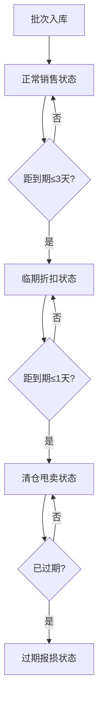

## 1. 产品概述

临期酸奶促销看板是一款面向便利小店的智能库存管理系统，旨在解决酸奶临期才打折导致的亏损和过期报损问题。系统通过自动监控批次保质期、智能建议折扣、先进先出销售扣减和数据统计分析，帮助小店最大化销售收入、减少报损。

- 核心目标：降低酸奶过期报损率，提升促销转化率
- 目标用户：便利小店经营者、收银员、库存管理员
- 市场价值：以低成本数字化方案解决实体小店的临期商品管理痛点

## 2. 核心功能

### 2.1 用户角色

| 角色 | 注册方式 | 核心权限 |
|------|----------|----------|
| 店长 | 默认账号 | 全部功能：商品管理、入库、销售、统计、设置 |
| 收银员 | 店长分配 | 销售收银、查看库存、商品查询 |

### 2.2 功能模块

1. **商品档案管理**：品牌、口味、规格、进货价、售价、保质期、冷藏位置、商品照片
2. **批次入库管理**：按批次记录数量、生产日期、到期日、供应商
3. **智能定价引擎**：距到期3天自动建议折扣、距到期1天转清仓价、过期自动下架报损
4. **收银销售系统**：扫码/选品销售、先进先出扣减批次库存、销售小票
5. **数据统计看板**：临期库存概览、促销效果分析、报损金额统计、热销口味排行、进货建议

### 2.3 页面详情

| 页面名称 | 模块名称 | 功能描述 |
|----------|----------|----------|
| 仪表盘首页 | 数据概览卡片 | 今日销售额、临期预警数、今日报损、库存总量 |
| 仪表盘首页 | 临期预警列表 | 展示即将到期商品，按紧急程度排序 |
| 仪表盘首页 | 快捷操作区 | 快速入库、快速收银入口 |
| 商品档案页 | 商品列表 | 卡片式展示所有酸奶商品，支持搜索筛选 |
| 商品档案页 | 商品表单 | 新增/编辑商品信息，支持图片上传 |
| 批次库存页 | 批次列表 | 按商品分组展示所有批次库存及状态 |
| 批次库存页 | 入库表单 | 新增入库批次，自动计算到期日 |
| 收银销售页 | 商品选择区 | 搜索/扫码添加商品到购物车 |
| 收银销售页 | 购物车 | 展示选中商品、数量、单价、总价，支持修改数量 |
| 收银销售页 | 结算区 | 显示应收金额、实收、找零，完成销售 |
| 统计报表页 | 临期库存统计 | 按到期天数分段统计库存数量和金额 |
| 统计报表页 | 促销效果分析 | 折扣销量占比、促销收入、挽回损失金额 |
| 统计报表页 | 报损统计 | 过期报损金额趋势、报损商品排行 |
| 统计报表页 | 热销口味排行 | 按口味统计销量和销售额 |
| 统计报表页 | 进货建议 | 基于销售速度和库存的智能补货建议 |

## 3. 核心流程

### 3.1 入库流程
店长录入商品档案 → 创建入库批次（数量、生产日期、供应商）→ 系统自动计算到期日 → 批次进入库存状态

### 3.2 销售流程
收银员选择商品 → 系统按FIFO自动匹配最早到期批次 → 计算当前售价（原价/折扣/清仓）→ 完成结算 → 扣减对应批次库存

### 3.3 临期处理流程
系统每日检查批次到期状态 → 距到期3天标记为"临期"并建议折扣价 → 距到期1天标记为"清仓"并设置清仓价 → 过期自动标记为"报损"并从可售库存移除

## 4. 用户界面设计

### 4.1 设计风格
- **主色调**：清新奶白色 + 酸奶蓝渐变，营造乳制品行业的洁净感
- **强调色**：橙色（临期预警）、红色（过期/报损）、绿色（正常）、金色（热销）
- **视觉风格**：玻璃拟态（Glassmorphism）卡片、柔和阴影、圆润边角
- **字体**：主标题使用圆润可爱的字体，正文使用清晰易读的无衬线字体
- **图标风格**：线性图标配合彩色背景圆点，活泼生动

### 4.2 页面设计概述

| 页面名称 | 模块名称 | UI元素 |
|----------|----------|--------|
| 仪表盘 | 数据卡片 | 渐变背景卡片、数字动效、趋势小箭头 |
| 仪表盘 | 临期预警 | 倒计时标签、紧急度颜色分级、进度条 |
| 商品档案 | 商品卡片 | 商品图、品牌标签、价格带、库存状态角标 |
| 批次库存 | 时间轴 | 批次时间轴展示，颜色区分状态 |
| 收银台 | 购物车 | 左侧商品列表右侧购物车的经典收银布局 |
| 统计报表 | 图表区 | 柱状图、饼图、折线图多种可视化 |

### 4.3 响应式设计
- 采用桌面优先设计，主显示区域为1920px宽度
- 平板端自适应调整卡片数量和布局
- 侧边导航在小屏幕转为底部Tab栏
- 表格在移动端转为卡片式列表展示

### 4.4 交互动效
- 数字滚动动画（数据看板）
- 卡片悬停微抬升效果
- 临期商品脉冲呼吸动画
- 页面切换平滑过渡
- 按钮点击涟漪反馈
