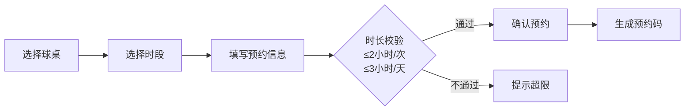
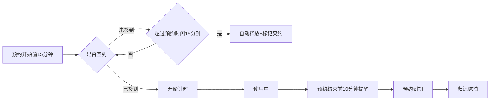
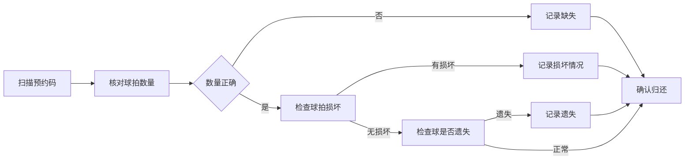

## 1. 产品概述

乒乓球桌预约系统是面向社区活动室的预约管理平台，解决两张乒乓球桌被居民争抢、微信排期混乱的问题。系统支持球桌档案管理、居民在线预约、签到计时、球拍归还和管理员数据统计等核心功能。

- 核心用户：社区居民（预约使用者）、活动室管理员（后台管理者）
- 核心价值：有序分配球桌资源，减少争抢矛盾，提高管理效率

## 2. 核心功能

### 2.1 用户角色

| 角色 | 登录方式 | 核心权限 |
|------|----------|----------|
| 居民 | 无需登录（手机号识别） | 浏览球桌、预约时段、签到、归还球拍 |
| 管理员 | 账号密码登录 | 球桌管理、预约管理、数据统计、器材维护 |

### 2.2 功能模块

1. **首页/球桌列表**：球桌卡片展示、状态筛选、今日排期概览
2. **预约页面**：时段选择、人数填写、球拍租借、手机号填写、预约确认
3. **签到页面**：扫码/预约码签到、计时开始、超时自动释放
4. **归还页面**：球拍数量确认、损坏登记、球遗失登记
5. **管理后台**：今日排期、爽约名单、器材损坏记录、热门时段分析、维护提醒

### 2.3 页面详情

| 页面名称 | 模块名称 | 功能描述 |
|----------|----------|----------|
| 首页 | 球桌卡片 | 展示球桌位置、照片、状态、开放时段、球网状态、球拍数量 |
| 首页 | 今日排期 | 时间轴展示两张球桌当天所有预约 |
| 首页 | 快捷入口 | 我要预约、我的预约、签到入口、归还入口 |
| 预约页 | 球桌选择 | 选择球桌1或球桌2 |
| 预约页 | 时段选择 | 30分钟为单位的时间段选择器，显示已占用/可用状态 |
| 预约页 | 预约表单 | 人数（1-4人）、是否借球拍（0-4副）、手机号 |
| 预约页 | 预约限制 | 单人单次最多预约2小时，同一天最多预约3小时 |
| 我的预约 | 预约列表 | 展示用户预约记录，状态：待签到/进行中/已完成/已取消/爽约 |
| 签到页 | 签到确认 | 输入预约码或扫码签到，签到后开始计时 |
| 签到页 | 超时释放 | 预约开始后15分钟未签到自动释放时段 |
| 归还页 | 器材归还 | 确认球拍归还数量、是否损坏、球是否遗失 |
| 管理后台 | 今日排期 | 日历+时间轴，可查看/取消任意预约 |
| 管理后台 | 爽约名单 | 未签到用户列表，标记爽约次数 |
| 管理后台 | 器材损坏 | 损坏记录列表，状态：待处理/已修复 |
| 管理后台 | 热门时段 | 柱状图展示各时段预约频次 |
| 管理后台 | 球桌维护 | 球桌状态标记（正常/维护中/停用）、维护记录 |

## 3. 核心流程

### 3.1 居民预约流程

用户选择球桌和可用时段 → 填写人数、是否借球拍、手机号 → 系统校验预约时长限制 → 确认预约 → 生成预约码 → 预约成功

### 3.2 签到计时流程

预约开始前15分钟可签到 → 到场扫描预约码/输入码 → 系统开始计时 → 到点提醒 → 结束后归还器材

### 3.3 器材归还流程

用户到归还台 → 管理员扫描预约码 → 核对球拍数量 → 检查是否损坏 → 检查球是否遗失 → 确认归还 → 记录异常

## 4. 用户界面设计

### 4.1 设计风格

**体育活力风格**，以乒乓球运动为灵感：
- 主色调：乒乓球橙（#FF6B35）作为主色，搭配球桌蓝（#1E88E5）
- 辅助色：球网白（#FFFFFF）、地板绿（#2E7D32）
- 按钮风格：圆润大按钮，带有轻微弹跳动画
- 字体：使用活力感的标题字体 + 清晰易读的正文字体
- 布局：卡片式布局，清晰的时间轴展示
- 图标：使用体育主题 emoji（🏓、⏰、📱、✅）

### 4.2 页面设计概览

| 页面名称 | 模块名称 | UI元素 |
|----------|----------|--------|
| 首页 | 顶部横幅 | 渐变背景，乒乓球运动主题图，大字标题 |
| 首页 | 球桌卡片 | 照片+状态标签（空闲/使用中/维护中）+关键信息 |
| 首页 | 今日排期 | 横向时间轴，彩色块标记预约 |
| 预约页 | 时段选择器 | 网格状时间块，绿色可用、灰色已用、红色超时 |
| 预约页 | 表单区域 | 人数步进器、球拍选择、手机号输入 |
| 管理后台 | 仪表盘 | 数据卡片网格 + 图表区域 + 列表区域 |
| 管理后台 | 热门时段 | 柱状图，橙色柱子，悬停动画 |

### 4.3 响应式

- 桌面端：并排布局，左侧导航，右侧内容区
- 移动端：顶部导航栏，底部Tab切换，单列流式布局
- 触摸优化：按钮最小44x44px，输入框足够大，避免误触

### 4.4 动画与交互

- 预约成功：球拍旋转动画 + 确认弹层
- 时间选择：块选中时缩放+高亮
- 倒计时：数字跳动动画，临近结束时颜色变红
- 页面切换：滑动过渡效果
- 数据加载：骨架屏占位
