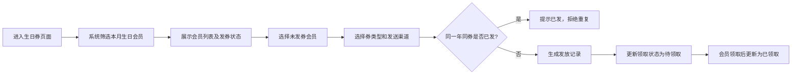

# 会员生日券管理系统 PRD

## 1. 产品概述

会员生日券管理系统是一款面向线下门店运营人员的会员营销工具，解决生日券人工发放易漏发、重复领、数据统计混乱的问题。通过自动化生日会员识别、券发放规则校验、领取状态追踪和数据统计分析，帮助门店高效精准地完成生日营销活动。

- **核心目标**：实现生日券发放全流程数字化管理，杜绝漏发和重复领取
- **目标用户**：门店运营人员、会员管理员
- **价值主张**：提升会员体验，提高营销 ROI，减少人工核对成本

## 2. 核心功能

### 2.1 用户角色

| 角色 | 登录方式 | 核心权限 |
|------|---------|---------|
| 运营管理员 | 账号密码 | 会员管理、发券操作、数据统计、系统配置 |

### 2.2 功能模块

1. **会员档案管理**：会员信息增删改查、生日信息维护、等级与常购品类管理
2. **本月生日列表**：自动列出当月生日会员、按等级/品类筛选、一键发券
3. **生日券发放记录**：券类型/金额/有效期管理、发放渠道记录、领取状态追踪
4. **数据统计面板**：本月发券数、使用率、带来订单金额、漏发名单、过期未用列表
5. **过期未用券**：单独列出过期未使用的生日券，便于后续跟进

### 2.3 页面详情

| 页面名称 | 模块名称 | 功能描述 |
|---------|---------|---------|
| 数据概览 | 统计卡片 | 展示本月发券数、使用率、订单金额、漏发数等关键指标 |
| 数据概览 | 本月生日会员 | 快速查看即将过生日的会员列表 |
| 数据概览 | 漏发预警 | 突出显示本月尚未发券的生日会员 |
| 会员管理 | 会员列表 | 分页展示所有会员，支持姓名/手机号搜索 |
| 会员管理 | 会员详情/编辑 | 姓名、手机号、生日、等级、常购品类、头像的增删改 |
| 生日券管理 | 本月生日列表 | 自动列出当月生日会员，显示发券状态 |
| 生日券管理 | 发券操作 | 选择券类型、发送渠道，执行发券，防重复校验 |
| 生日券管理 | 发放记录 | 所有券发放历史，支持按状态/时间筛选 |
| 生日券管理 | 过期未用 | 单独展示已过期但未使用的券 |
| 券类型配置 | 券类型列表 | 管理不同面额、类型的生日券模板 |

## 3. 核心流程

### 3.1 发券主流程

运营人员进入生日券管理页面，系统自动筛选出当月生日的会员列表。对未发券的会员，选择券类型和发送渠道后执行发券。系统校验同一会员同一年同券不可重复发放，校验通过后生成发放记录并更新领取状态。

### 3.2 统计分析流程

系统按月统计发券总数、已使用数、使用率、关联订单金额，同时生成漏发名单（本月生日但未发券的会员）和过期未用券列表，辅助运营决策。

## 4. 用户界面设计

### 4.1 设计风格

- **主色调**：温暖的珊瑚橙 `#FF6B6B` 搭配深金色 `#C9A962`，营造生日喜庆又精致的氛围
- **辅助色**：浅粉色背景 `#FFF5F5`、深灰文字 `#2D3436`、成功绿 `#00B894`、警告红 `#E17055`
- **按钮风格**：圆润胶囊形按钮，主按钮带微妙渐变和柔和阴影
- **字体**：标题使用富有设计感的「霞鹜文楷」或 Noto Serif SC；正文使用现代无衬线字体
- **布局风格**：卡片式布局，圆角柔和，层次分明，带细腻阴影和微妙高光
- **图标风格**：线性图标，搭配柔和色彩点缀

### 4.2 页面设计概览

| 页面名称 | 模块名称 | UI 元素 |
|---------|---------|---------|
| 数据概览 | 顶部导航 | Logo + 页面切换导航 + 管理员信息 |
| 数据概览 | 统计卡片组 | 4 张数据卡片，带图标、数值、环比变化 |
| 数据概览 | 本月生日会员 | 头像列表 + 姓名生日 + 发券状态标签 |
| 数据概览 | 漏发预警区 | 醒目的警告卡片 + 快捷补发按钮 |
| 会员管理 | 搜索筛选栏 | 搜索框 + 等级筛选 + 新增按钮 |
| 会员管理 | 会员表格 | 头像、姓名、手机号、生日、等级、常购品类、操作 |
| 生日券管理 | 月份选择器 | 切换查看不同月份的生日会员 |
| 生日券管理 | 发券弹窗 | 券类型选择、渠道选择、确认按钮 |
| 生日券管理 | 发放记录表格 | 券信息、会员、发放时间、状态、操作 |

### 4.3 响应式

- 桌面端优先设计（1440px 基准）
- 平板端：统计卡片自动换行，表格横向滚动
- 移动端：导航折叠为汉堡菜单，卡片堆叠布局

### 4.4 动效与交互

- 页面加载时卡片依次淡入上浮，带来层次感
- 悬停按钮有轻微放大和阴影加深
- 发券成功有庆祝微动效（彩屑/光晕）
- 数据变化有平滑数字滚动效果
- 标签状态切换有颜色过渡动画
