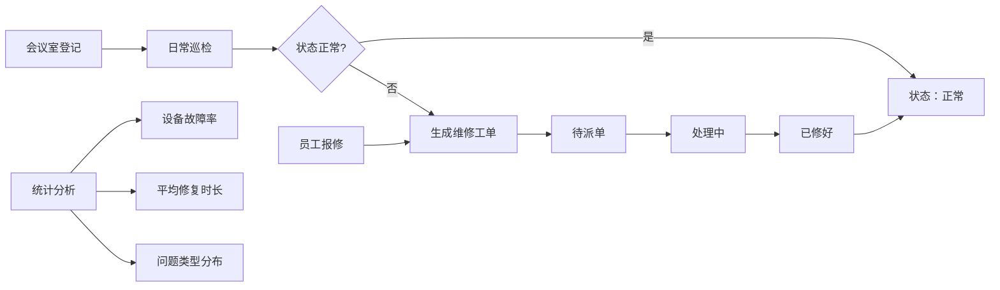

## 1. 产品概述

会议室设备巡检台是一款企业内部设备管理工具，解决会议前设备故障发现不及时的痛点。通过制度化巡检、员工报修和维修工单跟踪，确保会议室设备始终处于可用状态。

- 目标用户：行政管理员、IT运维人员、普通员工
- 核心价值：提前发现设备问题，减少会议中断，提升设备维护效率

## 2. 核心功能

### 2.1 用户角色
| 角色 | 登录方式 | 核心权限 |
|------|----------|----------|
| 管理员 | 模拟登录 | 会议室登记、巡检、维修工单管理、统计查看 |
| 普通员工 | 模拟登录 | 查看会议室状态、提交故障报修 |

### 2.2 功能模块
1. **首页看板**：按状态分组展示所有会议室（正常、待维修、缺配件、今日未巡检）
2. **会议室管理**：登记、编辑、删除会议室信息
3. **巡检中心**：按清单逐项巡检，记录设备状态和照片
4. **故障报修**：员工提交故障报告，描述问题和影响时间
5. **维修工单**：派单、处理中、已修好的全流程跟踪
6. **数据统计**：故障率排行、平均修复时长、设备问题分布

### 2.3 页面详情
| 页面名称 | 模块名称 | 功能描述 |
|----------|----------|----------|
| 首页看板 | 状态分组卡片 | 四列布局展示不同状态的会议室数量和列表 |
| 首页看板 | 快捷操作区 | 一键巡检、快速报修入口 |
| 会议室管理 | 会议室列表 | 表格展示所有会议室，支持搜索筛选 |
| 会议室管理 | 登记/编辑表单 | 位置、容量、投屏、麦克风、摄像头、白板、负责人 |
| 巡检中心 | 巡检清单 | 投屏正常、声音正常、遥控器在、电池够、照片、备注 |
| 巡检中心 | 历史记录 | 查看每个会议室的巡检历史 |
| 故障报修 | 报修列表 | 展示所有报修单及状态 |
| 故障报修 | 报修表单 | 选择会议室、描述问题、会议时间、联系方式 |
| 维修工单 | 工单看板 | 待派单、处理中、已修好三列看板 |
| 维修工单 | 工单操作 | 派单、标记处理中、标记已修好、添加备注 |
| 数据统计 | 故障率排行 | 按会议室统计故障次数排名 |
| 数据统计 | 修复时长 | 平均修复时间趋势图 |
| 数据统计 | 问题分布 | 按设备类型统计问题数量饼图 |

## 3. 核心流程

### 巡检流程
管理员选择会议室 → 逐项检查设备并勾选 → 上传照片（可选） → 填写备注 → 提交巡检记录 → 系统自动更新会议室状态

### 报修流程
员工选择会议室 → 描述故障问题 → 填写会议时间 → 提交报修 → 生成维修工单 → 管理员派单处理

### 维修流程
待派单 → 派单给维修人员 → 处理中 → 已修好 → 自动更新会议室状态

## 4. 界面设计

### 4.1 设计风格
- **主色调**：深靛蓝 (#1e3a5f) - 专业稳重
- **辅助色**：翠绿 (#10b981) 正常、琥珀橙 (#f59e0b) 待处理、赤红 (#ef4444) 故障、蓝灰 (#64748b) 未巡检
- **卡片风格**：圆角卡片，轻微阴影，悬停上浮效果
- **字体**：Inter 系统字体，清晰易读
- **布局**：左侧导航栏 + 右侧内容区，卡片式分组

### 4.2 页面设计概览
| 页面名称 | 模块名称 | UI 元素 |
|----------|----------|---------|
| 首页看板 | 状态统计卡 | 大数字、图标、渐变背景、状态标签 |
| 会议室管理 | 数据表格 | 斑马纹、状态徽标、操作按钮 |
| 巡检中心 | 勾选清单 | 大复选框、分组标题、照片上传区 |
| 维修工单 | 看板视图 | 三列拖拽布局、工单卡片、状态流转按钮 |
| 数据统计 | 图表展示 | 柱状图、折线图、环形图 |

### 4.3 响应式
桌面端优先设计，平板端自适应，移动端简化为单列布局。支持触控交互。
