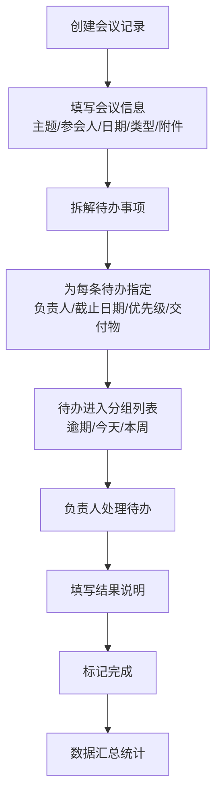

## 1. 产品概述

会议纪要待办管理系统，用于解决会议决策事项无人跟进、责任不清、延期无人知晓的问题。为团队提供从会议记录到待办追踪的全流程管理，确保每个会议产出的行动项都能被落实。

- 核心用户：项目经理、部门负责人、会议组织者、团队成员
- 产品价值：提升会议决策落地率，减少待办延期，透明化跟进过程

## 2. 核心功能

### 2.1 用户角色
| 角色 | 核心权限 |
|------|----------|
| 普通用户 | 创建会议、录入待办、标记自己负责的待办完成、查看统计 |
| 管理员 | 所有用户权限、编辑任意待办、查看全部门统计、删除会议/待办 |

### 2.2 功能模块
1. **待办列表首页**：按逾期/今天到期/本周到期分组展示，快速筛选与搜索
2. **会议记录管理**：新增、编辑会议记录（主题、参会人、日期、类型、附件截图）
3. **待办详情页**：查看待办完整信息、变更历史、完成结果
4. **数据汇总看板**：部门延期统计、会议类型待办分布、完成率趋势

### 2.3 页面详情
| 页面名称 | 模块名称 | 功能描述 |
|----------|----------|----------|
| 待办列表首页 | 分组列表 | 按逾期/今天到期/本周到期三个分组展示待办卡片 |
| 待办列表首页 | 筛选搜索 | 按负责人、优先级、会议类型筛选，关键字搜索 |
| 待办列表首页 | 快速操作 | 标记完成（弹窗填写结果说明）、查看详情 |
| 会议管理页 | 会议列表 | 展示所有会议记录，支持按日期/类型筛选 |
| 会议管理页 | 新增/编辑会议 | 填写主题、参会人、日期、类型、上传附件截图，关联待办 |
| 待办详情页 | 基本信息 | 展示负责人、截止日期、优先级、关联议题、交付物 |
| 待办详情页 | 变更历史 | 时间轴展示待办从创建到完成的所有状态变化 |
| 待办详情页 | 完成操作 | 填写结果说明后标记完成 |
| 数据看板 | 部门延期排行 | 柱状图展示各部门待办延期数量 |
| 数据看板 | 会议类型统计 | 饼图展示不同类型会议产生的待办数量 |
| 数据看板 | 完成率趋势 | 折线图展示近4周待办完成率变化 |

## 3. 核心流程

用户从创建会议记录开始，在会议中拆解出每条待办事项并指定负责人和截止日期。系统自动按时间维度分组展示待办，到期前提醒相关人员。完成待办时必须填写结果说明，所有状态变更留痕可追溯。管理层通过数据看板了解整体执行情况和问题所在。

## 4. 用户界面设计

### 4.1 设计风格
- 主色调：深蓝 `#1e3a5f` 搭配琥珀橙 `#f59e0b` 作为强调色，体现专业与紧迫感
- 辅助色：延期红色 `#ef4444`、完成绿色 `#10b981`、进行中蓝色 `#3b82f6`
- 按钮风格：圆角 8px，悬浮有阴影过渡，主要操作按钮使用琥珀橙
- 字体：中文使用思源黑体（Noto Sans SC），数字和英文使用 JetBrains Mono
- 布局风格：卡片式布局，顶部全局导航 + 左侧筛选面板 + 右侧内容区
- 图标风格：简洁线性图标，配合状态颜色使用

### 4.2 页面设计概览
| 页面名称 | 模块名称 | UI 元素 |
|----------|----------|---------|
| 待办列表首页 | 分组列表 | 折叠式分组标题带计数徽标，待办卡片悬浮上浮效果，优先级色块标签 |
| 待办列表首页 | 顶部操作栏 | 搜索框、筛选下拉、新增会议按钮（琥珀橙主按钮） |
| 会议管理页 | 会议卡片 | 左侧日期色块，右侧会议信息，底部关联待办数量标签 |
| 待办详情页 | 变更历史 | 垂直时间轴，节点颜色对应状态，左侧时间右侧变更描述 |
| 数据看板 | 统计卡片 | 大数字展示核心指标，底部趋势小箭头 |
| 数据看板 | 图表区域 | 深色卡片背景，图表配色与状态色一致 |

### 4.3 响应式设计
- 桌面端优先设计（1280px 起）
- 平板端：左侧筛选面板折叠为抽屉，内容区自适应宽度
- 移动端：导航变为底部 Tab，卡片改为单列布局，筛选按钮悬浮显示
