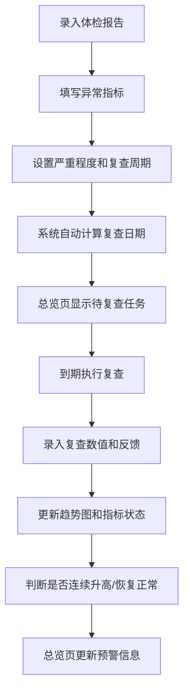

## 1. 产品概述
个人体检复查提醒应用，帮助用户管理体检报告中的异常指标，设置复查提醒，追踪指标变化趋势，确保健康问题得到及时跟进。
- 核心目标：解决体检报告看完就忘、异常指标疏于复查的问题
- 目标用户：关注自身健康、有定期体检习惯的个人用户

## 2. 核心功能

### 2.1 功能模块
1. **总览仪表盘**：未复查数量统计、连续升高指标预警、未执行建议提醒、近期复查任务
2. **体检报告管理**：报告录入（机构、日期、照片）、报告列表、报告详情
3. **异常指标管理**：按严重程度分组（轻微/关注/尽快处理）、指标详情、复查周期设置
4. **复查记录**：复查数值录入、医生反馈、历史记录时间线
5. **指标趋势**：折线图展示历次数值变化
6. **健康建议**：用药/运动/饮食建议关联到异常项、执行状态追踪

### 2.2 页面详情
| 页面名称 | 模块名称 | 功能描述 |
|---------|----------|---------|
| 总览仪表盘 | 统计卡片 | 待复查数量、连续升高指标、未执行建议、报告总数 |
| 总览仪表盘 | 近期复查任务 | 按复查日期排序，临近日期置顶显示，倒计时提醒 |
| 总览仪表盘 | 预警列表 | 连续升高的指标高亮显示 |
| 总览仪表盘 | 建议追踪 | 显示未执行的健康建议 |
| 报告列表 | 报告卡片 | 显示机构、日期、异常项数量、报告照片缩略图 |
| 报告录入 | 表单 | 体检机构、体检日期、报告照片上传、异常指标录入 |
| 异常指标详情 | 基本信息 | 指标名称、数值、参考范围、严重程度、医生建议 |
| 异常指标详情 | 趋势图 | 折线图展示历次复查数值变化 |
| 异常指标详情 | 复查记录 | 时间线展示每次复查的数值、日期、医生反馈 |
| 异常指标详情 | 健康建议 | 用药、运动、饮食建议，可标记执行状态 |
| 复查录入 | 表单 | 复查日期、新数值、医生反馈、照片上传 |

## 3. 核心流程
用户录入体检报告后，系统自动按严重程度对异常指标分组，根据复查周期计算下次复查日期。用户定期录入复查结果，系统生成趋势图并监测指标是否连续升高。健康建议可标记执行状态，总览页集中展示所有待处理事项。

## 4. 用户界面设计

### 4.1 设计风格
- **主色调**：深青色 #0D9488（医疗健康感）搭配暖橙 #F97316（警示提醒）
- **辅助色**：轻微-绿色 #10B981，关注-黄色 #F59E0B，尽快处理-红色 #EF4444
- **按钮风格**：圆角胶囊形，主色填充配白色文字，悬停微亮
- **字体**：标题使用 Noto Serif SC（人文感），正文使用系统 Sans-serif
- **布局风格**：卡片式布局，柔和阴影，圆角16px，充足留白
- **图标风格**：线性图标，配合emoji增加亲和力

### 4.2 页面设计概览
| 页面名称 | 模块名称 | UI元素 |
|---------|----------|--------|
| 总览仪表盘 | 统计卡片 | 渐变背景、大数字、趋势指示箭头 |
| 总览仪表盘 | 任务列表 | 严重程度色条、倒计时标签、优先级排序 |
| 报告列表 | 报告卡片 | 照片预览、机构名称、日期、异常标签组 |
| 异常指标详情 | 趋势图 | SVG折线图、数据点标注、参考范围区域 |
| 异常指标详情 | 时间线 | 竖线连接、圆形节点、左右交替布局 |

### 4.3 响应式
- 桌面端优先设计（1200px+）
- 平板端（768px-1199px）：两栏变一栏，卡片自适应宽度
- 移动端（<768px）：单列布局，底部导航，触摸优化
