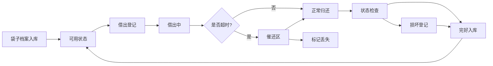

# 保温袋周转管理系统 产品需求文档

## 1. 产品概述

外卖店铺保温袋借出归还管理工具，解决保温袋借给骑手后忘记收回导致流失的问题。通过档案化管理、借出归还记录、超时催还和数据统计，实现保温袋全生命周期追踪，降低资产损耗。

- 目标用户：外卖门店店长、店员
- 核心价值：减少保温袋遗失损耗，提升周转效率

## 2. 核心功能

### 2.1 用户角色

| 角色 | 登录方式 | 核心权限 |
|------|----------|----------|
| 门店管理员 | 无需登录（本地使用） | 全部功能：袋子档案管理、借出归还、催还、统计 |

### 2.2 功能模块

1. **袋子档案**：保温袋列表、新增/编辑/删除袋子、照片上传
2. **借出管理**：借出登记、借出记录列表
3. **归还管理**：归还登记、状态检查（污渍/破损/拉链/垫板）
4. **催还区**：超时未还列表、催还提醒
5. **数据统计**：周转次数、损坏率、押金未退统计

### 2.3 页面详情

| 页面名称 | 模块名称 | 功能描述 |
|----------|----------|----------|
| 首页/总览 | 数据概览卡片 | 总袋子数、在借数、超时数、押金总额 |
| 首页/总览 | 快捷操作区 | 快速借出、快速归还入口 |
| 袋子档案 | 袋子列表 | 卡片式展示，筛选（状态/容量/颜色），搜索编号 |
| 袋子档案 | 新增/编辑袋子 | 表单：编号、容量、颜色、保温层状态、押金、照片 |
| 借出记录 | 借出列表 | 展示所有借出记录，筛选状态（进行中/已归还/超时） |
| 借出记录 | 新增借出 | 选择袋子、填写骑手信息、预计归还时间 |
| 归还登记 | 归还表单 | 检查项：污渍、破损、拉链、垫板，押金退还状态 |
| 催还区 | 超时列表 | 按超时天数排序，展示骑手联系方式 |
| 数据统计 | 统计图表 | 周转次数排行、损坏率统计、押金未退统计 |

## 3. 核心流程

### 3.1 借出流程
店员选择可用保温袋 → 填写骑手信息（姓名/平台/手机号/订单号）→ 设置预计归还时间 → 确认借出 → 袋子状态变为"借出中"

### 3.2 归还流程
选择借出记录 → 检查保温袋状态（污渍/破损/拉链/垫板）→ 填写损坏备注 → 确认归还 → 袋子状态更新，押金标记退还

### 3.3 超时催还流程
系统自动判断是否超时 → 超时记录进入催还区 → 店员查看并联系骑手 → 归还或标记丢失

## 4. 用户界面设计

### 4.1 设计风格
- **主色调**：暖橙色 (#FF7A45) — 呼应外卖保温的温暖感
- **辅助色**：深青色 (#2C3E50) — 专业稳重
- **成功色**：翡翠绿 (#2ECC71)
- **警告色**：琥珀橙 (#F39C12)
- **危险色**：珊瑚红 (#E74C3C)
- **背景色**：暖米色 (#FFF9F5) + 白色卡片
- **整体风格**：温暖实用的卡片式设计，清晰的状态色标，微交互动效

### 4.2 组件风格
- **按钮**：圆角 12px，悬停轻微上浮，点击有按压反馈
- **卡片**：白色底，浅阴影，圆角 16px，悬停阴影加深
- **状态标签**：圆角胶囊形，不同状态对应不同颜色
- **输入框**：浅灰边框，聚焦时橙色边框高亮
- **字体**：系统中文无衬线字体，标题加粗，正文清晰易读

### 4.3 页面设计概览

| 页面名称 | 模块名称 | UI 元素 |
|----------|----------|---------|
| 总览页 | 数据概览 | 4张彩色数据卡片，数字大字体，底部趋势小字 |
| 总览页 | 快捷操作 | 两个大按钮（借出/归还），图标+文字 |
| 总览页 | 最近动态 | 时间线式展示最近借出归还记录 |
| 袋子档案 | 筛选栏 | 搜索框 + 状态筛选标签 |
| 袋子档案 | 袋子卡片 | 缩略图 + 编号 + 状态标签 + 容量颜色标识 |
| 袋子档案 | 详情抽屉 | 右侧滑出，展示完整信息和操作按钮 |
| 借出记录 | 列表 | 表格形式，状态色标，操作列 |
| 催还区 | 超时卡片 | 红色警告标识，超时天数突出显示 |
| 统计页 | 图表 | 柱状图 + 环形图，动画加载效果 |

### 4.4 响应式
- 桌面端优先设计，宽度 1200px+ 最佳体验
- 平板端适配：侧边栏收起为图标
- 移动端：单列布局，底部导航栏

## 5. 数据存储说明
- 数据本地存储（localStorage），无需后端
- 支持导出/导入 JSON 数据备份
- 照片使用本地文件读取，base64 存储
