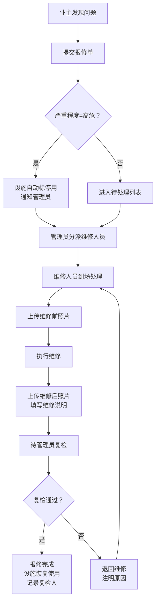

## 1. 产品概述
小区儿童游乐设施报修系统，解决家长群报修混乱、物业追踪困难的问题。
- 主要用途：统一管理游乐设施档案、规范报修流程、追踪维修进度、生成数据统计
- 目标用户：物业管理员、维修人员、小区业主
- 核心价值：让每一件报修可追踪、每一处设施有档案、每一次维修有记录

## 2. 核心功能

### 2.1 用户角色
| 角色 | 说明 | 核心权限 |
|------|------|----------|
| 管理员 | 物业管理人员 | 全部权限：设施管理、报修分派、停用标记、数据统计、复检确认 |
| 维修人员 | 负责设施维修 | 查看报修单、上传维修前后对比照、标记维修完成 |
| 业主 | 小区住户 | 提交报修单、查看报修进度、浏览设施信息 |

### 2.2 功能模块
1. **仪表盘首页**：关键指标卡片、待处理报修列表、下次巡检提醒、重复故障预警
2. **设施档案管理**：设施列表、新增/编辑设施、设施详情、设施照片管理
3. **报修单管理**：报修列表、新增报修、报修详情、状态流转、高风险停用
4. **维修执行**：维修记录上传、前后对比照、复检人记录
5. **统计分析**：未处理报修统计、平均维修时长、重复故障设施排行、巡检计划日历

### 2.3 页面详情
| 页面名称 | 模块名称 | 功能描述 |
|-----------|-------------|---------------------|
| 仪表盘 | 数据概览卡片 | 显示未处理报修数、进行中维修、本月完成率、平均维修时长4项核心指标 |
| 仪表盘 | 待处理报修列表 | 展示最新10条待处理报修，按严重程度排序，支持快捷操作 |
| 仪表盘 | 下次巡检计划 | 按日期展示未来7天需巡检的设施清单 |
| 仪表盘 | 重复故障TOP5 | 柱状图展示故障次数最多的5个设施 |
| 设施档案 | 设施列表 | 卡片/列表双视图，支持按状态/位置/适用年龄筛选，搜索名称 |
| 设施档案 | 新增/编辑设施 | 表单：名称、位置、适用年龄、安装日期、巡检周期、责任人、照片上传 |
| 设施档案 | 设施详情 | 展示完整档案信息、历史报修记录、历史巡检记录、状态切换 |
| 报修单 | 报修列表 | 支持按状态/严重程度/设施筛选，显示问题类型、发现人、提交时间 |
| 报修单 | 新增报修 | 表单：选择设施、问题类型、严重程度、发现人、照片、是否临时封闭、预计维修时间 |
| 报修单 | 报修详情 | 完整信息展示、状态流转操作（分派→处理中→待复检→已完成）、评论区 |
| 维修执行 | 维修记录 | 维修人员填写维修说明、上传维修前照片、维修后照片 |
| 维修执行 | 复检确认 | 管理员确认维修质量、填写复检意见、标记复检人 |
| 统计分析 | 未处理报修 | 按严重程度分类统计饼图，按设施分类统计条形图 |
| 统计分析 | 维修时长分析 | 折线图展示近30天平均维修时长趋势，按问题类型对比柱状图 |
| 统计分析 | 重复故障排行 | 表格+柱状图展示故障次数>=2的设施，显示首次故障日期和最近故障日期 |
| 统计分析 | 巡检计划 | 日历视图展示下月巡检安排，支持按月/周切换，逾期巡检标红 |

## 3. 核心流程

### 3.1 报修流程
业主发现设施问题 → 在系统提交报修单（填写问题类型、严重程度、上传照片）→ 系统自动判断高风险（严重程度=高危）→ 若是高危则自动将设施标为停用并通知管理员 → 管理员分派维修人员 → 维修人员到场处理 → 上传维修前后对比照 → 管理员复检 → 报修单完成，设施恢复使用

### 3.2 巡检流程
系统根据设施巡检周期自动生成巡检任务 → 到期前3天提醒责任人 → 责任人执行巡检 → 记录巡检结果（正常/异常）→ 异常则自动生成报修单

## 4. 用户界面设计

### 4.1 设计风格
- **主色调**：温暖橙黄色系（#FF6B35 主色），搭配天蓝（#4ECDC4 辅助色），营造童趣、安全、活力的社区氛围
- **辅色**：高危红 #E63946，警告黄 #FFB703，成功绿 #2A9D8F，信息蓝 #219EBC
- **按钮风格**：圆润大圆角（12px），带柔和阴影，hover时微上浮+阴影加深
- **字体**：标题使用"站酷快乐体"等圆润活泼中文字体，正文使用"思源黑体"保证可读性
- **布局风格**：卡片式布局，柔和阴影，充足留白，圆角边框（16px）
- **图标风格**：使用Font Awesome线性图标，搭配彩色圆角背景块

### 4.2 页面设计概述
| 页面名称 | 模块名称 | UI元素 |
|-----------|-------------|-------------|
| 仪表盘 | 数据概览卡片 | 4个彩色渐变卡片，左上小图标，中间大数字，底部趋势小箭头，入场动画依次延迟50ms |
| 仪表盘 | 待处理列表 | 表格样式，高危行红色左侧边框，点击展开详情，支持快捷操作按钮 |
| 仪表盘 | 巡检计划 | 时间轴样式，左侧日期色块，右侧设施名称+责任人，悬停显示详情弹窗 |
| 设施档案 | 设施卡片 | 顶部设施照片圆角裁切，中间名称+位置标签，底部状态标签（使用中/停用/维修中）+ 巡检倒计时 |
| 设施档案 | 表单弹窗 | 左右双列布局，左侧表单字段，右侧照片上传预览区，底部操作按钮右对齐 |
| 报修单 | 列表项 | 左侧严重程度色条（红/橙/黄/绿），中间问题描述+设施名称，右侧状态标签+时间，右上角快捷操作 |
| 报修单 | 详情页 | 上半部分基本信息网格，中间状态流转时间轴，下半部分照片对比+评论区 |
| 维修执行 | 对比照 | 左右分栏布局，左侧维修前（红色边框），右侧维修后（绿色边框），支持点击放大 |
| 统计分析 | 图表区 | ECharts图表库，主题色统一，动画入场，支持数据筛选切换 |

### 4.3 响应式
- 桌面端优先（1440px），适配1920px大屏
- 平板端（768px-1024px）：侧边栏收起为图标，卡片改为2列布局
- 移动端（<768px）：顶部导航+底部Tab切换，卡片单列布局，表单改为单列

### 4.4 动效设计
- 页面入场：整体内容淡入上移（translateY 20px → 0，opacity 0→1），时长400ms，缓动ease-out
- 卡片悬停：translateY -4px，box-shadow增大，transition 200ms
- 状态切换：标签颜色过渡动画，300ms渐变色
- 弹窗：背景遮罩淡入，内容缩放（0.95→1）+ 淡入，250ms
- 数据加载：骨架屏渐变闪烁动画
