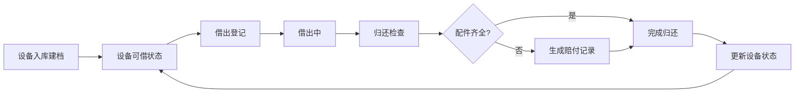

## 1. 产品概述
充电宝租借点管理系统，解决社区活动中心充电宝借出无登记、归还缺少配件无人发现的管理问题。面向社区活动中心管理员，实现充电宝设备全生命周期管理。

- 核心价值：规范化充电宝租借流程，自动追踪设备状态，减少资产流失
- 目标用户：社区活动中心管理员、运维人员

## 2. 核心功能

### 2.1 用户角色
| 角色 | 注册方式 | 核心权限 |
|------|----------|----------|
| 管理员 | 系统内置 | 设备管理、借出登记、归还检查、查看统计、赔付管理 |

### 2.2 功能模块
1. **数据看板**：可借数量、超时未还、低电量待充、本周租借次数统计
2. **设备档案**：设备列表、新增设备、编辑设备、删除设备
3. **借出管理**：借出登记、借出记录查询
4. **归还管理**：归还检查、自动生成赔付记录
5. **赔付记录**：赔付列表、赔付状态管理

### 2.3 页面详情
| 页面名称 | 模块名称 | 功能描述 |
|----------|----------|----------|
| 数据看板 | 统计卡片 | 展示可借数量、超时未还、低电量待充、本周租借次数 |
| 数据看板 | 租借趋势图 | 展示近7天租借次数折线图 |
| 设备档案 | 设备列表 | 表格展示所有设备，支持搜索筛选 |
| 设备档案 | 设备表单 | 新增/编辑设备：编号、容量、接口类型、当前电量、配件清单、存放柜、照片 |
| 借出管理 | 借出登记 | 选择设备，填写借用人、手机号、押金、预计归还时间、用途 |
| 借出管理 | 借出记录 | 展示所有借出记录，支持筛选 |
| 归还管理 | 归还检查 | 检查电量、线材、外壳破损，缺失配件自动计算赔付 |
| 赔付记录 | 赔付列表 | 展示所有赔付记录，标记处理状态 |

## 3. 核心流程

### 3.1 借出流程
管理员选择可借设备 → 填写借用人信息 → 确认借出 → 设备状态更新为借出中

### 3.2 归还流程
选择待归还设备 → 检查电量/线材/外壳 → 标记缺失配件 → 系统自动生成赔付记录 → 确认归还 → 更新设备状态

### 3.3 流程图

## 4. 用户界面设计

### 4.1 设计风格
- 主色调：深蓝色 #165DFF，代表专业、可信赖
- 辅助色：绿色 #00B42A（正常）、橙色 #FF7D00（警告）、红色 #F53F3F（危险）
- 按钮风格：圆角 8px，带微阴影，hover 时有轻微上浮效果
- 字体：系统无衬线字体 + 数字等宽字体
- 布局风格：卡片式布局，左侧导航栏 + 右侧内容区
- 图标风格：简洁线性图标，统一 24px 尺寸

### 4.2 页面设计概览
| 页面名称 | 模块名称 | UI 元素 |
|----------|----------|---------|
| 数据看板 | 统计卡片 | 渐变色背景卡片，大数字展示，趋势小箭头 |
| 数据看板 | 趋势图表 | 平滑折线图，悬停显示数据 |
| 设备档案 | 设备列表 | 斑马纹表格，状态标签色，操作按钮组 |
| 设备档案 | 设备表单 | 分组表单，图片上传预览，下拉选择器 |
| 借出管理 | 借出登记 | 设备选择器，表单分步引导 |
| 归还管理 | 归还检查 | 配件核对清单，赔付金额实时计算 |

### 4.3 响应式
- 桌面端优先设计，适配 1280px 以上屏幕
- 平板端：导航栏可折叠，表格支持横向滚动
- 移动端：底部 Tab 导航，卡片式列表替代表格

### 4.4 动效设计
- 页面加载：内容区淡入，卡片依次上浮
- 按钮交互：hover 时 scale(1.02)，active 时 scale(0.98)
- 状态变化：数字变化时有滚动动画
- 模态框：背景模糊 + 缩放进入效果
