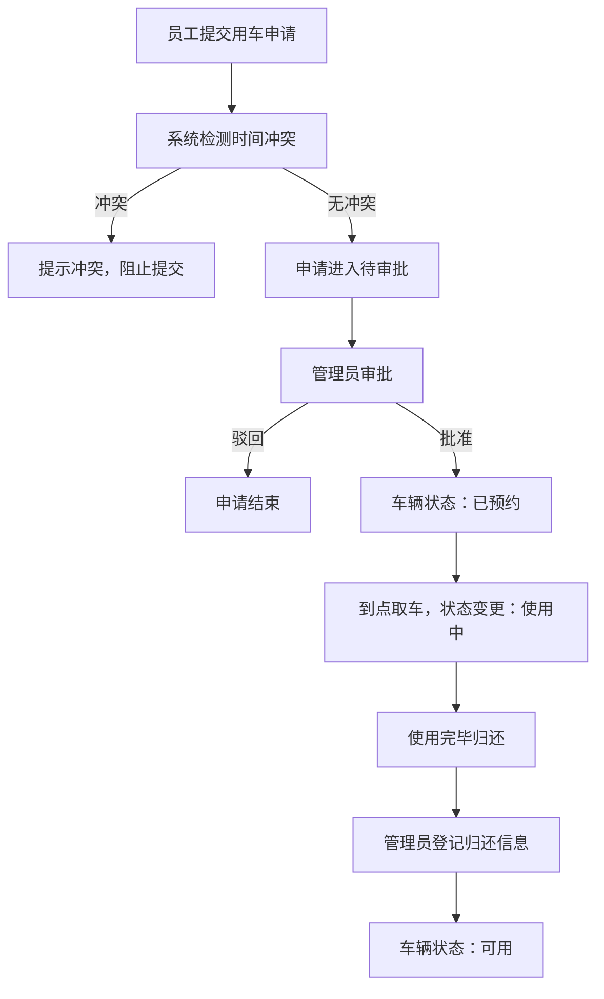

## 1. 产品概述

公司公车钥匙管理系统，解决公车使用混乱、信息不透明的问题。通过数字化管理车辆档案、用车申请、归还登记全流程，实现钥匙领用可追溯、时间冲突自动拦截、异常情况预警，提升公司公车使用效率与管理规范性。

- 目标用户：公司行政管理人员、各部门用车员工、前台钥匙保管人员
- 核心价值：钥匙领用全流程可追溯，时间冲突自动拦截，异常状态实时预警

## 2. 核心功能

### 2.1 用户角色

| 角色 | 说明 | 核心权限 |
|------|------|----------|
| 管理员 | 行政/前台人员 | 车辆档案管理、审批申请、看板查看、归还登记 |
| 普通员工 | 各部门员工 | 提交用车申请、查看我的申请 |

### 2.2 功能模块

1. **看板首页**：今日用车概览、逾期未还预警、油量偏低提醒、使用统计图表
2. **车辆档案**：车辆列表、新增/编辑车辆（车牌、车型、油卡、停车位、保管人、照片）
3. **用车申请**：申请列表、提交申请（部门、用途、时间、驾驶人、目的地、里程）、冲突检测
4. **归还登记**：待归还列表、登记归还（实际里程、油量、违章异常、停车照片）

### 2.3 页面详情

| 页面名称 | 模块名称 | 功能描述 |
|----------|----------|----------|
| 看板首页 | 统计卡片 | 显示今日用车数、逾期未还数、油量偏低车辆数、总车辆数 |
| 看板首页 | 今日用车列表 | 展示当日正在使用及待使用的车辆信息，含取车/预计归还时间 |
| 看板首页 | 逾期未还列表 | 高亮红色展示超期未归还的用车记录，含超时时长 |
| 看板首页 | 油量预警列表 | 展示油量低于30%的车辆，提醒加油 |
| 看板首页 | 使用时长统计 | 柱状图展示每辆车累计使用时长 |
| 看板首页 | 部门用车统计 | 饼图/环形图展示各部门用车次数占比 |
| 车辆档案 | 车辆列表 | 卡片式展示所有车辆，含照片、车牌、车型、状态标签 |
| 车辆档案 | 新增/编辑表单 | 弹窗表单录入车牌、车型、油卡号、停车位、保管人、照片 |
| 用车申请 | 申请列表 | 表格展示申请记录，含状态标签（待审批/已批准/已驳回/使用中/已归还） |
| 用车申请 | 提交申请 | 表单选择车辆、部门、填写用途、起止时间、驾驶人、目的地、预计里程；提交时实时检测时间冲突 |
| 用车申请 | 冲突提示 | 当所选车辆在申请时段被占用时，弹窗展示冲突详情并阻止提交 |
| 归还登记 | 待归还列表 | 展示"使用中"状态的申请记录，操作按钮进入归还登记 |
| 归还登记 | 归还表单 | 填写实际里程、油量百分比、违章/异常描述、上传停车照片 |

## 3. 核心流程

### 3.1 用车主流程

员工提交用车申请 → 系统自动检测车辆时间冲突 → 无冲突则进入待审批 → 管理员批准申请 → 到前台取钥匙使用 → 使用完毕归还 → 管理员登记归还信息 → 车辆状态更新为可用

### 3.2 时间冲突检测逻辑

同一辆车在同一时间段内不可被重复预约。检测规则：新申请的开始时间 < 已有申请的结束时间 AND 新申请的结束时间 > 已有申请的开始时间 → 判定为冲突。

## 4. 用户界面设计

### 4.1 设计风格

- **主色调**：深邃藏青 `#1E3A5F`（专业、稳重），搭配活力橙 `#F26B3A`（预警、行动按钮）
- **辅助色**：成功绿 `#22C55E`，警示黄 `#EAB308`，危险红 `#EF4444`
- **按钮风格**：圆角 10px，主按钮渐变填充，悬停微上浮阴影
- **字体**：标题使用思源黑体 Bold，正文使用思源黑体 Regular，数字使用等宽字体增强可读性
- **布局风格**：顶部导航 + 左侧菜单的经典后台布局，卡片式内容区域，圆角卡片带柔和阴影
- **图标**：使用 Phosphor Icons 线性图标，风格统一清爽

### 4.2 页面设计概览

| 页面名称 | 模块名称 | UI元素 |
|----------|----------|--------|
| 看板首页 | 统计卡片 | 四色渐变卡片，大数字+小标签，悬停上浮动效 |
| 看板首页 | 预警列表 | 逾期记录红底白字高亮，油量预警橙色渐变进度条 |
| 看板首页 | 统计图表 | 圆角卡片内嵌入图表，渐变柱状图，环形图带标签 |
| 车辆档案 | 车辆卡片 | 左侧车辆照片，右侧信息列表，状态徽标右上角悬浮 |
| 车辆档案 | 表单弹窗 | 毛玻璃背景遮罩，表单分组带标题，分区清晰 |
| 用车申请 | 申请列表 | 斑马纹表格，状态标签彩色圆角，操作按钮组 |
| 用车申请 | 冲突提示 | 红色警示图标 + 冲突时间段详情，禁止提交按钮置灰 |
| 归还登记 | 归还表单 | 油量滑块组件，照片上传缩略图预览，异常文本域 |

### 4.3 响应式

- Desktop-first 设计，主断点 1024px
- 移动端：左侧菜单折叠为抽屉，表格横向滚动，卡片单列排布
- 所有表单触控目标 ≥ 44×44px，保证触屏操作体验

