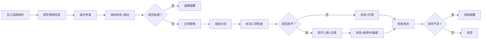

## 1. 产品概述
共享充电线借还管理系统，解决公司内部充电线借用混乱、丢失、损坏无人上报的问题。通过数字化管理线材档案、借还流程和损耗统计，实现充电线全生命周期可追溯。

- **核心痛点**：线材越借越少、接口松动损坏无人报、热门接口库存不足、缺少数据支撑采购决策
- **目标用户**：公司行政管理人员、全体员工
- **产品价值**：减少线材丢失率90%，损坏及时发现，库存智能预警，数据驱动采购决策

## 2. 核心 Features

### 2.1 用户角色

| 角色 | 登录方式 | 核心权限 |
|------|----------|----------|
| 普通员工 | 工号选择 | 浏览线材、发起借用、归还登记 |
| 管理员 | 工号选择 + 管理密码 | 线材档案CRUD、借用审批、数据统计、系统配置 |

### 2.2 功能模块
1. **线材档案管理**：线材列表、新增/编辑/删除线材、照片上传、状态管理
2. **借用管理**：可借线材展示、借用申请、借用记录、逾期提醒
3. **归还管理**：归还登记、状态检查（外皮/接口/充电）、损坏上报
4. **统计看板**：借用次数排行、损耗率统计、各楼层需求分布、接口采购建议
5. **智能提醒**：逾期未还、损坏未报、库存不足预警

### 2.3 页面详情

| 页面名称 | 模块名称 | 功能描述 |
|-----------|-------------|---------------------|
| 首页/仪表盘 | 概览卡片 | 显示在线总数、借出数、可用数、待归还数、逾期数 |
| 首页/仪表盘 | 智能提醒区 | 滚动展示逾期未还、损坏未报、库存不足提醒 |
| 首页/仪表盘 | 快捷操作 | 快速发起借用、快速归还入口 |
| 线材档案 | 线材列表 | 卡片式展示，支持筛选（接口类型、状态、楼层）、搜索 |
| 线材档案 | 线材详情 | 完整信息展示、借还历史、照片预览 |
| 线材档案 | 新增/编辑线材 | 表单录入：编号、接口、长度、功率、位置、照片 |
| 借用管理 | 可借线材 | 展示可用线材，支持按接口类型筛选 |
| 借用管理 | 借用申请 | 填写员工、部门、设备、预计归还、用途 |
| 借用管理 | 我的借用 | 当前借用记录、历史记录 |
| 归还管理 | 归还登记 | 选择线材，状态检查三项勾选 |
| 归还管理 | 损坏上报 | 损坏照片、描述、处理状态 |
| 统计看板 | 借用统计 | 借用次数Top10线材、月度借用趋势 |
| 统计看板 | 损耗分析 | 损耗率、损坏原因分布 |
| 统计看板 | 需求分析 | 各楼层借用次数、接口类型需求占比 |
| 统计看板 | 采购建议 | 热门接口库存、建议采购数量 |

## 3. 核心流程

### 3.1 借用流程
员工浏览可借线材 → 选择线材发起借用 → 填写借用信息（员工/部门/设备/预计归还/用途）→ 提交 → 系统记录 → 线材状态变为"借出"

### 3.2 归还流程
员工进入归还页面 → 选择要归还的线材 → 检查三项状态（外皮完好/接口紧固/充电正常）→ 若有损坏则填写损坏说明 → 提交归还 → 线材状态变为"可用/维修中/报废"

### 3.3 提醒触发
- 每日定时扫描：超过预计归还时间24h未还 → 逾期提醒
- 归还时标记损坏 → 损坏未报提醒（管理员处理前持续显示）
- 某接口类型库存<2 → 库存不足提醒

## 4. 用户界面设计

### 4.1 设计风格
- **主色调**：科技蓝 `#2563eb`，代表专业、可靠；辅助色：警示橙 `#f97316`（提醒）、成功绿 `#10b981`（正常）、危险红 `#ef4444`（损坏）
- **设计风格**：现代商务风格，卡片式布局，清晰的数据层级
- **按钮风格**：圆角8px，主按钮蓝色填充，次按钮描边
- **字体**：标题使用 `Noto Sans SC` 700，正文使用 `Noto Sans SC` 400，数字使用等宽字体 `JetBrains Mono`
- **图标风格**：使用 `lucide-react` 线性图标，统一风格
- **动效**：卡片悬停微抬升、数据加载骨架屏、状态切换平滑过渡

### 4.2 页面设计概览

| 页面名称 | 模块名称 | UI 元素 |
|-----------|-------------|-------------|
| 首页/仪表盘 | 概览卡片 | 渐变背景卡片，大号数字，趋势箭头 |
| 首页/仪表盘 | 提醒区域 | 横向滚动卡片，逾期红色、损坏橙色、库存黄色 |
| 线材档案 | 线材卡片 | 左侧缩略图，右侧信息网格，状态标签右上角 |
| 线材档案 | 表单弹窗 | 分步表单，照片拖拽上传，实时预览 |
| 借用管理 | 可借列表 | 网格布局，接口类型彩色标签 |
| 统计看板 | 图表区 | ECharts 柱状图、饼图、折线图，支持切换维度 |
| 统计看板 | 采购建议 | 卡片对比：当前库存、安全库存、建议采购量 |

### 4.3 响应式
- **桌面优先**，1280px以上完整展示，三栏布局
- **平板 768-1279px**：两栏布局，侧边栏可折叠
- **手机 <768px**：单栏布局，底部Tab导航，弹窗全屏展示
- **触摸优化**：按钮最小48x48px，表单控件间距充足

## 5. 数据展示规范
- 线材状态标签：`可用`（绿色）、`借出`（蓝色）、`维修中`（橙色）、`报废`（灰色）
- 时间展示：借用/归还时间精确到分钟，逾期时间红色高亮
- 照片展示：线材照片支持点击放大，EXIF信息隐藏
