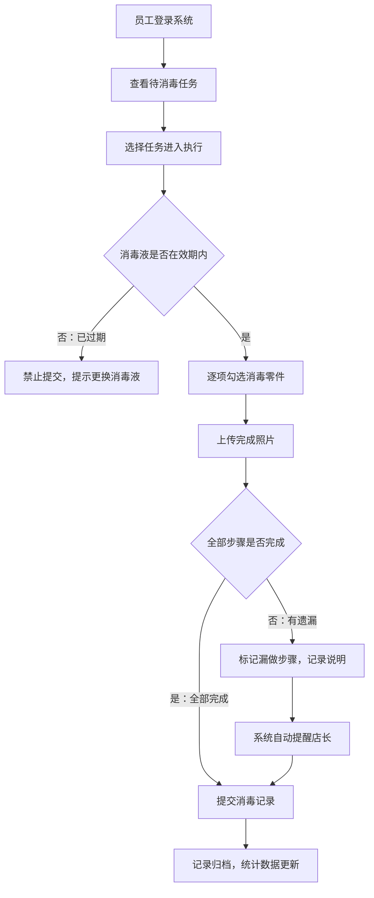

## 1. 产品概述

冰淇淋机消毒记录管理系统，专为连锁餐饮门店设计，解决冰淇淋机每日拆洗消毒步骤繁杂、零件遗漏追溯困难的管理痛点。通过数字化手段规范消毒流程，确保食品安全合规。

- **核心问题**：消毒步骤多易遗漏、零件丢失难追溯、消毒液使用不规范、缺乏数据化监管
- **目标用户**：门店店长、当班员工
- **产品价值**：流程标准化、责任可追溯、数据可视化、食品安全保障

## 2. 核心功能

### 2.1 用户角色

| 角色 | 登录方式 | 核心权限 |
|------|----------|----------|
| 店长 | 账号密码 | 全功能管理：设备档案、任务配置、记录审核、统计报表、提醒查看、员工管理 |
| 员工 | 账号密码 | 消毒任务执行：查看待办任务、逐项勾选零件、上传完成照片、提交消毒记录 |

### 2.2 功能模块

1. **登录页**：角色选择登录、账号密码校验
2. **工作台首页**：今日任务概览、待办提醒、数据统计卡片、快捷入口
3. **设备档案管理**：机器列表、新增/编辑设备、零件清单配置、照片管理
4. **消毒任务中心**：任务列表（开店前/午间/打烊）、任务详情、执行消毒、记录提交
5. **消毒记录查询**：历史记录列表、记录详情、漏做标记、异常照片查看
6. **统计报表中心**：完成率统计、漏做零件排行、异常照片汇总、消毒液消耗统计
7. **系统配置**：班次设置、消毒液管理、提醒规则配置

### 2.3 页面详情

| 页面名称 | 模块名称 | 功能描述 |
|---------|----------|----------|
| 登录页 | 登录表单 | 账号密码输入、角色选择、登录验证 |
| 工作台 | 数据概览 | 今日任务进度、待办数、异常提醒、7天完成率趋势 |
| 工作台 | 快捷操作 | 快速进入消毒执行、设备档案、记录查询入口 |
| 设备档案 | 设备列表 | 卡片式展示机器编号、口味槽、消毒液、负责班次、操作按钮 |
| 设备档案 | 设备表单 | 机器编号、口味槽数、消毒液型号、负责班次、零件清单、设备照片 |
| 消毒任务 | 任务列表 | 按时间分组显示（开店前/午间/打烊），状态标签（待执行/进行中/已完成/已逾期） |
| 消毒任务 | 任务执行 | 逐项勾选（料缸/出料口/搅拌轴/接水盘/外壳）、上传完成照片、消毒液校验 |
| 消毒任务 | 提交校验 | 漏做步骤弹窗确认、消毒液过期禁止提交 |
| 记录查询 | 记录列表 | 日期范围筛选、设备筛选、员工筛选、状态筛选、异常标记高亮 |
| 记录查询 | 记录详情 | 完整步骤勾选情况、上传照片预览、员工签字、漏做说明 |
| 统计报表 | 完成率统计 | 每台机器月度完成率柱状图、趋势折线图 |
| 统计报表 | 漏做零件排行 | 零件漏做次数Top10、占比饼图 |
| 统计报表 | 异常照片墙 | 照片网格展示、异常类型标签、点击放大预览 |
| 统计报表 | 消毒液消耗 | 月度消耗量统计、各机型消耗占比、库存预警 |
| 系统配置 | 班次管理 | 早班/中班/晚班时间段配置、负责人配置 |
| 系统配置 | 消毒液管理 | 消毒液型号、有效期、库存数量、采购记录 |
| 系统配置 | 提醒设置 | 店长漏做提醒开关、消毒液过期预警天数配置 |

## 3. 核心流程

### 3.1 消毒执行主流程

店长/员工登录系统后，进入消毒任务中心查看当日待办任务。选择待执行的消毒任务进入执行页面，系统自动校验消毒液是否在有效期内（过期则禁止提交）。员工按顺序逐项勾选完成的消毒零件（料缸→出料口→搅拌轴→接水盘→外壳），每完成一个步骤可上传对应照片。全部勾选后点击提交，系统检查是否有遗漏步骤：如有遗漏，系统自动记录并提醒店长查看；如无遗漏，记录提交成功。

### 3.2 店长审核流程

店长登录系统后，工作台自动展示异常提醒卡片。点击进入查看漏做任务详情，可查看具体遗漏零件、员工说明、现场照片。店长根据情况进行处理（标记已整改/重新执行），处理结果同步更新到统计报表。

## 4. 用户界面设计

### 4.1 设计风格

- **主色调**：清爽蓝色系 `#1890FF`（代表卫生、专业、信任），搭配青色 `#13C2C2` 点缀
- **辅助色**：成功绿 `#52C41A`、警告橙 `#FA8C16`、错误红 `#F5222D`
- **背景层次**：主背景 `#F5F7FA`，卡片背景 `#FFFFFF`，顶部导航深色渐变
- **按钮风格**：圆角 `6px`，主要按钮蓝色渐变填充，次要按钮描边风格
- **字体**：标题使用「思源黑体 Bold」，正文使用「思源黑体 Regular」，数字使用等宽字体
- **布局风格**：左侧固定导航栏 + 顶部面包屑 + 右侧卡片式内容区
- **图标风格**：线性图标风格，与 Element Plus 原生图标保持一致，使用彩色点缀
- **视觉特色**：关键数据卡片使用渐变背景 + 微阴影，统计图表使用柔和动画，列表行hover高亮

### 4.2 页面设计概览

| 页面名称 | 模块名称 | UI元素 |
|---------|----------|--------|
| 登录页 | 品牌区 | 左侧品牌插画（冰淇淋机线稿）、大标题、Slogan文字 |
| 登录页 | 表单区 | 右侧白色卡片、圆角输入框带图标、角色切换Tab、渐变登录按钮 |
| 工作台 | 数据卡片 | 4张渐变统计卡片（今日任务/完成率/异常数/消毒液预警），大数字 + 趋势箭头 |
| 工作台 | 任务进度 | 横向步骤条展示3个时段进度，完成/进行中/待执行不同颜色 |
| 工作台 | 提醒列表 | 左侧图标 + 右侧标题时间，异常项红色高亮，新消息气泡标记 |
| 设备档案 | 设备卡片 | 卡片式列表，机器编号大字、口味槽图标组、消毒液标签、班次色块 |
| 设备档案 | 表单弹窗 | 分步骤表单（基本信息→零件清单→照片上传），零件清单可增删行 |
| 消毒任务 | 时间轴列表 | 按时段分组的时间轴布局，任务卡片含机器号、员工、状态标签、进度条 |
| 消毒任务 | 执行页 | 大号步骤勾选区（圆形复选框 + 零件名称 + 描述 + 照片上传区） |
| 消毒任务 | 执行页 | 底部固定操作栏（消毒液状态指示 + 提交按钮） |
| 统计报表 | 图表区 | 双栏布局：左侧完成率柱状图，右侧漏做零件饼图 |
| 统计报表 | 照片墙 | 瀑布流/网格布局照片墙，悬停放大，异常角标，点击灯箱预览 |

### 4.3 响应式

- **设计优先**：Desktop-first 设计，优先适配 1440px 及以上门店管理终端
- **平板适配**：≥768px 时侧边栏可折叠收起，内容区自适应宽度
- **手机适配**：<768px 时导航转底部Tab，卡片纵向堆叠，表单单列布局
- **触控优化**：关键操作按钮最小尺寸 44×44px，勾选区域增大热区

