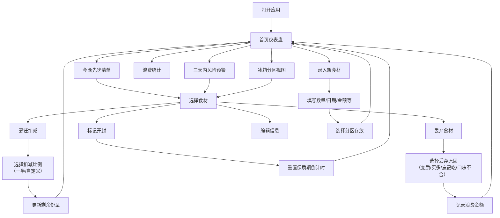

## 1. 产品概述

冰箱食材管理应用，解决"打开冰箱像开盲盒"的痛点。通过分区展示、倒计时提醒、库存追踪和浪费统计，帮助用户高效管理食材，减少浪费。

- **主要用途**：追踪食材保质期、管理库存、规划用餐、统计浪费
- **目标用户**：家庭主妇、上班族、独居青年等需要管理冰箱食材的人群
- **市场价值**：减少食物浪费、节省开支、提升生活品质

---

## 2. 核心功能

### 2.1 用户角色

| 角色 | 注册方式 | 核心权限 |
|------|----------|----------|
| 普通用户 | 无需注册，本地存储 | 录入、查看、修改、丢弃食材，查看统计数据 |

### 2.2 功能模块

1. **首页仪表盘**：今晚先吃清单、三天内风险预警、浪费金额统计
2. **冰箱分区视图**：冷藏层、冷冻抽屉、门架三大分区展示
3. **食材录入**：数量、单位、买入日期、开封时间、剩余份量、小票金额
4. **库存管理**：开封倒计时、做饭扣减库存、丢弃（带原因选择）
5. **浪费统计**：按原因分类统计浪费金额和数量

### 2.3 页面详情

| 页面名称 | 模块名称 | 功能描述 |
|----------|----------|----------|
| 首页仪表盘 | 今晚先吃清单 | 显示24小时内过期或开封后急需处理的食材，按紧急程度排序 |
| 首页仪表盘 | 三天内风险 | 显示未来3天将过期的食材，带颜色预警标识 |
| 首页仪表盘 | 浪费统计卡片 | 显示累计浪费金额、本月浪费、最常浪费原因 |
| 冰箱视图 | 分区导航 | Tab切换冷藏层/冷冻抽屉/门架 |
| 冰箱视图 | 食材卡片 | 显示食材名、数量、剩余份量、倒计时进度条、状态标签 |
| 食材录入 | 表单弹窗 | 录入食材名称、分类、数量、单位、买入日期、保质期、开封状态、小票金额 |
| 食材详情 | 操作面板 | 开封、扣减库存（支持一半/自定义）、丢弃（选原因）、编辑 |
| 统计页面 | 浪费明细 | 按时间/原因分类展示丢弃记录和金额统计 |

---

## 3. 核心流程

### 3.1 用户操作流程

用户打开应用 → 首页查看紧急食材 → 选择食材进行处理（烹饪/丢弃）→ 烹饪时扣减库存 → 丢弃时选择原因 → 录入新食材 → 查看浪费统计

### 3.2 流程图

---

## 4. 用户界面设计

### 4.1 设计风格

- **主色调**：清新薄荷绿 (#34D399) 作为主色，代表新鲜健康
- **辅助色**：警示橙 (#F97316) 代表即将过期，危险红 (#EF4444) 代表已过期
- **背景色**：浅灰绿渐变背景 (#F0FDF4 → #ECFDF5)
- **按钮风格**：圆角胶囊形按钮，带微阴影，hover时有轻微上浮效果
- **字体**：标题用"Fraunces"衬线体，正文用"DM Sans"无衬线体
- **布局风格**：卡片式布局，分区明确，带柔和阴影和圆角
- **图标风格**：使用 Lucide 图标库，配合食品类 emoji 增加亲切感

### 4.2 页面设计概述

| 页面名称 | 模块名称 | UI元素 |
|----------|----------|--------|
| 首页仪表盘 | 顶部标题 | 大字体标题"今日冰箱"，带冰箱emoji，渐入动画 |
| 首页仪表盘 | 紧急清单 | 红/橙/黄三色边条卡片，按紧急度倒序排列，进度条显示剩余时间 |
| 首页仪表盘 | 统计区 | 三个并排数字卡片：累计浪费、本月浪费、待处理食材数 |
| 冰箱视图 | 分区Tab | 三个Tab带图标（❄️冷藏/🧊冷冻/🚪门架），选中态有下划动画 |
| 冰箱视图 | 食材网格 | 2-3列响应式网格，卡片悬停上浮，展示食材缩略emoji |
| 录入弹窗 | 表单区 | 分组表单：基本信息、日期信息、存放位置，输入框带左侧图标 |
| 操作面板 | 快捷按钮 | 四个圆形图标按钮：🍳烹饪/🗑️丢弃/✂️开封/✏️编辑 |

### 4.3 响应式设计

- **桌面优先**：大屏采用3列网格，中屏2列，小屏1列
- **侧边导航**：桌面端左侧固定导航，移动端底部Tab栏
- **触控优化**：按钮最小点击区域48px，滑动删除支持
- **弹窗适配**：移动端全屏底部抽屉，桌面端居中模态框

---

## 4.4 动画细节

- 页面加载：卡片依次错位淡入（stagger animation）
- 倒计时：进度条实时更新，最后24小时脉冲动画
- 食材卡片：hover上浮3px，阴影加深
- 操作反馈：扣减/丢弃成功后，卡片缩小淡出
- 紧急标识：即将过期的食材卡片边框呼吸灯效果
