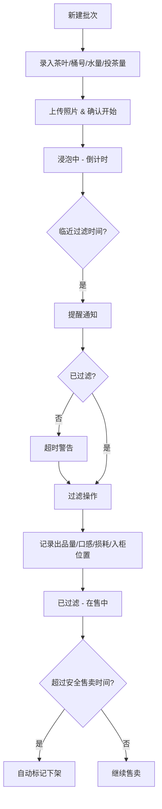

## 1. 产品概述

冷泡茶浸泡管理系统是一款面向茶饮店的生产管理工具，帮助门店标准化管理冷泡茶的浸泡流程，替代传统胶带上手写记录的方式，确保每一批次冷泡茶的品质稳定和食品安全。

- **核心价值**：数字化管理冷泡茶浸泡全流程，减少人为疏忽，提升出品稳定性
- **目标用户**：茶饮店店长、调茶师、门店运营人员
- **解决痛点**：手工记录易遗漏、浸泡时间靠记忆、出品品质不稳定、损耗难统计

## 2. 核心功能

### 2.1 用户角色

| 角色 | 注册方式 | 核心权限 |
|------|----------|----------|
| 门店员工 | 工号登录 | 新建批次、记录过滤、查看列表 |
| 店长 | 管理员账号 | 全部功能 + 统计分析 + 参数配置 |

### 2.2 功能模块

1. **批次管理页**：浸泡中批次看板、新建批次、过滤操作、批次详情
2. **统计分析页**：出品率统计、超时批次分析、报损原因分析、开泡时间建议
3. **基础配置页**：茶叶品种管理、浸泡参数设置、安全售卖时长配置

### 2.3 页面详情

| 页面名称 | 模块名称 | 功能描述 |
|---------|----------|----------|
| 批次管理页 | 状态筛选栏 | 按状态筛选：全部、浸泡中、待过滤、已过滤、已下架 |
| 批次管理页 | 批次卡片列表 | 展示茶叶名称、桶号、剩余时间、进度条、操作按钮 |
| 批次管理页 | 新建批次弹窗 | 茶叶、桶号、水量、投茶量、开始时间、操作人、照片上传 |
| 批次管理页 | 过滤操作弹窗 | 出品量、口感评分、损耗量、损耗原因、入柜位置 |
| 批次管理页 | 提醒通知 | 到点未过滤时醒目提醒，声音+视觉提示 |
| 统计分析页 | 出品率统计 | 每种茶的平均出品率、稳定度趋势 |
| 统计分析页 | 超时分析 | 超时批次数量、超时时长分布 |
| 统计分析页 | 报损分析 | 报损原因占比、损耗金额统计 |
| 统计分析页 | 开泡建议 | 基于历史销量推荐明日各茶品开泡时间和数量 |

## 3. 核心流程

### 3.1 主流程描述

调茶师开始泡冷泡茶时，在系统中新建批次，记录茶叶品种、桶号、水量、投茶量、开始时间等信息并拍照上传。系统自动计算目标过滤时间并开始倒计时。临近过滤时间时系统提醒，到点未过滤则高亮警告。调茶师过滤后在系统中记录出品量、口感、损耗和入柜位置。超过安全售卖时间的批次自动标记为下架。店长可通过统计页面查看出品率、超时情况和报损分析，并获取明日开泡建议。

### 3.2 核心流程图

## 4. 用户界面设计

### 4.1 设计风格

- **主色调**：抹茶绿 `#4A7C59`，代表茶叶、自然、健康
- **辅助色**：琥珀色 `#D4A574`，代表茶汤、温暖
- **警告色**：珊瑚红 `#E07A5F`，用于超时提醒
- **成功色**：森林绿 `#2D6A4F`，用于已完成状态
- **背景色**：米白色 `#FAF8F5`，温暖干净
- **字体**：标题使用「思源宋体」，正文使用「Inter」，体现茶饮店的文艺质感
- **按钮风格**：圆角 12px，柔和阴影，悬停微上浮效果
- **布局风格**：卡片式布局，舒适留白，自然呼吸感
- **图标风格**：线性图标，搭配柔和填充色

### 4.2 页面设计概览

| 页面名称 | 模块名称 | UI 元素 |
|---------|----------|---------|
| 批次管理页 | 顶部导航 | Logo、页面标题、统计概览、新建按钮 |
| 批次管理页 | 状态标签栏 | 横向滚动标签，选中态为抹茶绿背景 |
| 批次管理页 | 批次卡片 | 左侧茶叶色块 + 图标，中间信息区，右侧倒计时和状态 |
| 批次管理页 | 批次卡片 | 进度条展示浸泡进度，不同状态颜色不同 |
| 批次管理页 | 新建弹窗 | 表单分两栏，照片上传区在右侧，底部操作按钮 |
| 统计分析页 | 数据概览卡 | 四个指标卡片：今日批次、出品率、超时数、报损率 |
| 统计分析页 | 出品率图表 | 柱状图展示各茶品出品率对比 |
| 统计分析页 | 报损饼图 | 环形图展示报损原因分布 |
| 统计分析页 | 开泡建议 | 时间轴样式展示明日各时段建议开泡的茶品和数量 |

### 4.3 响应式

- 采用桌面优先设计，主内容区最大宽度 1280px
- 平板端（768px-1024px）：卡片两列布局，侧边导航收起
- 移动端（<768px）：卡片单列布局，底部导航栏
- 触摸优化：按钮最小高度 44px，卡片点击区域充足

### 4.4 交互动效

- 页面加载：卡片淡入 + 轻微上移，错落延迟
- 倒计时：数字变化时有轻微缩放动效
- 状态切换：卡片颜色渐变过渡，平滑自然
- 提醒动画：超时卡片脉冲呼吸效果，吸引注意
- 弹窗：从下方滑入 + 背景模糊效果
