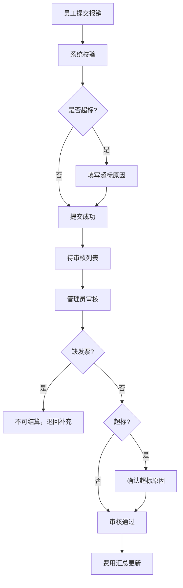

## 1. 产品概述

加班餐报销管理系统，解决企业月底对账痛苦、餐单发票超标理由混杂的问题。提供员工提交、管理员审核、费用汇总三大核心模块，实现报销流程数字化、规范化管理。

## 2. 核心功能

### 2.1 用户角色

| 角色 | 核心权限 |
|------|----------|
| 员工 | 提交加班餐报销申请、查看个人报销记录 |
| 管理员 | 审核报销单、批量过单、查看费用汇总、管理配置 |

### 2.2 功能模块

1. **报销提交页**：员工填写加班餐信息并提交申请
2. **审核管理页**：管理员审核报销单，支持批量操作
3. **费用汇总页**：多维度统计分析，未结算金额常驻显示

### 2.3 页面详情

| 页面名称 | 模块名称 | 功能描述 |
|-----------|-------------|---------------------|
| 报销提交页 | 表单区域 | 日期选择、项目选择、人数输入、店铺名称、金额输入、发票状态、截图上传 |
| 报销提交页 | 超标提示 | 金额超标准时自动提示并要求填写超标原因 |
| 审核管理页 | 待处理列表 | 默认显示所有待审核报销单 |
| 审核管理页 | 异常筛选 | 超标准、缺发票两类异常单独筛选展示 |
| 审核管理页 | 批量操作 | 按项目批量通过审核 |
| 审核管理页 | 详情查看 | 点击单条记录查看截图大图 |
| 审核管理页 | 审核操作 | 通过、驳回、填写审核意见 |
| 费用汇总页 | 维度切换 | 按周、按部门、按项目三种统计口径切换 |
| 费用汇总页 | 未结算金额 | 页面顶部常驻显示未结算总金额 |
| 费用汇总页 | 统计图表 | 柱状图/折线图展示费用趋势 |
| 费用汇总页 | 明细列表 | 各维度费用明细及占比 |

## 3. 核心流程

### 3.1 报销提交流程
员工选择日期和项目 → 填写人数、店铺、金额 → 选择发票状态并上传截图 → 系统自动判断是否超标 → 超标则强制填写原因 → 提交审核

### 3.2 审核流程
管理员进入审核页 → 查看待处理列表 → 可筛选超标准/缺发票 → 单条审核或按项目批量过单 → 缺发票不可结算 → 超标准需确认原因 → 审核完成

## 4. 用户界面设计

### 4.1 设计风格
- **主色调**：深青色 #0F766E（专业、可靠）
- **辅助色**：琥珀色 #F59E0B（警告、超标提示）、红色 #EF4444（错误、缺发票）
- **中性色**：深灰 #1F2937 为主文字，浅灰 #F3F4F6 为背景
- **按钮风格**：圆角 8px，悬停有轻微阴影和缩放效果
- **字体**：系统无衬线字体，清晰易读
- **布局风格**：卡片式布局，左侧导航 + 右侧内容区
- **图标风格**：线性图标，简约现代

### 4.2 页面设计概览

| 页面名称 | 模块名称 | UI 元素 |
|-----------|-------------|----------|
| 报销提交页 | 表单区域 | 卡片式表单，标签左对齐，输入框统一风格 |
| 报销提交页 | 超标提示 | 黄色警告条，加粗文字提示 |
| 审核管理页 | 标签切换 | 待处理/超标准/缺发票/已完成 四标签 |
| 审核管理页 | 列表卡片 | 每条记录为卡片，显示关键信息和状态标签 |
| 审核管理页 | 批量操作栏 | 顶部固定，项目筛选 + 批量通过按钮 |
| 费用汇总页 | 顶部金额卡 | 大号数字显示未结算金额，醒目突出 |
| 费用汇总页 | 维度切换 | 分段控制器切换统计口径 |
| 费用汇总页 | 图表区域 | 柱状图展示费用分布 |

### 4.3 响应式设计
- 桌面端优先设计
- 平板端自适应布局
- 移动端导航折叠为侧边抽屉

### 4.4 交互细节
- 表单输入有 focus 状态高亮
- 按钮悬停有微动画（背景加深 + 轻微上移）
- 列表项悬停背景变化
- 模态框淡入淡出效果
- 金额数字使用等宽字体
