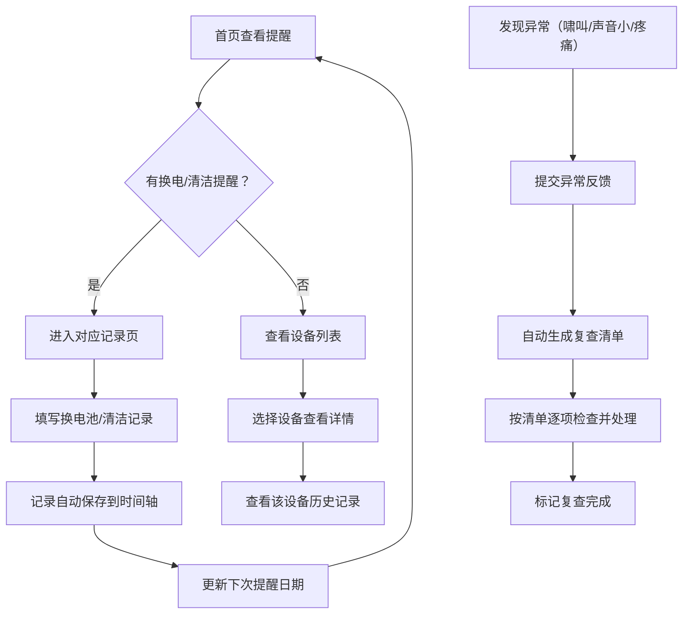

## 1. 产品概述

助听器电池及清洁记录管理系统，专为家中有老人佩戴助听器的家庭设计。解决助听器没电、清洁不及时、异常情况被忽视等问题，确保老人助听器始终处于良好工作状态。

- 主要用途：助听器设备信息管理、电池更换记录、清洁维护记录、异常反馈追踪
- 目标用户：家中有听力障碍老人的家庭成员、照护者

## 2. 核心特性

### 2.1 用户角色

| 角色 | 注册方式 | 核心权限 |
|------|----------|----------|
| 家庭成员 | 无需注册（本地存储） | 设备管理、记录维护、查看提醒 |

### 2.2 功能模块

1. **首页仪表盘**：未来三天换电提醒、电池库存、最近异常记录、下次复诊提醒
2. **设备管理页**：助听器设备信息录入与编辑（左右耳、型号、电池规格、验配门店、保修期、照片）
3. **记录管理页**：换电池记录、清洁记录的增删改查
4. **复查清单页**：异常反馈自动触发复查待办项

### 2.3 页面详情

| 页面名称 | 模块名称 | 功能描述 |
|----------|----------|----------|
| 首页仪表盘 | 未来三天换电提醒 | 展示电池即将耗尽的设备卡片，按紧急程度排序 |
| 首页仪表盘 | 电池库存总览 | 显示各规格电池剩余数量，低库存高亮警告 |
| 首页仪表盘 | 最近异常记录 | 列出近期反馈的啸叫、声音小、佩戴疼痛等问题 |
| 首页仪表盘 | 下次复诊提醒 | 显示距离验配门店复诊日期倒计时 |
| 设备管理 | 设备卡片列表 | 展示所有助听器设备，含缩略图和基本信息 |
| 设备管理 | 新增/编辑设备表单 | 录入左右耳、型号、电池规格、验配门店、保修期、照片、下次复诊日期 |
| 记录管理 | 换电池记录表单 | 记录日期、剩余电量、更换人、旧电池漏液情况 |
| 记录管理 | 清洁记录表单 | 勾选耳塞、导声管、干燥盒、麦克风口清洁项 |
| 记录管理 | 记录时间轴 | 按时间倒序展示所有换电池和清洁记录 |
| 复查清单 | 异常反馈入口 | 快速反馈啸叫、声音小、佩戴疼痛 |
| 复查清单 | 自动生成待办 | 异常反馈后自动生成复查检查项清单 |

## 3. 核心流程

## 4. 用户界面设计

### 4.1 设计风格

- **主色调**：温暖的蓝绿色系（#2A9D8F 青绿色），传递安心、健康的感觉
- **辅助色**：柔和橙色（#E9C46A）用于提醒和强调，红色（#E76F51）用于紧急警告
- **背景色**：浅米色（#F8F5F0），温暖舒适不刺眼，适合老人使用场景
- **按钮风格**：圆角矩形（12px），带有柔和阴影，点击有微下沉效果
- **字体**：Noto Sans SC（思源黑体），清晰易读，字号偏大便于老人查看
- **布局风格**：卡片式布局，大间距，信息层次分明
- **图标风格**：圆角线条图标，emoji增强直观性（🔋、🧹、👂、⚠️）

### 4.2 页面设计概览

| 页面名称 | 模块名称 | UI元素 |
|----------|----------|--------|
| 首页仪表盘 | 顶部问候 | 日期显示 + 温馨提示语，渐变背景 |
| 首页仪表盘 | 四象限卡片网格 | 2x2布局展示换电提醒、电池库存、异常记录、复诊提醒，每张卡片有独立图标和主色 |
| 首页仪表盘 | 快速操作区 | 大号按钮：换电池、做清洁、报异常 |
| 设备管理 | 设备卡片网格 | 每行2-3张卡片，卡片含设备照片、左右耳标识、电池规格标签 |
| 设备管理 | 悬浮新增按钮 | 右下角圆形+号按钮 |
| 设备管理 | 表单弹窗 | 模态框表单，大输入框，清晰标签 |
| 记录管理 | 时间轴 | 左侧垂直时间线，右侧记录卡片，换电池用蓝色标识、清洁用绿色标识 |
| 记录管理 | 筛选标签 | 顶部标签切换：全部记录 / 换电池 / 清洁记录 |
| 复查清单 | 异常统计卡片 | 顶部横向排列三种异常类型统计 |
| 复查清单 | 待办清单 | 勾选框 + 待办项，完成项划灰显示 |

### 4.3 响应式

- 桌面端优先设计（1280px+）
- 平板端（768px-1280px）：卡片自适应列数
- 移动端（<768px）：单列布局，字号保持可读性，触摸区域不小于44px
- 所有交互元素优化触摸操作

