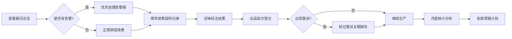

## 1. 产品概述

卤锅续煮台账系统是一款面向后厨卤味加工场景的生产管理工具，解决卤锅交班信息不对称、续煮记录缺失、品质波动不可追溯的痛点。通过数字化台账记录每口卤锅的实时状态、续煮操作、试味结果和出品批次，帮助后厨团队稳定出品质量、优化香料消耗、科学安排清锅周期。

## 2. 核心功能

### 2.1 用户角色

| 角色 | 使用方式 | 核心权限 |
|------|---------|----------|
| 卤味师傅 | 工号登录/快速切换 | 查看锅况、填写续煮记录、记录出锅、试味标注 |
| 后厨主管 | 管理员账号 | 全部操作权限、查看统计分析、设置告警阈值 |

### 2.2 功能模块

1. **锅况总览页**：所有卤锅状态卡片、告警高亮、今日出品概览
2. **续煮记录页**：续锅投料表单、试味结果记录、历史续煮流水
3. **出品记录页**：按锅号挂接出品批次、品类数量登记、客诉标记
4. **统计分析页**：香料消耗排行、清锅周期提醒、品质趋势图表

### 2.3 页面详情

| 页面名称 | 模块名称 | 功能描述 |
|---------|---------|---------|
| 锅况总览 | 卤锅状态卡 | 展示锅号、剩汤高度、盐度、颜色、今日卤过的品类、是否需要撇油 |
| 锅况总览 | 告警横幅 | 低液位、连续使用超72小时、客诉集中的锅号红色高亮提醒 |
| 锅况总览 | 快捷操作区 | 一键进入续锅、出锅登记、查看详情 |
| 续煮记录 | 投料表单 | 填写加水、加盐、加糖色、加香料包、加老汤的数量 |
| 续煮记录 | 试味标注 | 选择淡了/咸了/香味弱/正常，可补充备注 |
| 续煮记录 | 续煮流水 | 按时间倒序显示该锅所有续煮操作记录 |
| 出品记录 | 批次登记 | 选择锅号、品类（鸭脖/鸡爪/豆干）、数量、出锅时间 |
| 出品记录 | 客诉标记 | 对特定批次标记客诉，自动关联到对应卤锅 |
| 统计分析 | 香料消耗排行 | 按月统计每口锅的香料包使用量，排序展示 |
| 统计分析 | 清锅提醒 | 根据使用天数和续煮次数计算推荐清锅日期 |
| 统计分析 | 品质趋势 | 试味结果时间分布、客诉关联锅号分析 |

## 3. 核心流程

师傅接班后先查看锅况总览，确认每口锅的状态和告警。需要续锅时进入续煮记录页，选择锅号后填写投料量和试味结果。每批产品出锅时在出品记录页登记批次信息，关联到具体卤锅。月底主管通过统计分析页查看香料消耗排行和清锅提醒，安排下月工作计划。

## 4. 用户界面设计

### 4.1 设计风格

- **主色调**：深酱红 #8B2500 搭配琥珀金 #D4A84B，呼应卤味色泽
- **辅助色**：警告红 #E53935、正常绿 #43A047、中性灰 #546E7A
- **按钮风格**：圆角矩形，实心按钮配细边框，按压有下沉效果
- **字体**：标题用粗黑体，正文用清晰易读的无衬线字体，数字用等宽字体
- **布局风格**：卡片式布局，顶部导航 + 左侧锅号快速切换
- **图标风格**：线性图标，统一 2px 描边，配套餐饮主题图标

### 4.2 页面设计概述

| 页面名称 | 模块名称 | UI 元素 |
|---------|---------|--------|
| 锅况总览 | 卤锅状态卡 | 锅号大号数字、环形液位图、状态标签组、告警角标 |
| 锅况总览 | 告警横幅 | 红色渐变背景、闪烁动画、跳转按钮 |
| 续煮记录 | 投料表单 | 数字输入框带增减按钮、单位标签、试味单选卡片 |
| 续煮记录 | 续煮流水 | 时间轴布局、投料量标签、试味结果徽章 |
| 出品记录 | 批次登记表 | 下拉选择器、数量输入、客诉勾选框 |
| 统计分析 | 排行列表 | 排名徽章、锅号、消耗量、进度条对比 |
| 统计分析 | 清锅日历 | 日期格子高亮、清锅标记、悬停详情 |

### 4.3 响应式

桌面端优先设计，适配后厨大屏显示器。平板端自适应卡片排列，手机端简化为列表视图便于巡场查看。触屏按钮尺寸不小于 44px，方便戴手套操作。
