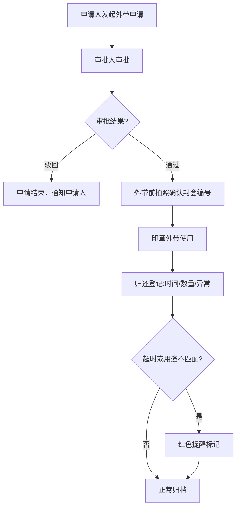

## 1. 产品概述

印章外带登记系统，用于规范公司印章外带流程，解决纸质登记难以追踪归还的痛点。支持印章档案管理、外带申请审批、拍照确认、归还登记及异常提醒，通过数据看板全面监控印章使用状态。

- 目标用户：行政人员、印章保管人、部门经理、审批领导
- 核心价值：印章全生命周期可追溯，降低合规风险，提升管理效率

## 2. 核心功能

### 2.1 用户角色
| 角色 | 说明 | 核心权限 |
|------|------|----------|
| 印章管理员 | 行政/印章保管人员 | 管理印章档案、登记归还、查看全部记录 |
| 申请人 | 普通员工 | 发起外带申请、查看本人申请记录 |
| 审批人 | 部门经理/领导 | 审批外带申请、查看部门用印统计 |

### 2.2 功能模块
1. **数据看板**: 今日外带、待审批、逾期统计、常用场景、各部门用印次数
2. **印章档案管理**: 印章类型、编号、保管人、适用范围、风险等级、照片
3. **外带申请**: 用途、文件类型、目的地、预计归还、陪同人、审批人
4. **外带与归还登记**: 外带前拍照确认封套编号、归还记录实际时间/盖章数量/异常
5. **异常提醒**: 超时未归还红色提醒、用途不匹配红色提醒

### 2.3 页面详情
| 页面名称 | 模块名称 | 功能描述 |
|----------|----------|----------|
| 数据看板 | 统计卡片 | 展示今日外带数、待审批数、逾期数、总印章数 |
| 数据看板 | 常用场景 | 柱状图展示TOP5用印场景 |
| 数据看板 | 部门统计 | 柱状图展示各部门月度用印次数 |
| 数据看板 | 近期记录 | 列表展示最近外带记录与状态 |
| 印章档案 | 印章列表 | 卡片展示所有印章，支持搜索筛选 |
| 印章档案 | 印章详情 | 展示印章完整信息与历史记录 |
| 印章档案 | 新增/编辑 | 录入印章类型、编号、保管人、适用范围、风险等级、照片 |
| 外带申请 | 申请列表 | 展示申请记录，支持状态筛选 |
| 外带申请 | 发起申请 | 选择印章、填写用途、文件类型、目的地、预计归还、陪同人、审批人 |
| 外带申请 | 审批操作 | 审批人查看详情并通过/驳回 |
| 外带登记 | 外带确认 | 拍照上传、输入封套编号、确认外带 |
| 归还登记 | 归还确认 | 记录实际归还时间、盖章文件数量、是否异常及备注 |

## 3. 核心流程

用户选择印章发起外带申请 → 审批人审批 → 通过后外带前拍照确认封套编号 → 印章外带使用 → 归还时登记实际时间、盖章数量、异常情况 → 系统自动判断是否超时或用途不匹配并触发红色提醒。

## 4. 用户界面设计

### 4.1 设计风格
- **主色调**: 深邃藏蓝 #1a365d 作为主色，传递专业、信任、稳重的政务/企业感
- **辅助色**: 金色 #d4a017 作为点缀色，呼应印章的权威感
- **警示色**: 正红 #c53030 用于超时/异常提醒，视觉冲击力强
- **背景色**: 暖灰 #f7f5f2，营造纸质档案的质感
- **按钮风格**: 圆角矩形 8px，主按钮采用藏蓝填充+金色边框，悬停微浮起动效
- **字体**: 标题使用"Noto Serif SC"衬线体（正式感），正文使用"Noto Sans SC"
- **布局风格**: 卡片式布局，微阴影+微妙边框，模拟档案盒质感
- **图标风格**: 使用线性图标，主操作按钮配圆形印章风格图标

### 4.2 页面设计概览
| 页面名称 | 模块名称 | UI元素 |
|----------|----------|--------|
| 数据看板 | 统计卡片 | 渐变背景、数据数字动画、状态色标识 |
| 数据看板 | 图表区域 | 柱状图使用藏蓝渐变柱、金色标注线 |
| 印章档案 | 印章卡片 | 左侧印章图片、右侧信息、风险等级色标 |
| 外带申请 | 申请表单 | 分组表单、印章选择器、日期选择器 |
| 外带登记 | 拍照区域 | 摄像头预览框、封套编号输入、确认按钮 |
| 归还登记 | 归还表单 | 异常勾选、红色异常提示栏 |

### 4.3 响应式
- 桌面端优先设计，主内容区最大宽度 1440px
- 侧边导航在平板端折叠为图标模式
- 移动端卡片单列布局，图表自适应缩放
