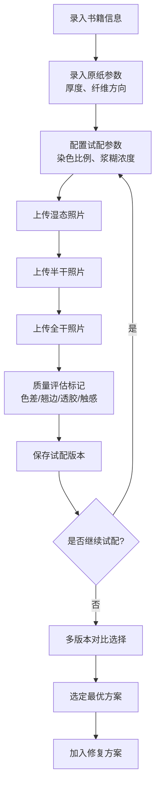

## 1. 产品概述

古籍修复补纸试配记录系统，为古籍修复师提供专业的补纸试配过程记录与管理工具。解决补纸颜色、纤维方向细微差异干后明显的问题，通过系统化记录试配参数和三态对比照片，帮助修复师精准选择最优补纸方案。

- 主要用途：记录补纸试配全过程，包括原纸参数、染色配方、三态照片对比、质量评估
- 目标用户：古籍修复师、文物保护专业人员
- 产品价值：提高补纸匹配精度，留存修复过程数据，形成可追溯的修复方案

## 2. 核心功能

### 2.1 用户角色

| 角色 | 注册方式 | 核心权限 |
|------|----------|----------|
| 修复师 | 账号登录 | 录入试配记录、上传照片、评估标记、管理修复方案 |

### 2.2 功能模块

1. **书籍信息管理**：书籍基本信息录入、修复方案汇总
2. **补纸试配记录**：原纸参数录入、试配参数记录、三态照片上传
3. **质量评估标记**：色差、翘边、透胶、触感差异标记与评分
4. **方案选定**：多版试配对比、最优方案选定、加入修复方案

### 2.3 页面详情

| 页面名称 | 模块名称 | 功能描述 |
|----------|----------|----------|
| 补纸试配记录页 | 书籍信息栏 | 显示当前书籍名称、编号、朝代等基本信息 |
| 补纸试配记录页 | 原纸参数录入 | 厚度、纤维方向输入 |
| 补纸试配记录页 | 试配参数录入 | 染色比例、浆糊浓度输入、试配版本号 |
| 补纸试配记录页 | 三态照片上传 | 湿态、半干、全干照片上传与预览 |
| 补纸试配记录页 | 质量评估面板 | 色差、翘边、透胶、触感四项评分与标记 |
| 补纸试配记录页 | 试配版本列表 | 历史试配记录卡片式展示 |
| 补纸试配记录页 | 方案选定区 | 最优版本选择、确认加入修复方案 |

## 3. 核心流程

修复师录入书籍信息 → 录入原纸厚度与纤维方向 → 配置染色比例与浆糊浓度 → 依次上传湿态、半干、全干照片 → 标记色差/翘边/透胶/触感差异 → 保存当前试配版本 → 可多次试配生成多版本 → 对比选择最优版本 → 确认加入修复方案

## 4. 用户界面设计

### 4.1 设计风格
- **主色调**：米白色（#FAF6ED）作为背景，深褐色（#5D4E37）作为主色，赭石色（#C08060）作为强调色
- **辅色调**：墨青色（#3D5A6C）用于交互元素，淡雅米色（#F5EFE0）用于卡片背景
- **整体风格**：典雅古朴，契合古籍修复的文化属性，采用宣纸质感纹理背景
- **按钮风格**：圆角矩形，微浮雕效果，悬停时有淡色晕染过渡
- **字体**：标题采用「思源宋体」，正文采用「思源黑体」，营造文化感与可读性的平衡
- **布局风格**：左右分栏布局，左侧为参数录入区，右侧为照片对比与评估区
- **装饰元素**：细边线分隔、传统回纹装饰边角、印章式状态标记

### 4.2 页面设计概述

| 页面名称 | 模块名称 | UI元素 |
|----------|----------|--------|
| 补纸试配记录页 | 书籍信息栏 | 仿古卷轴式标题栏，显示书名、编号、朝代标签 |
| 补纸试配记录页 | 原纸参数录入 | 表单式布局，厚度带单位选择，纤维方向可选纵横斜 |
| 补纸试配记录页 | 试配参数录入 | 染色比例支持多色配比滑块，浆糊浓度带浓度图示 |
| 补纸试配记录页 | 三态照片上传 | 三栏并排布局，每栏有上传区+预览+状态标签 |
| 补纸试配记录页 | 质量评估面板 | 四项评分卡片，每项有等级选择器+备注输入 |
| 补纸试配记录页 | 试配版本列表 | 时间轴式卡片排列，显示缩略图与核心参数 |
| 补纸试配记录页 | 方案选定区 | 底部固定操作栏，对比按钮+确认按钮 |

### 4.3 交互与动效
- 页面加载：元素渐入动画，从顶部标题栏开始，依次向下展开
- 照片上传：拖拽上传时有边框高亮和透明度变化
- 评分选择：星级/等级选择时有弹性缩放动效
- 版本切换：平滑过渡动画，参数区联动更新
- 按钮交互：悬停时背景色渐变，点击时有微缩反馈

### 4.4 响应式
- 桌面端（默认）：左右分栏布局，左侧40%参数区，右侧60%照片与评估区
- 平板端：改为上下布局，参数区在上，照片区在下
- 移动端：单列流式布局，照片改为轮播形式，触控优化
