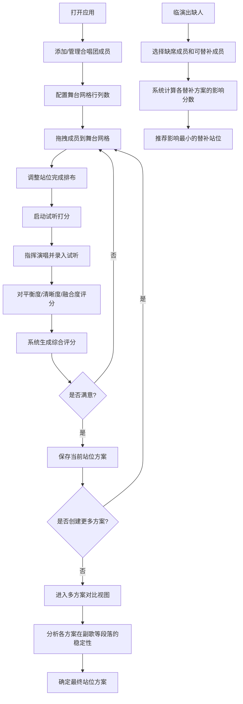

## 1. 产品概述

合唱团声部站位试听工具是一款面向合唱团指挥、声乐指导的专业排练辅助软件，通过可视化舞台网格和声部声学模型，解决排练中"换站位就失衡"的核心痛点，帮助指挥快速找到最佳成员排布方案。

- 核心目标：让指挥在排练前就能预判声部平衡，减少反复试位的时间成本
- 目标用户：合唱团指挥、声乐指导、艺术总监
- 应用场景：日常排练站位优化、演出前最终站位确认、临时缺人替补方案生成

---

## 2. 核心功能

### 2.1 用户角色
| 角色 | 注册方式 | 核心权限 |
|------|---------|---------|
| 指挥 | 无需注册，本地使用 | 全部功能：成员管理、站位编辑、试听打分、方案保存、替补推荐 |

### 2.2 功能模块
1. **首页/工作台**：声部图例、成员列表、快捷操作入口
2. **舞台编辑区**：可视化网格站位、拖拽摆位、声部标识
3. **成员管理面板**：添加/编辑成员、指定声部、上传头像
4. **试听打分面板**：试听录制、三维度评分（平衡度/清晰度/融合度）、实时声学模拟
5. **方案管理面板**：保存多套站位、方案命名备注、方案对比视图
6. **替补推荐面板**：缺失成员选择、替补影响分析、最优站位推荐

### 2.3 页面详情
| 页面名称 | 模块名称 | 功能描述 |
|---------|---------|-----------|
| 主工作台 | 顶部导航 | Logo、当前方案名称、保存/新建/比较按钮 |
| 主工作台 | 左侧成员面板 | 声部筛选标签、成员卡片列表、拖拽源、添加成员按钮 |
| 主工作台 | 中心舞台区 | 可配置行列表格、成员站位格、声部色区分、空站位提示、拖拽放置 |
| 主工作台 | 右侧工具面板 | Tab切换：试听打分/方案管理/替补推荐 |
| 试听打分Tab | 试听控制 | 开始/停止试听、试听段落选择 |
| 试听打分Tab | 三维评分 | 平衡度、清晰度、融合度滑块打分、自动计算综合得分 |
| 试听打分Tab | 声学热力图 | 舞台各区域声压级可视化、声部覆盖重叠图 |
| 方案管理Tab | 方案列表 | 卡片式展示所有保存方案、显示综合评分、创建时间 |
| 方案管理Tab | 方案对比 | 多方案并排对比、分数柱状图对比、站位差异高亮 |
| 替补推荐Tab | 缺人选择 | 选择缺失成员、可选替补列表 |
| 替补推荐Tab | 影响分析 | 各替补方案对三个维度的影响评分、最小影响方案置顶推荐 |

---

## 3. 核心流程

**主流程：创建站位 → 摆放成员 → 试听打分 → 保存方案 → 多方案对比 → 确定最优方案**

---

## 4. 用户界面设计

### 4.1 设计风格
**设计理念：音乐厅质感 + 专业指挥台**

- **主色调**：深邃勃艮第酒红 `#8B1A34`（象征舞台幕布），搭配暖金 `#D4AF37`（象征音乐厅灯光）
- **辅助色**：四声部专属配色 —— 女高Soprano柔粉 `#FF6B9D`、女低Alto紫蓝 `#7B68EE`、男高Tenor琥珀 `#FFA94D`、男低Bass墨绿 `#4CAF7D`
- **背景**：深色炭黑渐变 `#1A1A2E → #16213E`，配以微弱颗粒噪点营造音乐厅氛围
- **按钮风格**：圆角12px，微妙内阴影 + 悬浮上浮动画，主按钮金箔渐变
- **字体**：标题用 Playfair Display（古典衬线体，体现音乐艺术感），正文用 Lato（清晰现代无衬线体）
- **图标风格**：Lucide 线性图标，配以金色高亮
- **整体氛围**：暗色系专业工具感，类似专业录音软件界面，高对比度确保长时间使用不疲劳

### 4.2 页面设计概述
| 页面区域 | 模块名称 | UI元素 |
|---------|---------|--------|
| 顶部 | 导航栏 | 左Logo+标题、中当前方案名(可编辑)、右操作按钮组(新建/保存/比较) |
| 左侧 | 成员面板 | 四部合唱标签栏、成员垂直滚动列表、成员卡片(头像+姓名+声部色条)、底部添加成员浮动按钮 |
| 中心 | 舞台编辑区 | 顶部网格行列调节器、中央透视感舞台(后高前低)、带网格编号的站位格、拖拽放置高亮、声部色块叠层、底部图例说明 |
| 右侧 | 工具面板 | 三个Tab(试听打分/方案管理/替补推荐)、每个Tab内卡片式内容、圆角深色面板、金色强调线 |
| 试听 | 打分模块 | 三个维度大滑块(每个配表情图标)、综合分数环、热力图canvas、试听录制波形条 |
| 方案 | 对比模块 | 横向可滑动方案卡片、雷达图对比、差异站位红色边框闪烁 |
| 替补 | 推荐模块 | 缺人下拉选择、替补成员多选、影响度分数列表(绿-黄-红色条)、最佳方案置顶徽章 |

### 4.3 响应式设计
- **桌面优先**：以 1440×900 为基准设计，三栏布局（左280px + 中弹性 + 右360px）
- **平板适配**：≤1024px 时右面板改为底部抽屉，左面板可折叠收起
- **移动端**：≤768px 时单栏上下布局，舞台居中，面板全改为底部Tab切换
- **触控优化**：拖拽区域≥48px，按钮最小40px高度，关键操作添加触觉反馈

### 4.4 视觉特效与动画
- **入场**：元素渐入加向上位移，成员卡片错落延迟入场
- **拖拽**：被拖拽元素半透明+放大1.05倍，目标格金色边框脉冲
- **评分**：滑块拖动时实时数值变化，综合分数环进度动画
- **热力图**：颜色流动动画，声部波纹扩散效果
- **方案对比**：差异站位呼吸式边框高亮
