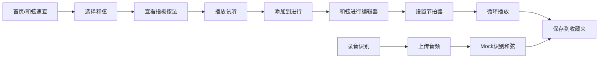

## 1. 产品概述

吉他和弦速查工具是一款面向吉他爱好者的在线应用，提供和弦查询、听音练习、和弦进行创作、录音识别等功能，帮助吉他手快速学习和创作音乐。

- 核心目标：提供直观、易用的吉他和弦学习和创作工具
- 目标用户：吉他初学者、爱好者、音乐创作者

## 2. 核心功能

### 2.1 功能模块

1. **和弦速查页面**：吉他指板可视化、和弦库浏览、和弦详情展示
2. **听音练习页面**：WebAudio吉他音色、和弦播放、扫弦效果
3. **和弦进行编辑器**：拖拽组合和弦、节拍器同步、循环播放
4. **录音识别页面**：上传录音、mock和弦识别、结果展示
5. **收藏夹页面**：和弦进行收藏、命名分类、本地存储

### 2.2 页面详情

| 页面名称 | 模块名称 | 功能描述 |
|---------|---------|---------|
| 和弦速查 | 指板可视化 | 6弦吉他指板图，红点标手指位置，圆圈标空弦，X标不弹 |
| 和弦速查 | 和弦库 | 60+常用和弦，按根音/类型分类筛选，搜索功能 |
| 听音练习 | 和弦播放 | WebAudio模拟吉他音色，单音/扫弦播放 |
| 和弦进行 | 拖拽编辑器 | 拖拽和弦卡片组成进行，支持删除和重排 |
| 和弦进行 | 节拍器 | BPM调节，节拍声响，循环播放整段进行 |
| 录音识别 | 上传识别 | 上传音频文件，mock识别和弦结果 |
| 收藏夹 | 收藏管理 | 保存和弦进行，命名分类，编辑删除 |

## 3. 核心流程

### 3.1 和弦查询流程
用户选择和弦 → 指板实时更新显示按法 → 点击播放按钮试听 → 可添加到和弦进行

### 3.2 和弦进行创作流程
从和弦库拖拽和弦 → 组成进行序列 → 设置BPM和节拍 → 点击播放循环 → 保存到收藏夹

### 3.3 录音识别流程
上传录音文件 → 模拟识别过程 → 显示识别的和弦序列 → 可保存到收藏夹

## 4. 用户界面设计

### 4.1 设计风格
- **主色调**：深木色(#5D4037)配暖橙色(#FF9800)，营造吉他木质温暖感
- **辅助色**：米白色(#FFF8E1)背景，深灰色(#333333)文字
- **按钮风格**：圆角矩形，轻微阴影，悬停有按压效果
- **字体**：标题用Playfair Display，正文用Inter，营造优雅音乐感
- **布局风格**：卡片式布局，中间突出吉他指板，侧边栏和弦库
- **视觉元素**：吉他木纹纹理背景，音符装饰元素，极简图标

### 4.2 页面设计概述

| 页面名称 | 模块名称 | UI元素 |
|---------|---------|-------|
| 和弦速查 | 指板区域 | 大尺寸吉他指板SVG，6条弦，品格标记，彩色按法指示 |
| 和弦速查 | 和弦库侧栏 | 分类标签，和弦卡片网格，搜索框 |
| 听音练习 | 控制面板 | 播放/暂停，音量调节，和弦信息展示 |
| 和弦进行 | 编辑区 | 横向时间轴，和弦卡片拖拽，添加/删除按钮 |
| 和弦进行 | 节拍器 | BPM滑块，节拍指示灯，播放控制 |
| 录音识别 | 上传区 | 拖拽上传区域，波形展示，识别进度条 |
| 收藏夹 | 列表区 | 收藏卡片，分类标签，编辑/删除按钮 |

### 4.3 响应式设计
- 桌面端：左右分栏布局，左侧和弦库，中间指板，右侧控制面板
- 平板端：上下布局，上半部分指板，下半部分和弦库和控制
- 移动端：垂直滚动布局，指板自适应宽度，和弦库折叠显示
- 触控优化：增大按钮点击区域，支持触摸滑动和弦选择

### 4.4 动效设计
- 指板按法切换时的平滑过渡动画
- 播放时琴弦振动的视觉效果
- 拖拽和弦卡片时的悬浮和吸附效果
- 节拍器指示灯的闪烁动画
- 页面切换的淡入淡出过渡
