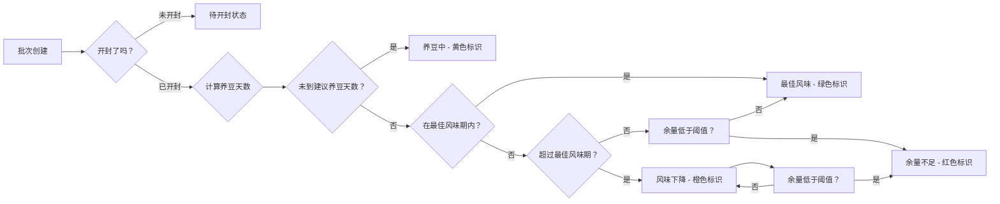

## 1. 产品概述

咖啡豆开封养豆看板是一款专为咖啡爱好者设计的咖啡豆管理工具，帮助用户追踪每批豆子的养豆进度、剩余克数和萃取记录，让每一杯咖啡都处于最佳风味期。

- 解决咖啡豆开封后养豆天数和剩余克数难以追踪的问题
- 通过可视化看板和智能提醒，确保每批豆子在最佳风味期内被享用
- 记录萃取参数和反馈，帮助用户不断优化冲煮手法

## 2. 核心功能

### 2.1 功能模块

1. **看板首页**：批次卡片展示、状态标识、快速出豆操作
2. **批次管理**：新增/编辑批次、袋身照片上传、风味标签管理
3. **出豆记录**：扣减克数、冲煮方式、研磨刻度、萃取反馈
4. **统计分析**：消耗速度、出品评价、浪费量、补货建议

### 2.2 页面详情

| 页面名称 | 模块名称 | 功能描述 |
|---------|---------|---------|
| 看板首页 | 批次卡片列表 | 展示所有咖啡豆批次，按状态排序，显示剩余克数和养豆进度 |
| 看板首页 | 状态筛选栏 | 按养豆状态筛选：全部、养豆中、最佳风味、即将过期、已过期 |
| 看板首页 | 快速出豆 | 点击批次卡片快速记录出豆，扣减克数 |
| 批次详情 | 基本信息 | 产区、处理法、烘焙日期、开封日期、建议养豆天数 |
| 批次详情 | 风味标签 | 可自定义的风味标签，如花香、果香、坚果等 |
| 批次详情 | 袋身照片 | 上传咖啡豆包装袋照片，直观识别 |
| 批次详情 | 出豆历史 | 该批次所有出豆记录的时间线 |
| 新增批次 | 表单填写 | 完整的批次信息录入表单 |
| 新增批次 | 照片上传 | 支持拍照或从相册选择袋身照片 |
| 出豆记录 | 克数扣减 | 输入本次使用克数，自动计算剩余 |
| 出豆记录 | 冲煮方式 | 手冲、意式、冷萃三种选项 |
| 出豆记录 | 萃取参数 | 研磨刻度、水温、粉水比等参数 |
| 出豆记录 | 风味评价 | 星级评分和文字反馈 |
| 统计页 | 消耗速度 | 各批次日均消耗克数图表 |
| 统计页 | 出品评价 | 各批次平均评分排行 |
| 统计页 | 浪费统计 | 过期或剩余不足导致的浪费量 |
| 统计页 | 补货建议 | 基于消耗速度预测下周需要补货的豆子 |

## 3. 核心流程

### 3.1 主要用户流程

用户打开应用后，首先看到看板首页，展示所有咖啡豆批次的状态。用户可以：
- 查看各批次的养豆进度和剩余克数
- 对某批次进行出豆操作，记录冲煮参数和反馈
- 添加新的咖啡豆批次
- 查看统计数据，了解消耗情况和补货需求

### 3.2 状态判断逻辑

## 4. 用户界面设计

### 4.1 设计风格

- **设计方向**：温暖精致的咖啡馆风格，木质色调搭配奶油色背景
- **主色调**：深咖啡色 (#3E2723) 作为主色，暖橙色 (#FF8A65) 作为强调色
- **辅助色**：奶油白 (#FFF8E1) 背景，抹茶绿 (#81C784) 表示最佳状态
- **卡片风格**：圆角卡片，微妙阴影，模拟咖啡杯垫的质感
- **字体**：标题使用优雅的衬线字体，正文使用清晰的无衬线字体
- **图标风格**：线性图标，咖啡相关元素点缀

### 4.2 页面设计概述

| 页面名称 | 模块名称 | UI 元素 |
|---------|---------|---------|
| 看板首页 | 顶部导航 | 品牌logo、统计页入口、新增批次按钮 |
| 看板首页 | 状态筛选 | 横向滚动标签，选中态为填充胶囊 |
| 看板首页 | 批次卡片 | 左侧色条标识状态、袋身照片缩略图、产区名称、剩余克数进度条、养豆天数标签 |
| 批次详情 | 头部区域 | 大图展示袋身照片、状态徽章、基本信息网格 |
| 批次详情 | 风味标签 | 圆角标签云，可点击筛选 |
| 批次详情 | 出豆历史 | 时间线样式，每次出豆一条记录 |
| 出豆弹窗 | 表单区域 | 克数输入、冲煮方式选择器、研磨刻度滑块、评价星级 |
| 统计页 | 数据卡片 | 四个核心指标卡片：总批次、在养、即将过期、总消耗 |
| 统计页 | 图表区域 | 消耗速度柱状图、评分雷达图 |
| 统计页 | 补货列表 | 卡片式列表，显示预计耗尽日期和建议补货量 |

### 4.3 响应式设计

- 桌面端优先设计，自适应平板和手机尺寸
- 桌面端：批次卡片为 3 列网格布局
- 平板端：批次卡片为 2 列网格布局
- 手机端：批次卡片为单列列表布局，底部导航栏
- 触控优化：所有可点击元素不小于 44x44pt

### 4.4 交互动效

- 批次卡片悬停时轻微上浮，阴影加深
- 状态变化时有颜色渐变过渡动画
- 出豆确认后剩余克数数字滚动变化
- 页面切换使用淡入淡出过渡
- 弹窗从底部滑入，背景模糊效果
