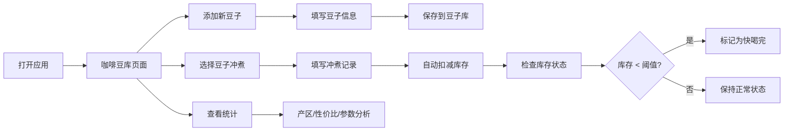

# 咖啡豆笔记 - 产品需求文档

## 1. 产品概述

咖啡豆笔记是一款帮助咖啡爱好者管理咖啡豆收藏和冲煮记录的工具应用。用户可以记录每款咖啡豆的详细信息、追踪库存、记录每次冲煮的参数与风味体验，并通过统计分析发现自己的口味偏好。

- **核心问题**：咖啡豆买太多记不住风味特点，冲煮参数随意导致口感不稳定
- **目标用户**：家庭咖啡爱好者、手冲咖啡玩家
- **产品价值**：系统化管理咖啡豆库存，沉淀冲煮经验，量化风味偏好

## 2. 核心功能

### 2.1 用户角色

| 角色 | 注册方式 | 核心权限 |
|------|----------|----------|
| 普通用户 | 无需注册，本地存储 | 完整使用所有功能，数据保存在本地浏览器 |

### 2.2 功能模块

1. **咖啡豆库**：豆子卡片列表、新增/编辑豆子、库存管理、风味标签筛选
2. **冲煮记录**：记录冲煮参数、风味评分、口感备注、自动扣减库存
3. **统计分析**：最喜欢的产区、性价比最高的豆子、常用冲煮参数

### 2.3 页面详情

| 页面名称 | 模块名称 | 功能描述 |
|----------|----------|----------|
| 咖啡豆库 | 豆子卡片网格 | 展示所有咖啡豆卡片，显示产地、烘焙度、剩余克数、状态标签 |
| 咖啡豆库 | 风味筛选栏 | 按酸、甜、苦、坚果、花香等风味标签筛选豆子 |
| 咖啡豆库 | 新增/编辑表单 | 填写产地、处理法、烘焙度、购买日期、价格、推荐研磨度、包装照片、初始克数、低库存阈值 |
| 咖啡豆库 | 库存状态指示 | 正常/即将喝完/已喝完三种状态，低于阈值高亮提醒 |
| 冲煮记录 | 记录列表 | 按时间倒序展示所有冲煮记录 |
| 冲煮记录 | 新增记录表单 | 选择豆子、填写器具、粉水比、水温、萃取时间、粉量、风味评分、口感备注 |
| 冲煮记录 | 风味标签选择 | 可多选酸、甜、苦、坚果、花香等风味标签 |
| 统计分析 | 产区分布 | 饼图展示各产区豆子数量/冲煮次数 |
| 统计分析 | 性价比排行 | 按每克价格和综合评分排序的豆子列表 |
| 统计分析 | 常用参数 | 最常用的器具、粉水比、水温分布统计 |

## 3. 核心流程

## 4. 用户界面设计

### 4.1 设计风格

**风格定位**：温暖自然 · 有机质感 · 咖啡文化

- **主色调**：深咖啡色 `#4A3728`（代表咖啡的醇厚与专业）
- **辅助色**：暖米色 `#F5EFE6`（背景，温暖舒适）、焦糖橙 `#D4A574`（点缀，活力温暖）
- **强调色**：抹茶绿 `#7BA05B`（状态正常）、琥珀红 `#C2563B`（低库存警告）
- **字体**：标题用 'Playfair Display' 衬线字体（优雅有质感），正文用 'Inter' 无衬线（清晰易读）
- **按钮风格**：圆角中等，轻微阴影，悬停有微妙上浮效果
- **布局风格**：卡片式布局，柔和阴影，温暖的米色背景配咖啡色文字
- **图标风格**：使用 lucide-react 线性图标，配合咖啡主题色

### 4.2 页面设计概览

| 页面名称 | 模块名称 | UI 元素 |
|----------|----------|---------|
| 咖啡豆库 | 顶部导航 | 品牌 Logo、三个页面切换标签 |
| 咖啡豆库 | 风味筛选条 | 横向滚动的风味标签胶囊按钮 |
| 咖啡豆库 | 豆子卡片 | 顶部包装照片、产地名称大标题、属性标签行、库存进度条、状态徽章 |
| 咖啡豆库 | 悬浮添加按钮 | 右下角圆形 + 按钮，点击弹出表单 |
| 冲煮记录 | 时间线列表 | 左侧时间轴，右侧记录卡片 |
| 冲煮记录 | 记录卡片 | 豆子名称、参数网格、风味标签、评分星级、备注文字 |
| 统计分析 | 数据卡片 | 大数字 + 趋势标签的指标卡片组 |
| 统计分析 | 图表区域 | 饼图/条形图展示产区分布、参数分布 |
| 统计分析 | 排行榜 | 带排名序号的豆子性价比列表 |

### 4.3 响应式

- **桌面端优先**，三栏式布局转单栏堆叠
- 卡片网格：桌面 3 列、平板 2 列、手机 1 列
- 导航栏：桌面顶部横排，移动端底部 Tab 栏
- 表单弹窗：桌面居中弹窗，移动端底部抽屉

### 4.4 动效与交互

- 页面切换：淡入淡出过渡
- 卡片悬停：轻微上浮 + 阴影加深
- 库存进度条：渐变填充动画
- 风味标签：选中时有缩放弹跳效果
- 添加按钮：旋转展开动画
