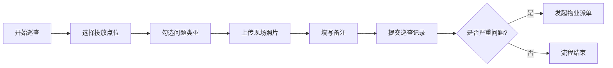
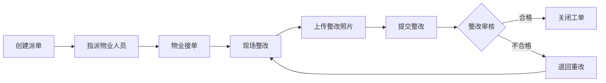

## 1. 产品概述

垃圾分类督导系统是一款面向社区垃圾分类管理的Web应用，旨在解决督导员日常巡查中照片管理混乱、问题追溯困难、整改跟踪不到位的痛点。系统通过点位化管理，实现巡查记录、问题派单、整改跟踪和宣传记录的全流程数字化管理，帮助管理者快速识别反复出错的楼栋，优化督导资源配置。

- 目标用户：社区垃圾分类督导员、物业管理人员、社区管理者
- 核心价值：让垃圾分类问题可追溯、可量化、可整改

## 2. 核心功能

### 2.1 用户角色

| 角色 | 登录方式 | 核心权限 |
|------|----------|----------|
| 督导员 | 账号登录 | 巡查记录、查看点位、提交宣传记录 |
| 物业人员 | 账号登录 | 接收派单、上传整改照片、关闭工单 |
| 管理员 | 账号登录 | 点位管理、查看统计、派单管理、全部权限 |

### 2.2 功能模块

1. **点位管理**：管理垃圾分类投放点位，包括楼栋、桶类型、开放时段、督导员、摄像头位置
2. **巡查记录**：督导员巡查时选择点位，勾选问题类型并拍照记录
3. **问题派单**：严重问题派发给物业处理，跟踪整改进度
4. **宣传记录**：记录居民宣传活动，关联具体点位
5. **统计看板**：按点位统计复发次数、整改平均时长、常见错误类型、需重点宣传楼栋

### 2.3 页面详情

| 页面名称 | 模块名称 | 功能描述 |
|---------|----------|----------|
| 数据看板 | 概览卡片 | 今日巡查数、待处理工单、本月问题总数、整改完成率 |
| 数据看板 | 问题趋势图 | 近30天问题数量趋势折线图 |
| 数据看板 | 问题类型分布 | 饼图展示各类型问题占比 |
| 数据看板 | 高频问题点位 | 列表展示复发次数最多的Top10点位 |
| 点位管理 | 点位列表 | 卡片式展示所有投放点位，支持筛选和搜索 |
| 点位管理 | 点位详情 | 展示点位基本信息、历史问题记录、摄像头位置 |
| 点位管理 | 新增/编辑点位 | 表单录入楼栋、桶类型、开放时段、督导员等信息 |
| 巡查记录 | 巡查列表 | 按时间倒序展示所有巡查记录，支持筛选 |
| 巡查记录 | 新建巡查 | 选择点位、勾选问题类型、上传照片、填写备注 |
| 巡查记录 | 巡查详情 | 展示巡查的完整信息和照片 |
| 问题派单 | 工单列表 | 展示所有派单，按状态筛选（待处理/处理中/已完成） |
| 问题派单 | 派单详情 | 展示问题描述、指派物业、整改照片、处理时效 |
| 问题派单 | 创建派单 | 从巡查记录发起派单，指派物业人员，设置优先级 |
| 宣传记录 | 宣传列表 | 展示所有宣传活动记录 |
| 宣传记录 | 新建宣传 | 记录宣传时间、地点、形式、参与人数、关联点位 |
| 统计分析 | 复发统计 | 按点位统计问题复发次数排名 |
| 统计分析 | 整改时效 | 各点位平均整改时长统计 |
| 统计分析 | 错误类型 | 各类问题出现频次统计 |
| 统计分析 | 宣传重点 | 需上门宣传的楼栋推荐列表 |

## 3. 核心流程

### 3.1 巡查记录流程

督导员登录系统后，进入巡查记录页面，点击新建巡查。首先选择投放点位，然后勾选发现的问题类型（混投、满溢、破袋、厨余未沥水、可回收堆放），上传现场照片，填写备注后提交。如果问题严重，可以直接发起派单给物业处理。

### 3.2 问题整改流程

管理员或督导员发现严重问题后，创建派单并指派物业人员。物业人员接单后进行整改，完成后上传整改后的照片并提交审核。督导员或管理员验证整改合格后关闭工单，不合格则退回重新整改。

## 4. 用户界面设计

### 4.1 设计风格

- **主色调**：环保绿色系，主色 #10B981（翠绿），辅助色 #059669（深绿）
- **强调色**：橙色 #F59E0B（警告/待处理）、红色 #EF4444（严重问题）
- **中性色**：以 slate 灰色系为基础，保持专业简洁
- **按钮风格**：圆角中等（rounded-lg），悬停有阴影和颜色深浅变化
- **字体**：标题使用思源黑体，正文使用系统无衬线字体，清晰易读
- **布局风格**：左侧导航栏 + 右侧内容区的经典管理后台布局，卡片式内容展示
- **图标风格**：使用 lucide-react 线性图标，统一24px尺寸

### 4.2 页面设计概述

| 页面名称 | 模块名称 | UI元素 |
|---------|----------|--------|
| 数据看板 | 概览卡片 | 4个统计卡片横向排列，带图标和趋势指标 |
| 数据看板 | 图表区域 | 左右分栏，左侧折线图，右侧饼图 |
| 数据看板 | 问题点位排行 | 表格形式展示Top10，带进度条 |
| 点位管理 | 点位卡片 | 网格布局卡片，显示点位信息和状态标签 |
| 点位管理 | 筛选栏 | 顶部筛选搜索栏，支持按楼栋、桶类型筛选 |
| 巡查记录 | 列表项 | 时间线式布局，展示巡查摘要和照片缩略图 |
| 问题派单 | 工单卡片 | 带状态标签的卡片列表，颜色区分优先级 |
| 统计分析 | 图表 | 柱状图、条形图多种可视化方式 |

### 4.3 响应式设计

- 桌面端优先设计，最小支持1280px宽度
- 平板端（768px-1280px）：导航栏收起为图标模式
- 移动端（<768px）：底部Tab导航，内容单列布局
- 所有表格支持横向滚动，图片自适应容器

### 4.4 动效设计

- 页面切换：淡入淡出过渡，200ms
- 卡片悬停：微微上浮 + 阴影加深，150ms过渡
- 按钮点击：缩放效果（scale 0.97）
- 数据加载：骨架屏脉冲动画
- 状态变更：颜色渐变过渡
