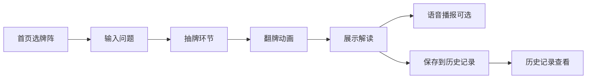

## 1. 产品概述
塔罗占卜网站是一款在线塔罗牌占卜应用，为用户提供沉浸式的塔罗占卜体验。用户可以选择不同牌阵，进行抽牌和解读，记录占卜历史，并可选择语音播报解读内容。
- 主要目的：提供便捷、美观、有趣的在线塔罗占卜服务
- 目标用户：对塔罗占卜感兴趣的年轻用户群体
- 产品价值：将传统塔罗占卜与现代Web技术结合，创造独特的沉浸式占卜体验

## 2. 核心功能

### 2.1 功能模块
1. **首页**：牌阵选择、主题切换、历史记录入口
2. **占卜页面**：问题输入、抽牌环节、翻牌动画
3. **解读页面**：单牌解读、位置含义、组合解读、语音播报
4. **历史记录**：过往占卜记录查看、详情回顾

### 2.2 页面详情
| 页面名称 | 模块名称 | 功能描述 |
|---------|---------|---------|
| 首页 | 牌阵选择区 | 展示四种牌阵（三牌阵、凯尔特十字、时间之流、心灵镜像），点击选择 |
| 首页 | 主题切换 | 深色月夜主题与浅色日间主题切换 |
| 首页 | 历史记录入口 | 进入历史记录页面查看过往占卜 |
| 占卜页面 | 问题输入 | 用户输入心中想问的问题 |
| 占卜页面 | 抽牌环节 | 78张牌背朝上扇形排列，鼠标悬停飘起，点击翻牌 |
| 解读页面 | 牌面展示 | 展示所有抽取的牌，包含正逆位 |
| 解读页面 | 详细解读 | 单牌含义、位置含义、综合解读 |
| 解读页面 | 语音播报 | 可选语音播报解读内容 |
| 历史记录 | 记录列表 | 展示所有历史占卜记录，按时间排序 |
| 历史记录 | 记录详情 | 查看某次占卜的完整内容 |

## 3. 核心流程
用户选择牌阵 → 输入占卜问题 → 进入抽牌界面 → 依次点击抽取所需数量的牌 → 所有牌翻开后展示解读 → 可选择语音播报 → 可保存到历史记录

## 4. 用户界面设计

### 4.1 设计风格
- **深色月夜主题**：深蓝紫渐变背景，金色点缀，星空粒子效果，神秘梦幻氛围
- **浅色日间主题**：米白暖色调，淡金点缀，柔和阳光感，温暖治愈氛围
- **主色调**：
  - 深色主题：#1a1a2e（深紫蓝）、#16213e（深蓝）、#e94560（玫红金）、#0f3460（深蓝）
  - 浅色主题：#faf3e0（米白）、#e8d5b7（浅金）、#8b5a2b（棕褐）、#c9a86c（金色）
- **按钮风格**：圆角渐变按钮，带有光晕效果，悬停放大
- **字体**：展示字体使用 Cinzel（古典衬线），正文字体使用 Noto Serif SC（中文衬线）
- **布局风格**：卡片式布局，多层阴影，适当留白，居中对称
- **视觉特效**：星光粒子、光晕、毛玻璃效果、3D翻牌动画

### 4.2 页面设计概述
| 页面名称 | 模块名称 | UI元素 |
|---------|---------|--------|
| 首页 | 牌阵选择区 | 四张精美牌阵卡片，悬停浮起，点击波纹效果 |
| 占卜页面 | 抽牌区 | 扇形排列的牌背，悬停飘起，3D翻转动画 |
| 解读页面 | 牌面展示区 | 翻开的塔罗牌，正逆位标识，详细解读文字 |
| 历史记录 | 记录列表 | 时间线式布局，每条记录可展开查看详情 |

### 4.3 响应式
- 桌面端优先设计，自适应不同屏幕尺寸
- 移动端优化触控交互，调整牌阵大小和布局
- 抽牌区在移动端调整为更紧凑的扇形排列

### 4.4 动画与交互
- 页面加载：渐入动画，元素依次浮现
- 牌阵选择：卡片悬停上浮，点击缩放反馈
- 抽牌环节：鼠标悬停牌面飘起，点击后3D翻转，翻牌音效（可选）
- 解读展示：文字逐行淡入，牌面依次展开
- 主题切换：平滑过渡动画
