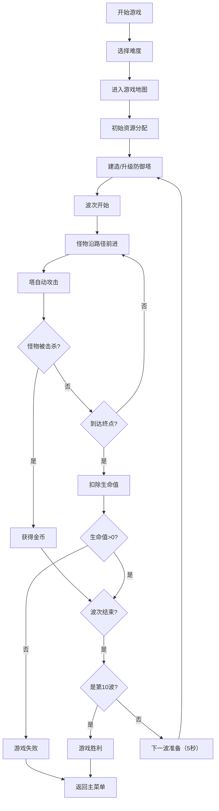

## 1. 产品概述

经典路径式塔防游戏，玩家通过建造防御塔阻止怪物沿固定路径到达终点。游戏包含三种塔类型、四种怪物类型、三张难度地图，支持暂停和多倍速游戏。

- 核心玩法：策略性放置防御塔，升级塔防，管理资源，抵御怪物波次
- 目标用户：休闲游戏玩家，策略游戏爱好者

## 2. 核心特性

### 2.1 功能模块

1. **主菜单页面**：难度选择、游戏开始、游戏说明
2. **游戏主页面**：游戏画布、塔防建造面板、资源状态栏、波次信息、速度控制
3. **游戏结束页面**：胜利/失败展示、重新开始、返回菜单

### 2.2 页面详情

| 页面名称 | 模块名称 | 功能描述 |
|-----------|-------------|---------------------|
| 主菜单 | 难度选择 | 三张地图三种难度（简单/普通/困难） |
| 主菜单 | 游戏说明 | 游戏规则、塔类型介绍、怪物类型介绍 |
| 游戏主页面 | 游戏画布 | Canvas渲染地图、路径、怪物、塔、子弹、特效 |
| 游戏主页面 | 建塔面板 | 三种塔选择、建塔价格显示、塔升级选项 |
| 游戏主页面 | 状态栏 | 金币数量、生命值、当前波次/总波次 |
| 游戏主页面 | 速度控制 | 暂停/继续、1x/2x/3x倍速切换 |
| 游戏结束 | 结果展示 | 胜利/失败动画、最终数据统计 |

## 3. 核心流程

### 3.1 游戏流程

玩家选择难度地图 → 进入游戏 → 初始金币和生命值 → 等待波次开始 → 建造/升级防御塔 → 怪物沿路径前进 → 塔攻击怪物 → 击杀获得金币 → 漏怪扣除生命 → 10波全部击杀胜利 → 生命归零失败

## 4. 用户界面设计

### 4.1 设计风格

- **主色调**：深色科幻风格，深蓝紫渐变背景，霓虹发光效果
- **辅助色**：绿色（单体塔）、红色（AOE塔）、蓝色（冰塔）、金色（金币）、红色（生命）
- **按钮风格**：圆角矩形，发光边框，悬浮放大动画
- **字体**：像素风格字体配合现代无衬线字体，游戏感与可读性平衡
- **布局风格**：游戏画布居中，上下状态栏，右侧建塔面板
- **图标风格**：简约几何图标，配合发光效果

### 4.2 页面设计概览

| 页面名称 | 模块名称 | UI元素 |
|-----------|-------------|-------------|
| 主菜单 | 标题区 | 发光游戏标题，粒子动画背景 |
| 主菜单 | 难度选择 | 三张卡片式按钮，hover动效 |
| 游戏主页面 | 游戏画布 | Canvas居中，路径发光效果，塔和怪物有动画 |
| 游戏主页面 | 顶部状态栏 | 半透明玻璃态，金币/生命/波次图标+数字 |
| 游戏主页面 | 右侧面板 | 三种塔选择卡片，选中高亮，价格显示 |
| 游戏主页面 | 底部控制栏 | 速度切换按钮，暂停按钮，半透明背景 |
| 游戏结束 | 结果面板 | 居中弹窗，胜利/失败大标题，数据统计，操作按钮 |

### 4.3 响应式

- 桌面端优先设计，游戏画布固定尺寸
- 面板区域自适应宽度
- 移动端适配：面板改为上下布局，按钮放大

### 4.4 动效设计

- 塔攻击时发射子弹动画，命中特效
- 怪物死亡爆炸粒子效果
- 建塔和升级时的光圈扩散动画
- 按钮hover缩放发光效果
- 生命值变化时的震动反馈
- 波次开始倒计时动画
