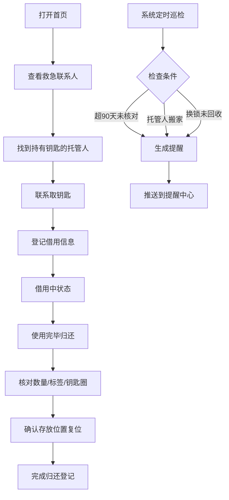

## 1. 产品概述

备用钥匙托管管理系统，帮助家庭系统化管理散落各处的备用钥匙，解决忘带钥匙时找不到、记不清谁有钥匙的痛点。系统提供钥匙档案登记、借用归还跟踪、智能提醒和救急联系人首页，让备用钥匙的管理透明、可追溯、有保障。

## 2. 核心功能

### 2.1 用户角色

| 角色 | 注册方式 | 核心权限 |
|------|----------|----------|
| 家庭成员 | 默认使用系统 | 查看钥匙档案、发起借用、确认归还、管理提醒 |
| 系统管理员 | 家庭负责人 | 新建钥匙档案、编辑托管信息、标记锁芯更换、导出数据 |

### 2.2 功能模块

1. **首页（救急联系人）**：按家庭成员分类展示可求助的托管人，快速查看哪些钥匙在谁手里
2. **钥匙档案管理**：钥匙档案列表、新增/编辑钥匙档案、档案详情
3. **借用归还记录**：借用申请、归还确认、借用历史
4. **智能提醒中心**：长期未核对提醒、托管人搬家提醒、锁芯更换旧钥匙回收提醒
5. **成员与设置**：家庭成员管理、提醒阈值设置、数据导出

### 2.3 页面详情

| 页面名称 | 模块名称 | 功能描述 |
|----------|----------|----------|
| 首页 | 救急联系人卡片 | 按家庭成员分组显示托管人，展示姓名、关系、联系方式、持有钥匙清单、当前可用状态 |
| 首页 | 快捷操作区 | 快速借用钥匙、新增钥匙档案、查看提醒 |
| 首页 | 统计概览 | 托管钥匙总数、借出中数量、待处理提醒数 |
| 钥匙档案列表 | 筛选搜索 | 按门锁名称、托管人、状态筛选，支持关键词搜索 |
| 钥匙档案列表 | 档案卡片 | 显示门锁、钥匙数量、托管人、存放位置、当前状态标签 |
| 钥匙档案详情 | 档案信息 | 门锁名称、钥匙数量、托管人姓名/关系/电话、存放位置、交付日期、照片展示 |
| 钥匙档案详情 | 借用记录时间线 | 历史借用记录倒序展示，含借用人、原因、借出/归还时间、复制标记 |
| 钥匙档案详情 | 操作按钮 | 发起借用、确认归还、编辑档案、标记锁芯更换 |
| 新增/编辑档案 | 表单录入 | 门锁选择、钥匙数量、托管人信息、存放位置、交付日期、照片上传 |
| 借用登记 | 表单录入 | 借用人、借用原因、预计归还日期、是否需要复制 |
| 归还确认 | 核对清单 | 钥匙数量核对、标签完好确认、钥匙圈完好确认、存放位置复位确认、签收人签名 |
| 提醒中心 | 提醒列表 | 分类展示三类提醒：长期未核对、托管人搬家、旧钥匙未回收 |
| 提醒中心 | 提醒操作 | 标记已核对、更新托管人信息、确认回收、忽略提醒 |
| 设置页面 | 成员管理 | 新增/编辑家庭成员、头像、关系标签 |
| 设置页面 | 提醒阈值 | 长期未核对天数阈值（默认90天）设置 |

## 3. 核心流程

用户忘带钥匙 → 打开首页 → 按家庭成员查看谁有备用钥匙 → 联系托管人取钥匙 → 系统登记借用 → 归还时确认数量和完好 → 归档记录

系统自动巡检：每7天扫描一次 → 检查超过90天未核对的钥匙 → 检查标记为搬家的托管人 → 检查标记更换锁芯但旧钥匙未回收 → 生成提醒推送到提醒中心

## 4. 用户界面设计

### 4.1 设计风格

**整体美学方向：安全感与信任感驱动的温暖工业风**

- **主色调**：深海军蓝 `#1e3a5f`（安全、可靠）
- **辅助色**：暖琥珀金 `#d4a24c`（钥匙、温暖）、薄荷绿 `#4ecdc4`（安全可用）、珊瑚橙 `#ff6b6b`（提醒、借出）
- **背景色**：暖米白 `#faf8f5` + 细腻亚麻纹理
- **按钮风格**：圆角 12px，微阴影，主按钮使用深海军蓝配金色文字描边，hover 时轻微上浮
- **字体**：标题用 "Noto Serif SC"（衬线、正式感），正文用 "Noto Sans SC"（清晰易读），数字用 "JetBrains Mono"
- **布局风格**：卡片式布局，微投影，卡片左上角带彩色状态条（绿色-可用/橙色-借出/灰色-停用）
- **图标/emoji**：使用 emoji 钥匙🔑、锁🔒、房子🏠、提醒⏰、家庭👨‍👩‍👧等增加亲切感，辅以线性图标

### 4.2 页面设计概述

| 页面名称 | 模块名称 | UI 元素 |
|----------|----------|---------|
| 首页 | 救急联系人卡片 | 温暖米色卡片、头像圆形带绿色在线点、关系标签（胶囊状）、持有钥匙清单（标签云）、一键拨打电话按钮 |
| 首页 | 统计概览 | 三个大数字卡片，配渐变背景（蓝/金/橙），数字动画计数效果 |
| 钥匙档案列表 | 档案卡片 | 左侧彩色状态条（3px宽）、门锁名称大字体、托管人头像缩略图、存放位置图标化展示 |
| 钥匙档案详情 | 照片画廊 | 大图轮播 + 缩略图栏，支持点击放大 |
| 钥匙档案详情 | 时间线 | 左侧竖线带节点圆点，每条记录含日期徽标 |
| 借用/归还表单 | 表单设计 | 分段卡片式表单，大输入框，错误时红框抖动动画 |
| 提醒中心 | 提醒卡片 | 顶部图标条（黄色⚠️/红色🚨/蓝色ℹ️），底部操作按钮组 |

### 4.3 响应式

- **桌面优先设计**：针对 1280px+ 优化，主内容区最大宽度 1440px
- **平板适配**：1024px 时双列卡片变单列，侧边栏收起为顶部标签
- **手机适配**：768px 以下全屏卡片堆叠，底部导航 Tab 栏（首页/钥匙/提醒/我的）
- **触控优化**：所有交互按钮最小 44px 点击区域，表单输入框高度 52px

### 4.4 微交互动效

- 页面加载：卡片依次淡入上浮（stagger 动画 50ms）
- 卡片悬停：y 轴 -4px，阴影加深，0.2s ease-out
- 状态切换：颜色过渡 + 缩放脉冲
- 表单提交：按钮 loading 旋转图标 + 成功勾选动画
- 提醒通知：右上角滑入 + 轻微震动效果
