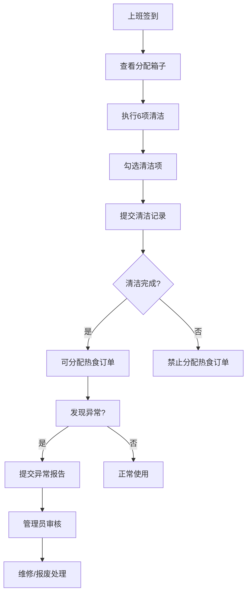

## 1. 产品概述
外卖保温箱清洁台账管理系统，用于管理外卖骑手保温箱的清洁记录、异常处理和状态追踪。解决保温箱汤汁渗漏、串味、卫生不达标的问题，确保食品安全和服务质量。目标用户为外卖站点管理员、质量管控人员。

## 2. 核心功能

### 2.1 用户角色
| 角色 | 注册方式 | 核心权限 |
|------|----------|----------|
| 站点管理员 | 内置账号 | 箱子档案管理、清洁记录审核、维修报废审批、查看统计报表 |
| 骑手 | 站点分配 | 查看分配的箱子、提交清洁记录、上报异常情况 |

### 2.2 功能模块
1. **箱子档案管理**：保温箱基础信息录入、编辑、查询，包含编号、容量、用途、所属骑手、购买日期、照片
2. **每日清洁记录**：清洁项勾选（倒残渣、擦内胆、消毒、晾干、检查拉链、闻味道），清洁状态追踪
3. **维修报废管理**：异常情况记录（破损、异味、保温差、汤汁渗漏），维修/报废流程
4. **订单分配校验**：业务规则校验，未清洁箱子禁止分配热食订单
5. **统计分析**：清洁完成率、异常箱子统计、骑手使用频率、需更换保温箱预警

### 2.3 页面详情
| 页面名称 | 模块名称 | 功能描述 |
|----------|----------|----------|
| 仪表盘 | 数据概览 | 今日待清洁、异常预警、清洁完成率趋势、待处理维修申请 |
| 箱子档案 | 档案列表 | 保温箱列表展示、筛选查询、新增/编辑/删除 |
| 箱子档案 | 档案详情 | 箱子完整信息展示、历史清洁记录、维修报废历史 |
| 清洁记录 | 清洁列表 | 按日期查看所有箱子清洁状态 |
| 清洁记录 | 清洁登记 | 6项清洁内容勾选、备注填写、异常上报入口 |
| 维修报废 | 异常列表 | 异常箱子列表、状态筛选 |
| 维修报废 | 异常处理 | 维修记录登记、报废审批流程 |
| 统计分析 | 清洁统计 | 清洁完成率图表、未清洁预警 |
| 统计分析 | 使用统计 | 骑手使用频率排名、箱子周转率 |
| 统计分析 | 更换预警 | 需更换保温箱列表、预计更换时间 |

## 3. 核心流程

### 3.1 每日清洁流程
骑手上班 → 查看分配的保温箱 → 执行清洁（倒残渣→擦内胆→消毒→晾干→检查拉链→闻味道 → 勾选清洁项 → 提交清洁记录 → 系统校验清洁完成 → 可分配热食订单

### 3.2 异常处理流程
发现异常（破损/异味/保温差/渗漏） → 提交异常报告 → 管理员审核 → 发起维修申请/报废申请 → 处理完成更新状态

### 3.3 订单分配校验流程
调度分配订单 → 检查箱子今日清洁状态 → 未清洁/异常 → 禁止分配热食订单 → 提醒先完成清洁

## 4. 用户界面设计

### 4.1 设计风格
- 主色调：橙色系（#FF6B35）代表食品安全与活力
- 辅助色：绿色（#10B981）表示清洁正常，红色（#EF4444）表示异常告警
- 中性色：深灰（#1F2937）、浅灰（#F3F4F6）
- 按钮风格：圆角矩形，渐变填充，悬浮微动画
- 字体：标题使用思源黑体 Bold，正文使用思源黑体 Regular
- 布局：顶部导航 + 侧边菜单 + 卡片式内容区
- 图标：线性图标配合 emoji 增强视觉识别

### 4.2 页面设计概述
| 页面名称 | 模块名称 | UI 元素 |
|----------|----------|----------|
| 仪表盘 | 数据概览 | 统计卡片网格、清洁状态徽章、异常告警横幅、趋势折线图 |
| 箱子档案 | 档案列表 | 表格布局、搜索筛选栏、操作按钮组、照片缩略图 |
| 清洁记录 | 清洁登记 | 步骤条、复选框组、提交按钮、异常快速上报 |
| 维修报废 | 异常列表 | 状态标签、时间线、审批流程指示 |
| 统计分析 | 数据可视化 | 柱状图、饼图、排名列表、预警卡片 |

### 4.3 响应式
- 桌面端（>1280px）：完整侧边栏 + 多列布局
- 平板端（768-1280px）：折叠侧边栏 + 双列布局
- 移动端（<768px）：底部Tab导航 + 单列布局，触摸优化按钮

## 5. 业务规则
1. 未完成今日清洁的箱子，次日0点自动标记为"待清洁"
2. 待清洁状态的箱子禁止分配热食订单（汤类、盒饭类）
3. 保温箱使用满180天自动标记为"建议更换"
4. 累计3次维修记录的箱子自动进入报废预警
5. 清洁记录必须6项全部勾选才算完成
